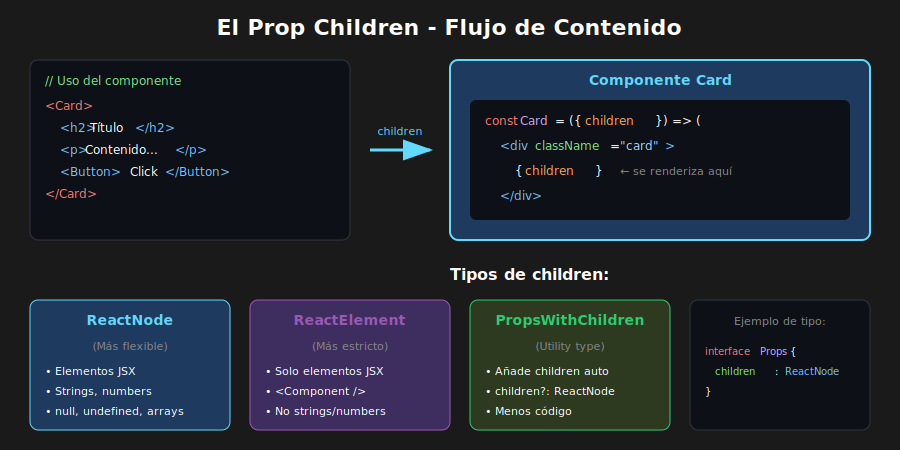

# 📘 Children y Slots Pattern

## 🎯 Objetivos

- Dominar el prop `children` y sus tipos en TypeScript
- Diferenciar entre ReactNode, ReactElement y otros tipos
- Implementar el patrón Slots para mayor flexibilidad
- Crear componentes con múltiples áreas de contenido

---

## 📋 Contenido

### 1. El Prop Children

En React, `children` es un prop especial que permite pasar elementos JSX entre las etiquetas de apertura y cierre de un componente:

```tsx
// children es lo que está entre las etiquetas
<Card>
  <h2>Título</h2>
  <p>Contenido del card</p>
</Card>
```



#### 1.1 Tipando Children

```tsx
import { ReactNode, ReactElement, PropsWithChildren } from 'react';

// QUÉ: ReactNode es el tipo más amplio para children
// PARA: Aceptar cualquier contenido renderizable (elementos, strings, numbers, null)
// IMPACTO: Máxima flexibilidad - el componente funciona con cualquier contenido
interface CardProps {
  children: ReactNode;
  title?: string;
}

// QUÉ: Componente que renderiza children dentro de su estructura
// PARA: Crear contenedores que encapsulan estilos sin imponer contenido
// IMPACTO: El padre decide qué va dentro, el componente decide cómo se ve
const Card: React.FC<CardProps> = ({ children, title }) => (
  <div className="card">
    {title && <h2>{title}</h2>}
    <div className="card-content">{children}</div>
  </div>
);

// Todos estos usos son válidos con ReactNode
<Card>
  <p>Texto en un elemento</p>
</Card>

<Card>Texto directo</Card>

<Card>{42}</Card>

<Card>{null}</Card>

<Card>
  <>
    <p>Fragmento</p>
    <p>Con múltiples hijos</p>
  </>
</Card>
```

#### 1.2 Tipos de Children

```tsx
import {
  ReactNode,
  ReactElement,
  ReactChild,
  JSX,
} from 'react';

// QUÉ: ReactNode - tipo que acepta cualquier cosa renderizable
// PARA: Máxima flexibilidad cuando no importa qué tipo de contenido se pasa
// IMPACTO: Acepta strings, numbers, elementos, null, arrays, fragments
type ReactNode = /* tipo amplio */;

// QUÉ: ReactElement - tipo que solo acepta elementos JSX
// PARA: Forzar que se pase un componente, no texto plano
// IMPACTO: TypeScript rechaza strings o numbers, solo acepta <Component />
type ReactElement = /* elemento JSX específico */;

// Ejemplos de uso según necesidad

// 1. Aceptar cualquier contenido renderizable
interface FlexibleContainerProps {
  children: ReactNode;
}

// 2. Requerir exactamente un elemento JSX
interface SingleChildProps {
  children: ReactElement;
}

// QUÉ: Props que mezclan ReactElement y ReactNode según necesidad
// PARA: Forzar que icon sea un componente pero children puede ser texto
// IMPACTO: API más segura - previene errores como pasar emoji como icon
interface IconButtonProps {
  icon: ReactElement; // Debe ser un elemento, no texto
  children: ReactNode; // Texto del botón puede ser string
}

const IconButton: React.FC<IconButtonProps> = ({ icon, children }) => (
  <button className="icon-button">
    <span className="icon">{icon}</span>
    <span className="text">{children}</span>
  </button>
);

// Uso correcto
<IconButton icon={<SearchIcon />}>Buscar</IconButton>

// ❌ Error de TypeScript - string no es ReactElement
<IconButton icon="🔍">Buscar</IconButton>
```

#### 1.3 PropsWithChildren

TypeScript ofrece un helper para añadir children a tus props:

```tsx
import { PropsWithChildren } from 'react';

// Sin PropsWithChildren
interface CardProps {
  title: string;
  children: ReactNode;
}

// QUÉ: PropsWithChildren es un utility type de React
// PARA: Añadir automáticamente children?: ReactNode a cualquier tipo
// IMPACTO: Menos código repetitivo, children siempre es opcional
type CardProps = PropsWithChildren<{
  title: string;
}>;

// Ambos resultan en:
// { title: string; children?: ReactNode }

const Card: React.FC<CardProps> = ({ title, children }) => (
  <div className="card">
    <h2>{title}</h2>
    {children}
  </div>
);
```

---

### 2. Manipulando Children

React provee utilidades para trabajar con children de forma segura:

```tsx
import {
  Children,
  cloneElement,
  isValidElement,
  ReactNode,
  ReactElement,
} from 'react';

interface ListProps {
  children: ReactNode;
}

const List: React.FC<ListProps> = ({ children }) => {
  // Contar children
  const count = Children.count(children);
  console.log(`Lista tiene ${count} elementos`);

  // Iterar sobre children
  const items = Children.map(children, (child, index) => {
    // Verificar si es un elemento válido antes de clonar
    if (isValidElement(child)) {
      // Clonar y añadir props
      return cloneElement(child, {
        className: `list-item item-${index}`,
        'data-index': index,
      });
    }
    return child;
  });

  return <ul className="list">{items}</ul>;
};

// Convertir a array
const childArray = Children.toArray(children);

// Verificar que solo hay un child
const onlyChild = Children.only(children); // Lanza error si hay más de uno
```

#### Ejemplo práctico: Tabs

```tsx
interface TabsProps {
  children: ReactNode;
  defaultTab?: number;
}

interface TabProps {
  label: string;
  children: ReactNode;
}

const Tab: React.FC<TabProps> = ({ children }) => <div>{children}</div>;

const Tabs: React.FC<TabsProps> = ({ children, defaultTab = 0 }) => {
  const [activeTab, setActiveTab] = useState(defaultTab);

  // Obtener array de children válidos
  const tabs = Children.toArray(children).filter(
    (child): child is ReactElement<TabProps> =>
      isValidElement(child) && child.type === Tab,
  );

  return (
    <div className="tabs">
      {/* Botones de navegación */}
      <div className="tab-buttons">
        {tabs.map((tab, index) => (
          <button
            key={index}
            className={index === activeTab ? 'active' : ''}
            onClick={() => setActiveTab(index)}>
            {tab.props.label}
          </button>
        ))}
      </div>

      {/* Contenido del tab activo */}
      <div className="tab-content">{tabs[activeTab]}</div>
    </div>
  );
};

// Uso
<Tabs defaultTab={0}>
  <Tab label="Perfil">
    <ProfileContent />
  </Tab>
  <Tab label="Configuración">
    <SettingsContent />
  </Tab>
  <Tab label="Notificaciones">
    <NotificationsContent />
  </Tab>
</Tabs>;
```

---

### 3. Slots Pattern

El patrón Slots permite definir **áreas específicas** donde el padre puede inyectar contenido:


#### 3.1 Slots con Props Explícitas

```tsx
// QUÉ: Interface con múltiples props que actúan como "slots" de contenido
// PARA: Definir áreas específicas donde el padre puede inyectar contenido
// IMPACTO: Estructura predecible con flexibilidad en cada zona
interface CardProps {
  // Slots definidos como props
  header?: ReactNode;
  footer?: ReactNode;
  children: ReactNode; // Slot principal (body)
}

// QUÉ: Componente con múltiples zonas de contenido
// PARA: El padre controla qué va en cada zona sin modificar el componente
// IMPACTO: Mismo componente sirve para cards muy diferentes
const Card: React.FC<CardProps> = ({ header, footer, children }) => (
  <div className="card">
    {header && <header className="card-header">{header}</header>}
    <main className="card-body">{children}</main>
    {footer && <footer className="card-footer">{footer}</footer>}
  </div>
);

// Uso
<Card
  header={<h2>Título del Card</h2>}
  footer={
    <div className="actions">
      <button>Cancelar</button>
      <button>Guardar</button>
    </div>
  }>
  <p>Este es el contenido principal del card.</p>
  <p>Puede tener múltiples elementos.</p>
</Card>;
```

#### 3.2 Slots Tipados Estrictamente

```tsx
// QUÉ: Interface con tipos específicos para cada slot
// PARA: Forzar que trigger sea un elemento con onClick
// IMPACTO: TypeScript previene errores - no puedes pasar texto como trigger
interface ModalSlots {
  trigger: ReactElement<{ onClick: () => void }>; // Debe tener onClick
  title: ReactNode;
  content: ReactNode;
  actions?: ReactNode;
}

// QUÉ: Modal que inyecta comportamiento al trigger
// PARA: El padre define el botón, Modal añade la funcionalidad de abrir
// IMPACTO: Separación de responsabilidades - UI vs comportamiento
const Modal: React.FC<ModalSlots> = ({ trigger, title, content, actions }) => {
  const [isOpen, setIsOpen] = useState(false);

  // Clonar trigger para añadir onClick
  const triggerWithHandler = cloneElement(trigger, {
    onClick: () => setIsOpen(true),
  });

  return (
    <>
      {triggerWithHandler}

      {isOpen && (
        <div
          className="modal-overlay"
          onClick={() => setIsOpen(false)}>
          <div
            className="modal"
            onClick={(e) => e.stopPropagation()}>
            <header className="modal-header">
              <h2>{title}</h2>
              <button onClick={() => setIsOpen(false)}>✕</button>
            </header>
            <main className="modal-content">{content}</main>
            {actions && <footer className="modal-actions">{actions}</footer>}
          </div>
        </div>
      )}
    </>
  );
};

// Uso
<Modal
  trigger={<button>Abrir Modal</button>}
  title="Confirmar acción"
  content={<p>¿Estás seguro de que deseas continuar?</p>}
  actions={
    <>
      <button>Cancelar</button>
      <button>Confirmar</button>
    </>
  }
/>;
```

#### 3.3 Slots con Render Props

Para mayor control, combina slots con funciones:

```tsx
interface DataTableProps<T> {
  data: T[];
  // Slots como render props
  renderHeader: () => ReactNode;
  renderRow: (item: T, index: number) => ReactNode;
  renderFooter?: (totalItems: number) => ReactNode;
  renderEmpty?: () => ReactNode;
}

function DataTable<T>({
  data,
  renderHeader,
  renderRow,
  renderFooter,
  renderEmpty,
}: DataTableProps<T>) {
  if (data.length === 0 && renderEmpty) {
    return <div className="table-empty">{renderEmpty()}</div>;
  }

  return (
    <table className="data-table">
      <thead>{renderHeader()}</thead>
      <tbody>
        {data.map((item, index) => (
          <tr key={index}>{renderRow(item, index)}</tr>
        ))}
      </tbody>
      {renderFooter && <tfoot>{renderFooter(data.length)}</tfoot>}
    </table>
  );
}

// Uso
interface User {
  id: string;
  name: string;
  email: string;
  role: string;
}

const users: User[] = [
  /* ... */
];

<DataTable
  data={users}
  renderHeader={() => (
    <tr>
      <th>Nombre</th>
      <th>Email</th>
      <th>Rol</th>
    </tr>
  )}
  renderRow={(user) => (
    <>
      <td>{user.name}</td>
      <td>{user.email}</td>
      <td>{user.role}</td>
    </>
  )}
  renderFooter={(total) => (
    <tr>
      <td colSpan={3}>Total: {total} usuarios</td>
    </tr>
  )}
  renderEmpty={() => <p>No hay usuarios registrados</p>}
/>;
```

---

### 4. Layout Components con Slots

Componentes de layout son un caso de uso perfecto para slots:

```tsx
// Layout con múltiples slots
interface PageLayoutProps {
  header?: ReactNode;
  sidebar?: ReactNode;
  children: ReactNode; // Contenido principal
  footer?: ReactNode;
}

const PageLayout: React.FC<PageLayoutProps> = ({
  header,
  sidebar,
  children,
  footer,
}) => (
  <div className="page-layout">
    {header && <header className="layout-header">{header}</header>}

    <div className="layout-body">
      {sidebar && <aside className="layout-sidebar">{sidebar}</aside>}
      <main className="layout-content">{children}</main>
    </div>

    {footer && <footer className="layout-footer">{footer}</footer>}
  </div>
);

// Uso en una página
const DashboardPage: React.FC = () => (
  <PageLayout
    header={<Navbar />}
    sidebar={
      <nav>
        <NavLink to="/dashboard">Inicio</NavLink>
        <NavLink to="/users">Usuarios</NavLink>
        <NavLink to="/settings">Configuración</NavLink>
      </nav>
    }
    footer={<p>© 2024 Mi Aplicación</p>}>
    <h1>Dashboard</h1>
    <DashboardWidgets />
  </PageLayout>
);
```

#### Layout con Slots Condicionales

```tsx
interface ResponsiveLayoutProps {
  mobileHeader?: ReactNode;
  desktopHeader?: ReactNode;
  children: ReactNode;
}

const ResponsiveLayout: React.FC<ResponsiveLayoutProps> = ({
  mobileHeader,
  desktopHeader,
  children,
}) => {
  const [isMobile, setIsMobile] = useState(window.innerWidth < 768);

  useEffect(() => {
    const handleResize = () => setIsMobile(window.innerWidth < 768);
    window.addEventListener('resize', handleResize);
    return () => window.removeEventListener('resize', handleResize);
  }, []);

  return (
    <div className={`layout ${isMobile ? 'mobile' : 'desktop'}`}>
      <header>{isMobile ? mobileHeader : desktopHeader}</header>
      <main>{children}</main>
    </div>
  );
};

// Uso
<ResponsiveLayout
  mobileHeader={<MobileNavbar />}
  desktopHeader={<DesktopNavbar />}>
  <PageContent />
</ResponsiveLayout>;
```

---

### 5. Validación de Children

A veces necesitas validar qué tipo de children se pasan:

```tsx
import { Children, isValidElement, ReactElement, ReactNode } from 'react';

// Componente que solo acepta ciertos tipos de children
interface TabPanelProps {
  children: ReactNode;
}

interface TabItemProps {
  id: string;
  label: string;
  children: ReactNode;
}

// Marcar componente para identificación
const TabItem: React.FC<TabItemProps> & { displayName: string } = ({
  children,
}) => <div>{children}</div>;
TabItem.displayName = 'TabItem';

const TabPanel: React.FC<TabPanelProps> = ({ children }) => {
  // Validar que todos los children sean TabItem
  const validChildren = Children.toArray(children).filter((child) => {
    if (!isValidElement(child)) {
      console.warn('TabPanel: child inválido ignorado');
      return false;
    }

    // Verificar el tipo del componente
    if ((child.type as any).displayName !== 'TabItem') {
      console.warn(
        `TabPanel: solo acepta TabItem como children, recibió ${(child.type as any).displayName || 'unknown'}`
      );
      return false;
    }

    return true;
  }) as ReactElement<TabItemProps>[];

  const [activeId, setActiveId] = useState(validChildren[0]?.props.id);

  return (
    <div className="tab-panel">
      <div className="tab-buttons">
        {validChildren.map((child) => (
          <button
            key={child.props.id}
            className={child.props.id === activeId ? 'active' : ''}
            onClick={() => setActiveId(child.props.id)}
          >
            {child.props.label}
          </button>
        ))}
      </div>
      <div className="tab-content">
        {validChildren.find((child) => child.props.id === activeId)}
      </div>
    </div>
  );
};

// Uso correcto
<TabPanel>
  <TabItem id="profile" label="Perfil">
    <ProfileContent />
  </TabItem>
  <TabItem id="settings" label="Configuración">
    <SettingsContent />
  </TabItem>
</TabPanel>

// Uso incorrecto - mostrará warning
<TabPanel>
  <TabItem id="profile" label="Perfil">
    <ProfileContent />
  </TabItem>
  <div>Esto no es un TabItem</div> {/* Warning */}
</TabPanel>
```

---

### 6. Children como Función (Render Props)

Patrón avanzado donde children es una función:

```tsx
interface MouseTrackerProps {
  children: (position: { x: number; y: number }) => ReactNode;
}

const MouseTracker: React.FC<MouseTrackerProps> = ({ children }) => {
  const [position, setPosition] = useState({ x: 0, y: 0 });

  useEffect(() => {
    const handleMove = (e: MouseEvent) => {
      setPosition({ x: e.clientX, y: e.clientY });
    };
    window.addEventListener('mousemove', handleMove);
    return () => window.removeEventListener('mousemove', handleMove);
  }, []);

  // children es una función, la llamamos con los datos
  return <>{children(position)}</>;
};

// Uso - el padre decide qué renderizar con los datos
<MouseTracker>
  {({ x, y }) => (
    <div className="mouse-info">
      <p>
        Posición: ({x}, {y})
      </p>
      <div
        className="cursor-follower"
        style={{ left: x, top: y }}
      />
    </div>
  )}
</MouseTracker>;
```

---

## ✅ Checklist de Verificación

- [ ] Sé cuándo usar ReactNode vs ReactElement
- [ ] Puedo crear componentes que aceptan children
- [ ] Entiendo el patrón Slots y cuándo usarlo
- [ ] Puedo manipular children con Children.map, Children.toArray
- [ ] Sé crear layouts flexibles con múltiples slots
- [ ] Entiendo children como función (render props)

---

## 🔗 Recursos Adicionales

- [React TypeScript Cheatsheet - Children](https://react-typescript-cheatsheet.netlify.app/docs/basic/getting-started/basic_type_example#useful-react-prop-type-examples)
- [React Docs - Passing JSX as children](https://react.dev/learn/passing-props-to-a-component#passing-jsx-as-children)

---

_Siguiente: [Compound Components](./03-compound-components.md)_
