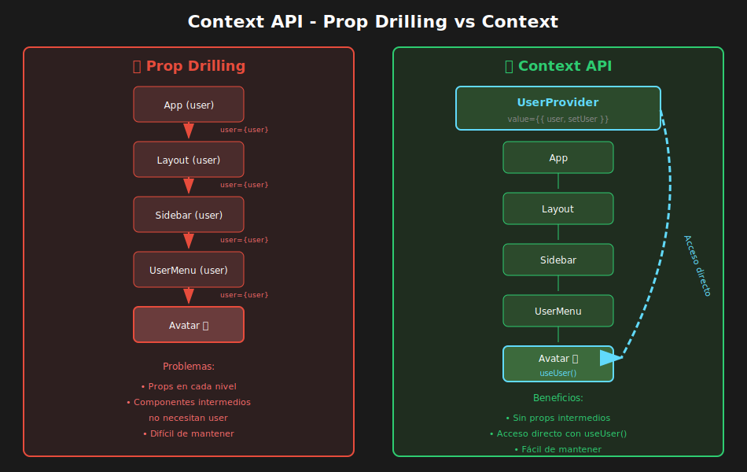

# 📘 Context API con TypeScript

## 🎯 Objetivos

- Entender cuándo usar Context vs props
- Crear contextos tipados correctamente
- Implementar providers seguros con valores por defecto
- Optimizar Context para evitar re-renders innecesarios
- Combinar múltiples contextos efectivamente

---

## 📋 Contenido

### 1. ¿Qué es Context API?

Context proporciona una forma de pasar datos a través del árbol de componentes sin tener que pasar props manualmente en cada nivel (prop drilling).



#### 1.1 El Problema del Prop Drilling

```tsx
// ❌ Prop drilling - pasar datos a través de muchos niveles
const App = () => {
  const [user, setUser] = useState<User | null>(null);

  return (
    <Layout user={user}>
      <Sidebar user={user}>
        <UserInfo user={user} />
      </Sidebar>
      <Main user={user}>
        <Header user={user} />
        <Content user={user}>
          <UserGreeting user={user} /> {/* 5 niveles de props! */}
        </Content>
      </Main>
    </Layout>
  );
};

// ✅ Con Context - acceso directo al dato
const App = () => {
  return (
    <UserProvider>
      <Layout>
        <Sidebar>
          <UserInfo /> {/* Accede a user vía useUser() */}
        </Sidebar>
        <Main>
          <Header />
          <Content>
            <UserGreeting /> {/* Accede a user vía useUser() */}
          </Content>
        </Main>
      </Layout>
    </UserProvider>
  );
};
```

---

### 2. Crear Context con TypeScript

#### 2.1 Patrón Básico

```tsx
import { createContext, useContext, useState, ReactNode } from 'react';

// ============================================
// 1. DEFINIR TIPOS
// ============================================

// QUÉ: Interface que describe la estructura de un usuario
// PARA: Tipar los datos que el contexto compartirá
// IMPACTO: Autocompletado y errores en tiempo de compilación
interface User {
  id: string;
  name: string;
  email: string;
  role: 'admin' | 'user';
}

// QUÉ: Interface que define TODO lo que el contexto expone
// PARA: Documentar el contrato entre Provider y Consumers
// IMPACTO: Cualquier componente sabe exactamente qué puede usar
interface AuthContextValue {
  user: User | null;
  isAuthenticated: boolean;
  login: (email: string, password: string) => Promise<void>;
  logout: () => void;
  isLoading: boolean;
}

// ============================================
// 2. CREAR CONTEXTO
// ============================================

// QUÉ: createContext con tipo union que incluye undefined
// PARA: Forzar que el hook verifique si existe el Provider
// IMPACTO: Previene el error de usar Context fuera de su Provider
const AuthContext = createContext<AuthContextValue | undefined>(undefined);

// Opción B: Con valor por defecto (no recomendado para datos dinámicos)
// const AuthContext = createContext<AuthContextValue>({
//   user: null,
//   isAuthenticated: false,
//   login: async () => {},
//   logout: () => {},
//   isLoading: false,
// });

// ============================================
// 3. CREAR HOOK PERSONALIZADO
// ============================================

// QUÉ: Hook que encapsula useContext con validación
// PARA: Garantizar que el contexto existe antes de usarlo
// IMPACTO: Error claro si se usa fuera del Provider, tipo seguro dentro
export const useAuth = (): AuthContextValue => {
  const context = useContext(AuthContext);

  if (context === undefined) {
    throw new Error('useAuth must be used within an AuthProvider');
  }

  return context;
};

// ============================================
// 4. CREAR PROVIDER
// ============================================

interface AuthProviderProps {
  children: ReactNode;
}

// QUÉ: Componente Provider que mantiene el estado y lo comparte
// PARA: Encapsular toda la lógica de autenticación en un solo lugar
// IMPACTO: Cualquier descendiente puede acceder al estado sin prop drilling
export const AuthProvider: React.FC<AuthProviderProps> = ({ children }) => {
  const [user, setUser] = useState<User | null>(null);
  const [isLoading, setIsLoading] = useState(false);

  const login = async (email: string, password: string) => {
    setIsLoading(true);
    try {
      // Simular llamada a API
      const response = await fetch('/api/login', {
        method: 'POST',
        body: JSON.stringify({ email, password }),
      });
      const userData = await response.json();
      setUser(userData);
    } finally {
      setIsLoading(false);
    }
  };

  const logout = () => {
    setUser(null);
  };

  const value: AuthContextValue = {
    user,
    isAuthenticated: user !== null,
    login,
    logout,
    isLoading,
  };

  return <AuthContext.Provider value={value}>{children}</AuthContext.Provider>;
};

// ============================================
// 5. USO EN COMPONENTES
// ============================================

// En App.tsx
const App: React.FC = () => (
  <AuthProvider>
    <Router>
      <Routes />
    </Router>
  </AuthProvider>
);

// En cualquier componente descendiente
const Navbar: React.FC = () => {
  const { user, isAuthenticated, logout } = useAuth();

  return (
    <nav>
      {isAuthenticated ? (
        <>
          <span>Hola, {user?.name}</span>
          <button onClick={logout}>Cerrar sesión</button>
        </>
      ) : (
        <Link to="/login">Iniciar sesión</Link>
      )}
    </nav>
  );
};

const ProtectedRoute: React.FC<{ children: ReactNode }> = ({ children }) => {
  const { isAuthenticated, isLoading } = useAuth();

  if (isLoading) {
    return <div>Cargando...</div>;
  }

  if (!isAuthenticated) {
    return <Navigate to="/login" />;
  }

  return <>{children}</>;
};
```

---

### 3. Context con Reducer

Para estados más complejos, combina Context con `useReducer`:

```tsx
import {
  createContext,
  useContext,
  useReducer,
  ReactNode,
  Dispatch,
} from 'react';

// ============================================
// TIPOS
// ============================================

interface CartItem {
  id: string;
  name: string;
  price: number;
  quantity: number;
}

interface CartState {
  items: CartItem[];
  total: number;
  itemCount: number;
}

// Acciones tipadas con discriminated unions
type CartAction =
  | { type: 'ADD_ITEM'; payload: Omit<CartItem, 'quantity'> }
  | { type: 'REMOVE_ITEM'; payload: { id: string } }
  | { type: 'UPDATE_QUANTITY'; payload: { id: string; quantity: number } }
  | { type: 'CLEAR_CART' };

interface CartContextValue {
  state: CartState;
  dispatch: Dispatch<CartAction>;
  // Helpers para facilitar el uso
  addItem: (item: Omit<CartItem, 'quantity'>) => void;
  removeItem: (id: string) => void;
  updateQuantity: (id: string, quantity: number) => void;
  clearCart: () => void;
}

// ============================================
// REDUCER
// ============================================

const calculateTotals = (items: CartItem[]) => ({
  total: items.reduce((sum, item) => sum + item.price * item.quantity, 0),
  itemCount: items.reduce((sum, item) => sum + item.quantity, 0),
});

const cartReducer = (state: CartState, action: CartAction): CartState => {
  switch (action.type) {
    case 'ADD_ITEM': {
      const existingItem = state.items.find((i) => i.id === action.payload.id);

      let newItems: CartItem[];
      if (existingItem) {
        newItems = state.items.map((item) =>
          item.id === action.payload.id
            ? { ...item, quantity: item.quantity + 1 }
            : item,
        );
      } else {
        newItems = [...state.items, { ...action.payload, quantity: 1 }];
      }

      return { ...state, items: newItems, ...calculateTotals(newItems) };
    }

    case 'REMOVE_ITEM': {
      const newItems = state.items.filter((i) => i.id !== action.payload.id);
      return { ...state, items: newItems, ...calculateTotals(newItems) };
    }

    case 'UPDATE_QUANTITY': {
      if (action.payload.quantity <= 0) {
        const newItems = state.items.filter((i) => i.id !== action.payload.id);
        return { ...state, items: newItems, ...calculateTotals(newItems) };
      }

      const newItems = state.items.map((item) =>
        item.id === action.payload.id
          ? { ...item, quantity: action.payload.quantity }
          : item,
      );
      return { ...state, items: newItems, ...calculateTotals(newItems) };
    }

    case 'CLEAR_CART':
      return { items: [], total: 0, itemCount: 0 };

    default:
      return state;
  }
};

// ============================================
// CONTEXTO Y PROVIDER
// ============================================

const CartContext = createContext<CartContextValue | undefined>(undefined);

export const useCart = () => {
  const context = useContext(CartContext);
  if (!context) {
    throw new Error('useCart must be used within a CartProvider');
  }
  return context;
};

const initialState: CartState = {
  items: [],
  total: 0,
  itemCount: 0,
};

export const CartProvider: React.FC<{ children: ReactNode }> = ({
  children,
}) => {
  const [state, dispatch] = useReducer(cartReducer, initialState);

  // Helpers para simplificar el uso
  const addItem = (item: Omit<CartItem, 'quantity'>) => {
    dispatch({ type: 'ADD_ITEM', payload: item });
  };

  const removeItem = (id: string) => {
    dispatch({ type: 'REMOVE_ITEM', payload: { id } });
  };

  const updateQuantity = (id: string, quantity: number) => {
    dispatch({ type: 'UPDATE_QUANTITY', payload: { id, quantity } });
  };

  const clearCart = () => {
    dispatch({ type: 'CLEAR_CART' });
  };

  return (
    <CartContext.Provider
      value={{
        state,
        dispatch,
        addItem,
        removeItem,
        updateQuantity,
        clearCart,
      }}>
      {children}
    </CartContext.Provider>
  );
};

// ============================================
// USO
// ============================================

const ProductCard: React.FC<{ product: Product }> = ({ product }) => {
  const { addItem } = useCart();

  return (
    <div className="product-card">
      <h3>{product.name}</h3>
      <p>${product.price}</p>
      <button
        onClick={() =>
          addItem({ id: product.id, name: product.name, price: product.price })
        }>
        Agregar al carrito
      </button>
    </div>
  );
};

const CartSummary: React.FC = () => {
  const { state, clearCart } = useCart();

  return (
    <div className="cart-summary">
      <h3>Carrito ({state.itemCount} items)</h3>
      <ul>
        {state.items.map((item) => (
          <li key={item.id}>
            {item.name} x {item.quantity} = ${item.price * item.quantity}
          </li>
        ))}
      </ul>
      <p>
        <strong>Total: ${state.total.toFixed(2)}</strong>
      </p>
      <button onClick={clearCart}>Vaciar carrito</button>
    </div>
  );
};
```

---

### 4. Optimización de Context

#### 4.1 El Problema de Re-renders

```tsx
// ❌ PROBLEMA: Todos los consumidores se re-renderizan cuando cualquier valor cambia
const AppContext = createContext<
  | {
      user: User | null;
      theme: 'light' | 'dark';
      notifications: Notification[];
      setUser: (user: User) => void;
      setTheme: (theme: 'light' | 'dark') => void;
      addNotification: (n: Notification) => void;
    }
  | undefined
>(undefined);

// Si cambia 'notifications', componentes que solo usan 'theme' también se re-renderizan
```

#### 4.2 Solución: Separar Contextos

```tsx
// ✅ SOLUCIÓN: Separar por dominio/frecuencia de cambio

// Contexto de autenticación (cambia poco)
const AuthContext = createContext<AuthContextValue | undefined>(undefined);

// Contexto de tema (cambia poco)
const ThemeContext = createContext<ThemeContextValue | undefined>(undefined);

// Contexto de notificaciones (cambia frecuentemente)
const NotificationContext = createContext<NotificationContextValue | undefined>(
  undefined,
);

// Componente que solo necesita theme no se re-renderiza
// cuando cambian las notificaciones
const ThemeToggle: React.FC = () => {
  const { theme, setTheme } = useTheme();
  return (
    <button onClick={() => setTheme(theme === 'light' ? 'dark' : 'light')}>
      {theme === 'light' ? '🌙' : '☀️'}
    </button>
  );
};
```

#### 4.3 Separar Estado y Dispatch

```tsx
// Para contextos con reducer, separar estado de dispatch

interface CounterState {
  count: number;
}

type CounterAction = { type: 'INCREMENT' } | { type: 'DECREMENT' };

// Contexto para el estado (cambia)
const CounterStateContext = createContext<CounterState | undefined>(undefined);

// Contexto para dispatch (nunca cambia)
const CounterDispatchContext = createContext<
  Dispatch<CounterAction> | undefined
>(undefined);

// Hooks separados
export const useCounterState = () => {
  const context = useContext(CounterStateContext);
  if (!context)
    throw new Error('useCounterState must be within CounterProvider');
  return context;
};

export const useCounterDispatch = () => {
  const context = useContext(CounterDispatchContext);
  if (!context)
    throw new Error('useCounterDispatch must be within CounterProvider');
  return context;
};

// Provider
export const CounterProvider: React.FC<{ children: ReactNode }> = ({
  children,
}) => {
  const [state, dispatch] = useReducer(counterReducer, { count: 0 });

  return (
    <CounterStateContext.Provider value={state}>
      <CounterDispatchContext.Provider value={dispatch}>
        {children}
      </CounterDispatchContext.Provider>
    </CounterStateContext.Provider>
  );
};

// Componente que solo dispara acciones NO se re-renderiza cuando cambia el estado
const IncrementButton: React.FC = () => {
  const dispatch = useCounterDispatch();

  return <button onClick={() => dispatch({ type: 'INCREMENT' })}>+</button>;
};

// Componente que solo lee el estado se re-renderiza cuando cambia
const CountDisplay: React.FC = () => {
  const { count } = useCounterState();

  return <span>Count: {count}</span>;
};
```

#### 4.4 Memoización del Value

```tsx
import { useMemo, useCallback } from 'react';

const ThemeProvider: React.FC<{ children: ReactNode }> = ({ children }) => {
  const [theme, setTheme] = useState<'light' | 'dark'>('light');

  // Memoizar funciones para que no cambien en cada render
  const toggleTheme = useCallback(() => {
    setTheme((prev) => (prev === 'light' ? 'dark' : 'light'));
  }, []);

  // Memoizar el value completo
  const value = useMemo(
    () => ({
      theme,
      toggleTheme,
      isDark: theme === 'dark',
    }),
    [theme, toggleTheme],
  );

  return (
    <ThemeContext.Provider value={value}>{children}</ThemeContext.Provider>
  );
};
```

---

### 5. Composición de Múltiples Providers

#### 5.1 Provider Hell

```tsx
// ❌ Difícil de leer y mantener
const App = () => (
  <AuthProvider>
    <ThemeProvider>
      <CartProvider>
        <NotificationProvider>
          <ModalProvider>
            <ToastProvider>
              <AppContent />
            </ToastProvider>
          </ModalProvider>
        </NotificationProvider>
      </CartProvider>
    </ThemeProvider>
  </AuthProvider>
);
```

#### 5.2 Solución: Compose Providers

```tsx
// Utility para componer providers
type Provider = React.FC<{ children: ReactNode }>;

const composeProviders = (...providers: Provider[]): Provider => {
  return ({ children }) =>
    providers.reduceRight(
      (acc, Provider) => <Provider>{acc}</Provider>,
      children,
    );
};

// Crear provider compuesto
const AppProviders = composeProviders(
  AuthProvider,
  ThemeProvider,
  CartProvider,
  NotificationProvider,
  ModalProvider,
  ToastProvider,
);

// ✅ Uso limpio
const App = () => (
  <AppProviders>
    <AppContent />
  </AppProviders>
);
```

#### 5.3 Alternativa: Provider Component

```tsx
// providers/AppProviders.tsx
export const AppProviders: React.FC<{ children: ReactNode }> = ({
  children,
}) => (
  <AuthProvider>
    <ThemeProvider>
      <CartProvider>
        <NotificationProvider>{children}</NotificationProvider>
      </CartProvider>
    </ThemeProvider>
  </AuthProvider>
);

// App.tsx
const App = () => (
  <AppProviders>
    <AppContent />
  </AppProviders>
);
```

---

### 6. Context con Valores Iniciales desde Props

```tsx
interface ThemeProviderProps {
  children: ReactNode;
  initialTheme?: 'light' | 'dark';
  storageKey?: string;
}

export const ThemeProvider: React.FC<ThemeProviderProps> = ({
  children,
  initialTheme = 'light',
  storageKey = 'app-theme',
}) => {
  // Intentar cargar tema de localStorage
  const [theme, setTheme] = useState<'light' | 'dark'>(() => {
    if (typeof window === 'undefined') return initialTheme;

    const stored = localStorage.getItem(storageKey);
    return (stored as 'light' | 'dark') || initialTheme;
  });

  // Persistir cambios
  useEffect(() => {
    localStorage.setItem(storageKey, theme);
    document.documentElement.setAttribute('data-theme', theme);
  }, [theme, storageKey]);

  const value = useMemo(
    () => ({
      theme,
      setTheme,
      toggleTheme: () => setTheme((t) => (t === 'light' ? 'dark' : 'light')),
    }),
    [theme],
  );

  return (
    <ThemeContext.Provider value={value}>{children}</ThemeContext.Provider>
  );
};

// Uso con configuración
<ThemeProvider
  initialTheme="dark"
  storageKey="my-app-theme">
  <App />
</ThemeProvider>;
```

---

### 7. Cuándo Usar Context

| Usar Context ✅                    | No Usar Context ❌                   |
| ---------------------------------- | ------------------------------------ |
| Datos globales (user, theme)       | Estado local de un componente        |
| Datos necesarios en muchos niveles | Datos solo 1-2 niveles abajo         |
| Configuración de la app            | Estado que cambia muy frecuentemente |
| Autenticación                      | Datos de formularios                 |
| Preferencias del usuario           | Estados de UI específicos            |

---

### 8. Testing de Context

```tsx
// Crear wrapper para tests
const createTestWrapper = (initialUser?: User) => {
  const wrapper: React.FC<{ children: ReactNode }> = ({ children }) => (
    <AuthProvider initialUser={initialUser}>{children}</AuthProvider>
  );
  return wrapper;
};

// Test
describe('useAuth', () => {
  it('returns user when authenticated', () => {
    const mockUser = {
      id: '1',
      name: 'Test',
      email: 'test@test.com',
      role: 'user',
    };

    const { result } = renderHook(() => useAuth(), {
      wrapper: createTestWrapper(mockUser),
    });

    expect(result.current.user).toEqual(mockUser);
    expect(result.current.isAuthenticated).toBe(true);
  });

  it('throws error when used outside provider', () => {
    expect(() => {
      renderHook(() => useAuth());
    }).toThrow('useAuth must be used within an AuthProvider');
  });
});
```

---

## ✅ Checklist de Verificación

- [ ] Sé cuándo usar Context vs prop drilling
- [ ] Puedo crear contextos tipados con TypeScript
- [ ] Implemento hooks seguros que validan el contexto
- [ ] Entiendo cómo combinar Context con useReducer
- [ ] Sé optimizar Context para evitar re-renders
- [ ] Puedo componer múltiples providers limpiamente
- [ ] Entiendo cómo testear contextos

---

## 🔗 Recursos Adicionales

- [React Docs - Context](https://react.dev/learn/passing-data-deeply-with-context)
- [React Docs - Scaling with Reducer + Context](https://react.dev/learn/scaling-up-with-reducer-and-context)
- [Kent C. Dodds - How to Use Context Effectively](https://kentcdodds.com/blog/how-to-use-react-context-effectively)

---

_Fin del material teórico de Week-05_
