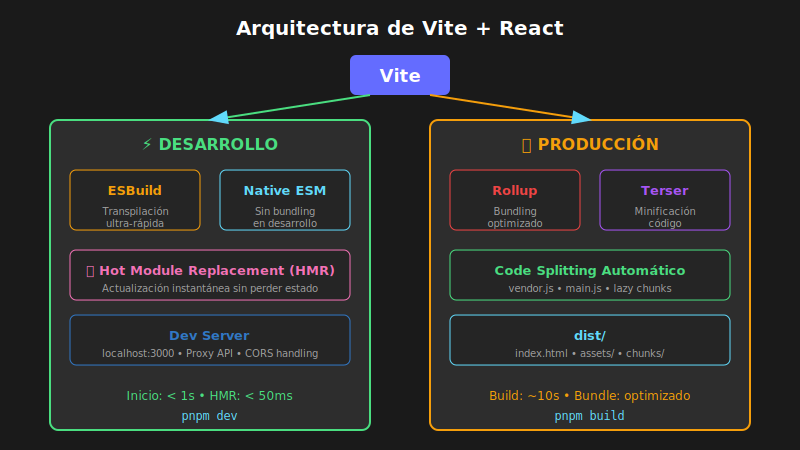

# 📘 Configuración de Vite

## 🎯 Objetivos

- Entender la arquitectura de Vite
- Configurar vite.config.ts para proyectos React
- Optimizar desarrollo y producción
- Usar variables de entorno correctamente

---

## 1. ¿Qué es Vite?



**Vite** (pronunciado "vit", francés para "rápido") es un build tool moderno que ofrece:

- ⚡ **Servidor de desarrollo ultrarrápido** con Hot Module Replacement (HMR)
- 📦 **Build optimizado** con Rollup
- 🔧 **Configuración mínima** pero extensible
- 📝 **Soporte nativo para TypeScript**

### Comparación con Create React App

| Característica   | Vite             | Create React App |
| ---------------- | ---------------- | ---------------- |
| Tiempo de inicio | < 1 segundo      | 10-30 segundos   |
| HMR              | Instantáneo      | 1-5 segundos     |
| Configuración    | vite.config.ts   | Eject necesario  |
| Build tool       | Rollup (ESBuild) | Webpack          |
| Tamaño bundle    | Más pequeño      | Más grande       |

---

## 2. Estructura de Proyecto Vite + React

```
mi-proyecto/
├── public/               # Archivos estáticos (no procesados)
│   ├── favicon.ico
│   └── robots.txt
├── src/
│   ├── assets/          # Importados en código (procesados)
│   │   └── logo.svg
│   ├── components/
│   ├── hooks/
│   ├── App.tsx
│   ├── main.tsx         # Punto de entrada
│   └── vite-env.d.ts    # Tipos de Vite
├── index.html           # ← En la raíz (no en public)
├── package.json
├── tsconfig.json
├── tsconfig.node.json   # Para vite.config.ts
└── vite.config.ts       # Configuración de Vite
```

### index.html en la raíz

```html
<!DOCTYPE html>
<html lang="es">
  <head>
    <meta charset="UTF-8" />
    <link
      rel="icon"
      type="image/svg+xml"
      href="/vite.svg" />
    <meta
      name="viewport"
      content="width=device-width, initial-scale=1.0" />
    <title>Mi App React</title>
  </head>
  <body>
    <div id="root"></div>
    <!-- Vite inyecta el script automáticamente -->
    <script
      type="module"
      src="/src/main.tsx"></script>
  </body>
</html>
```

---

## 3. vite.config.ts Básico

```typescript
// ============================================
// QUÉ: Configuración mínima de Vite para React
// PARA: Iniciar un proyecto React con TypeScript rápidamente
// IMPACTO: Servidor de desarrollo funcionando en segundos
// ============================================

import { defineConfig } from 'vite';
import react from '@vitejs/plugin-react';

export default defineConfig({
  // Plugin de React (requerido)
  plugins: [react()],
});
```

---

## 4. Configuración Completa

```typescript
// ============================================
// QUÉ: Configuración avanzada de Vite con todas las opciones
// PARA: Proyectos de producción con alias, proxy, optimizaciones
// IMPACTO: Control total sobre desarrollo y build
// ============================================

import { defineConfig, loadEnv } from 'vite';
import react from '@vitejs/plugin-react';
import path from 'path';

export default defineConfig(({ command, mode }) => {
  // Cargar variables de entorno
  const env = loadEnv(mode, process.cwd(), '');

  return {
    // 1️⃣ PLUGINS
    plugins: [
      react({
        // Opciones de Fast Refresh
        fastRefresh: true,
        // JSX runtime automático (React 17+)
        jsxRuntime: 'automatic',
      }),
    ],

    // 2️⃣ ALIAS DE RUTAS
    resolve: {
      alias: {
        '@': path.resolve(__dirname, './src'),
        '@components': path.resolve(__dirname, './src/components'),
        '@hooks': path.resolve(__dirname, './src/hooks'),
        '@utils': path.resolve(__dirname, './src/utils'),
        '@assets': path.resolve(__dirname, './src/assets'),
        '@types': path.resolve(__dirname, './src/types'),
      },
    },

    // 3️⃣ SERVIDOR DE DESARROLLO
    server: {
      port: 3000,
      open: true, // Abrir navegador automáticamente
      cors: true,
      strictPort: true, // Fallar si puerto ocupado

      // Proxy para API (evitar CORS en desarrollo)
      proxy: {
        '/api': {
          target: env.VITE_API_URL || 'http://localhost:8080',
          changeOrigin: true,
          rewrite: (path) => path.replace(/^\/api/, ''),
        },
      },

      // Watch para archivos extra
      watch: {
        usePolling: true, // Útil en Docker
      },
    },

    // 4️⃣ BUILD DE PRODUCCIÓN
    build: {
      outDir: 'dist',
      sourcemap: mode !== 'production',
      minify: 'terser',

      // Chunk splitting
      rollupOptions: {
        output: {
          manualChunks: {
            // Separar vendors grandes
            vendor: ['react', 'react-dom'],
            // Separar librerías de UI
            // ui: ['@headlessui/react', 'framer-motion'],
          },
        },
      },

      // Tamaño de chunks
      chunkSizeWarningLimit: 500,
    },

    // 5️⃣ PREVIEW (sirve build de producción)
    preview: {
      port: 4173,
      open: true,
    },

    // 6️⃣ OPTIMIZACIÓN DE DEPENDENCIAS
    optimizeDeps: {
      include: ['react', 'react-dom'],
      // Excluir si causan problemas
      // exclude: ['some-package'],
    },

    // 7️⃣ CSS
    css: {
      modules: {
        localsConvention: 'camelCase',
      },
      preprocessorOptions: {
        scss: {
          additionalData: `@import "@/styles/variables.scss";`,
        },
      },
    },

    // 8️⃣ DEFINICIÓN DE CONSTANTES GLOBALES
    define: {
      __APP_VERSION__: JSON.stringify(process.env.npm_package_version),
    },

    // 9️⃣ ESBUILD (transpilación)
    esbuild: {
      // Eliminar console.log en producción
      drop: mode === 'production' ? ['console', 'debugger'] : [],
    },
  };
});
```

---

## 5. Alias de Rutas con TypeScript

Para que TypeScript reconozca los alias, actualizar `tsconfig.json`:

```json
{
  "compilerOptions": {
    "baseUrl": ".",
    "paths": {
      "@/*": ["src/*"],
      "@components/*": ["src/components/*"],
      "@hooks/*": ["src/hooks/*"],
      "@utils/*": ["src/utils/*"],
      "@assets/*": ["src/assets/*"],
      "@types/*": ["src/types/*"]
    }
  }
}
```

### Uso de Alias

```tsx
// ❌ Sin alias
import { Button } from '../../../components/ui/Button';
import { useAuth } from '../../../hooks/useAuth';

// ✅ Con alias
import { Button } from '@components/ui/Button';
import { useAuth } from '@hooks/useAuth';
```

---

## 6. Variables de Entorno

### Archivos de Entorno

```
mi-proyecto/
├── .env                  # Siempre cargado
├── .env.local            # Siempre cargado, ignorado por git
├── .env.development      # Solo en dev
├── .env.development.local
├── .env.production       # Solo en build
└── .env.production.local
```

### Prefijo VITE\_

```bash
# .env
# ❌ No accesible en cliente (sin prefijo)
SECRET_KEY=mi-secreto

# ✅ Accesible en cliente
VITE_API_URL=https://api.example.com
VITE_APP_TITLE=Mi Aplicación
VITE_ENABLE_ANALYTICS=true
```

### Uso en Código

```typescript
// ============================================
// QUÉ: Acceso a variables de entorno en React con Vite
// PARA: Configurar URLs de API, feature flags, etc.
// IMPACTO: Diferentes configuraciones por ambiente (dev/prod)
// ============================================

// Acceder a variables
const apiUrl = import.meta.env.VITE_API_URL;
const appTitle = import.meta.env.VITE_APP_TITLE;

// Variables especiales de Vite
const isDev = import.meta.env.DEV;        // true en desarrollo
const isProd = import.meta.env.PROD;       // true en producción
const mode = import.meta.env.MODE;         // 'development' | 'production'
const baseUrl = import.meta.env.BASE_URL;  // '/'

// Ejemplo en componente
const ApiConfig: React.FC = () => {
  return (
    <div>
      <p>API: {import.meta.env.VITE_API_URL}</p>
      <p>Modo: {import.meta.env.MODE}</p>
      {import.meta.env.DEV && <p>⚠️ Modo desarrollo</p>}
    </div>
  );
};
```

### Tipos para Variables de Entorno

```typescript
// src/vite-env.d.ts
/// <reference types="vite/client" />

interface ImportMetaEnv {
  readonly VITE_API_URL: string;
  readonly VITE_APP_TITLE: string;
  readonly VITE_ENABLE_ANALYTICS: string;
  // Agregar más variables según necesites
}

interface ImportMeta {
  readonly env: ImportMetaEnv;
}
```

---

## 7. Scripts de Package.json

```json
{
  "scripts": {
    "dev": "vite",
    "build": "tsc && vite build",
    "preview": "vite preview",
    "lint": "eslint . --ext ts,tsx --report-unused-disable-directives --max-warnings 0",
    "type-check": "tsc --noEmit",

    "// Modos personalizados": "",
    "dev:staging": "vite --mode staging",
    "build:staging": "tsc && vite build --mode staging",

    "// Análisis": "",
    "build:analyze": "vite build --mode production && npx vite-bundle-visualizer"
  }
}
```

---

## 8. Proxy para APIs

```typescript
// ============================================
// QUÉ: Configuración de proxy para APIs en desarrollo
// PARA: Evitar errores CORS al llamar a APIs externas
// IMPACTO: Desarrollo local sin configurar CORS en el backend
// ============================================

export default defineConfig({
  server: {
    proxy: {
      // Proxy simple
      '/api': 'http://localhost:8080',

      // Proxy con opciones
      '/api': {
        target: 'http://localhost:8080',
        changeOrigin: true,
        secure: false,
        rewrite: (path) => path.replace(/^\/api/, ''),
        configure: (proxy, options) => {
          proxy.on('proxyReq', (proxyReq, req, res) => {
            console.log('Proxy request:', req.url);
          });
        },
      },

      // WebSocket proxy
      '/socket.io': {
        target: 'ws://localhost:8080',
        ws: true,
      },
    },
  },
});
```

### Uso en Código

```typescript
// En desarrollo: /api/users → http://localhost:8080/users
// En producción: /api/users → tu-dominio.com/api/users

const fetchUsers = async () => {
  // Usa ruta relativa, el proxy maneja el resto
  const response = await fetch('/api/users');
  return response.json();
};
```

---

## 9. Importación de Assets

### Imágenes y SVG

```tsx
// Importación directa (incluido en bundle)
import logo from '@assets/logo.svg';
import heroImage from '@assets/hero.png';

const Header: React.FC = () => (
  <header>
    
    
  </header>
);

// SVG como componente React
import { ReactComponent as Logo } from '@assets/logo.svg'; // ❌ No funciona en Vite

// ✅ Usar vite-plugin-svgr para SVG como componentes
import Logo from '@assets/logo.svg?react';

const Header: React.FC = () => (
  <header>
    <Logo className="logo" />
  </header>
);
```

### URL de Assets

```tsx
// Obtener URL del asset
const imageUrl = new URL('./image.png', import.meta.url).href;

// Assets en carpeta public (no procesados)
const publicImage = '/images/hero.jpg'; // → public/images/hero.jpg
```

---

## 10. Configuración para Docker

```typescript
// ============================================
// QUÉ: Configuración de Vite para contenedores Docker
// PARA: Desarrollo con hot-reload dentro de contenedores
// IMPACTO: Entorno de desarrollo consistente entre equipos
// ============================================

export default defineConfig({
  server: {
    host: '0.0.0.0', // Accesible desde fuera del contenedor
    port: 3000,
    watch: {
      usePolling: true, // Necesario para Docker en algunos sistemas
    },
  },
});
```

### Dockerfile Multi-Stage

```dockerfile
# Stage 1: Build
FROM node:20-alpine AS builder

WORKDIR /app
COPY package.json pnpm-lock.yaml ./
RUN corepack enable && pnpm install --frozen-lockfile

COPY . .
RUN pnpm build

# Stage 2: Serve con Nginx
FROM nginx:alpine AS production

COPY --from=builder /app/dist /usr/share/nginx/html
COPY nginx.conf /etc/nginx/conf.d/default.conf

EXPOSE 80
CMD ["nginx", "-g", "daemon off;"]
```

---

## 11. Plugins Útiles

```typescript
// ============================================
// QUÉ: Plugins recomendados para Vite + React + TypeScript
// PARA: Extender funcionalidad (SVG, type-checking, etc.)
// IMPACTO: Mejor DX con validación en tiempo real
// ============================================

import { defineConfig } from 'vite';
import react from '@vitejs/plugin-react';
import svgr from 'vite-plugin-svgr';
import checker from 'vite-plugin-checker';

export default defineConfig({
  plugins: [
    // React con Fast Refresh
    react(),

    // SVG como componentes React
    svgr({
      svgrOptions: {
        icon: true,
      },
    }),

    // Type checking en tiempo real
    checker({
      typescript: true,
      eslint: {
        lintCommand: 'eslint "./src/**/*.{ts,tsx}"',
      },
    }),
  ],
});
```

### Instalación de Plugins

```bash
# Instalar plugins
pnpm add -D vite-plugin-svgr vite-plugin-checker
```

---

## 📚 Recursos Adicionales

- [Vite Documentation](https://vitejs.dev/)
- [Vite Plugin React](https://github.com/vitejs/vite-plugin-react)
- [Awesome Vite](https://github.com/vitejs/awesome-vite)

---

## ✅ Checklist de Comprensión

- [ ] Entiendo la estructura de un proyecto Vite
- [ ] Sé configurar alias de rutas
- [ ] Conozco el sistema de variables de entorno
- [ ] Puedo configurar un proxy para APIs
- [ ] Sé optimizar el build de producción

---

_Final de la teoría · Semana 06_
