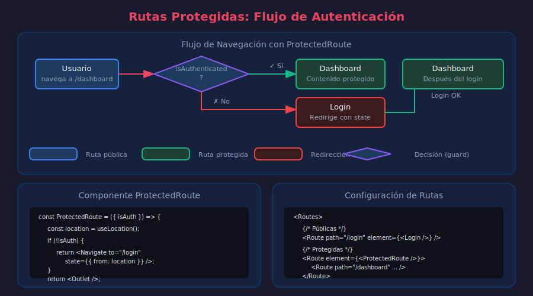

# 📘 Rutas Protegidas y Autenticación

## 🎯 Objetivos

- Implementar guards para rutas protegidas
- Redirigir usuarios no autenticados
- Manejar roles y permisos
- Crear flujos de autenticación completos

---

## 1. Concepto de Rutas Protegidas



### ¿Por Qué Proteger Rutas?

Algunas páginas solo deben ser accesibles para:

- Usuarios autenticados (dashboard, perfil, settings)
- Usuarios con roles específicos (admin panel)
- Usuarios que cumplen condiciones (onboarding completado)

```
Usuario no autenticado → /dashboard → Redirigir a /login
Usuario autenticado   → /dashboard → Mostrar dashboard
Usuario sin rol admin → /admin     → Redirigir a /unauthorized
```

---

## 2. Componente ProtectedRoute

```tsx
// ============================================
// QUÉ: Componente que protege rutas verificando autenticación
// PARA: Redirigir usuarios no autenticados al login
// IMPACTO: Seguridad en el cliente (complementa seguridad del servidor)
// ============================================

import { Navigate, Outlet, useLocation } from 'react-router-dom';

interface ProtectedRouteProps {
  isAuthenticated: boolean;
  redirectPath?: string;
  children?: React.ReactNode;
}

const ProtectedRoute: React.FC<ProtectedRouteProps> = ({
  isAuthenticated,
  redirectPath = '/login',
  children,
}) => {
  const location = useLocation();

  if (!isAuthenticated) {
    // Guardar la ubicación intentada para redirigir después del login
    return (
      <Navigate
        to={redirectPath}
        state={{ from: location.pathname }}
        replace
      />
    );
  }

  // Si hay children, renderizarlos; si no, usar Outlet para rutas anidadas
  return children ? <>{children}</> : <Outlet />;
};

export { ProtectedRoute };
```

### Uso Básico

```tsx
// ============================================
// QUÉ: Proteger rutas con el componente ProtectedRoute
// PARA: Solo usuarios autenticados acceden a ciertas páginas
// IMPACTO: Flujo de autenticación controlado
// ============================================

import { Routes, Route } from 'react-router-dom';
import { ProtectedRoute } from './components/ProtectedRoute';
import { useAuth } from './hooks/useAuth';

const App: React.FC = () => {
  const { isAuthenticated } = useAuth();

  return (
    <Routes>
      {/* Rutas públicas */}
      <Route
        path="/"
        element={<HomePage />}
      />
      <Route
        path="/login"
        element={<LoginPage />}
      />
      <Route
        path="/register"
        element={<RegisterPage />}
      />

      {/* Rutas protegidas */}
      <Route element={<ProtectedRoute isAuthenticated={isAuthenticated} />}>
        <Route
          path="/dashboard"
          element={<DashboardPage />}
        />
        <Route
          path="/profile"
          element={<ProfilePage />}
        />
        <Route
          path="/settings"
          element={<SettingsPage />}
        />
      </Route>
    </Routes>
  );
};
```

---

## 3. Hook useAuth

```tsx
// ============================================
// QUÉ: Hook para manejar estado de autenticación
// PARA: Centralizar lógica de auth en toda la aplicación
// IMPACTO: Un solo lugar para login, logout, verificación
// ============================================

import {
  createContext,
  useContext,
  useState,
  useCallback,
  useMemo,
} from 'react';

interface User {
  id: number;
  email: string;
  name: string;
  role: 'user' | 'admin';
}

interface AuthContextType {
  user: User | null;
  isAuthenticated: boolean;
  isLoading: boolean;
  login: (email: string, password: string) => Promise<void>;
  logout: () => void;
  checkAuth: () => Promise<void>;
}

const AuthContext = createContext<AuthContextType | null>(null);

const AuthProvider: React.FC<{ children: React.ReactNode }> = ({
  children,
}) => {
  const [user, setUser] = useState<User | null>(null);
  const [isLoading, setIsLoading] = useState(true);

  const isAuthenticated = useMemo(() => user !== null, [user]);

  const login = useCallback(async (email: string, password: string) => {
    setIsLoading(true);
    try {
      const response = await fetch('/api/login', {
        method: 'POST',
        headers: { 'Content-Type': 'application/json' },
        body: JSON.stringify({ email, password }),
      });

      if (!response.ok) {
        throw new Error('Credenciales inválidas');
      }

      const { user, token } = await response.json();
      localStorage.setItem('token', token);
      setUser(user);
    } finally {
      setIsLoading(false);
    }
  }, []);

  const logout = useCallback(() => {
    localStorage.removeItem('token');
    setUser(null);
  }, []);

  const checkAuth = useCallback(async () => {
    const token = localStorage.getItem('token');
    if (!token) {
      setIsLoading(false);
      return;
    }

    try {
      const response = await fetch('/api/me', {
        headers: { Authorization: `Bearer ${token}` },
      });

      if (response.ok) {
        const user = await response.json();
        setUser(user);
      } else {
        localStorage.removeItem('token');
      }
    } catch {
      localStorage.removeItem('token');
    } finally {
      setIsLoading(false);
    }
  }, []);

  const value = useMemo(
    () => ({ user, isAuthenticated, isLoading, login, logout, checkAuth }),
    [user, isAuthenticated, isLoading, login, logout, checkAuth],
  );

  return <AuthContext.Provider value={value}>{children}</AuthContext.Provider>;
};

const useAuth = (): AuthContextType => {
  const context = useContext(AuthContext);
  if (!context) {
    throw new Error('useAuth debe usarse dentro de AuthProvider');
  }
  return context;
};

export { AuthProvider, useAuth };
```

---

## 4. Redirección Post-Login

```tsx
// ============================================
// QUÉ: Redirigir al usuario a donde intentaba ir después del login
// PARA: UX fluida, el usuario no pierde su destino
// IMPACTO: Experiencia sin fricciones
// ============================================

import { useLocation, useNavigate } from 'react-router-dom';
import { useAuth } from '../hooks/useAuth';

interface LocationState {
  from?: string;
}

const LoginPage: React.FC = () => {
  const { login, isLoading } = useAuth();
  const navigate = useNavigate();
  const location = useLocation();

  // Obtener la ruta desde donde fue redirigido
  const state = location.state as LocationState;
  const from = state?.from || '/dashboard';

  const handleSubmit = async (e: React.FormEvent<HTMLFormElement>) => {
    e.preventDefault();
    const formData = new FormData(e.currentTarget);
    const email = formData.get('email') as string;
    const password = formData.get('password') as string;

    try {
      await login(email, password);
      // Redirigir a donde el usuario quería ir
      navigate(from, { replace: true });
    } catch (error) {
      console.error('Login failed:', error);
    }
  };

  return (
    <div className="login-page">
      <h1>Iniciar Sesión</h1>

      {from !== '/dashboard' && (
        <p className="info">
          Inicia sesión para acceder a <code>{from}</code>
        </p>
      )}

      <form onSubmit={handleSubmit}>
        <input
          name="email"
          type="email"
          placeholder="Email"
          required
        />
        <input
          name="password"
          type="password"
          placeholder="Contraseña"
          required
        />
        <button
          type="submit"
          disabled={isLoading}>
          {isLoading ? 'Cargando...' : 'Entrar'}
        </button>
      </form>
    </div>
  );
};
```

---

## 5. Protección por Roles

```tsx
// ============================================
// QUÉ: Componente que verifica roles específicos
// PARA: Páginas de admin, moderador, etc.
// IMPACTO: Control granular de acceso
// ============================================

import { Navigate, Outlet, useLocation } from 'react-router-dom';
import { useAuth } from '../hooks/useAuth';

type Role = 'user' | 'admin' | 'moderator';

interface RoleProtectedRouteProps {
  allowedRoles: Role[];
  redirectPath?: string;
}

const RoleProtectedRoute: React.FC<RoleProtectedRouteProps> = ({
  allowedRoles,
  redirectPath = '/unauthorized',
}) => {
  const { user, isAuthenticated } = useAuth();
  const location = useLocation();

  // Primero verificar autenticación
  if (!isAuthenticated) {
    return (
      <Navigate
        to="/login"
        state={{ from: location.pathname }}
        replace
      />
    );
  }

  // Luego verificar rol
  if (!user || !allowedRoles.includes(user.role)) {
    return (
      <Navigate
        to={redirectPath}
        replace
      />
    );
  }

  return <Outlet />;
};

export { RoleProtectedRoute };
```

### Uso con Roles

```tsx
// ============================================
// QUÉ: Configuración de rutas con diferentes niveles de acceso
// PARA: Separar acceso por tipo de usuario
// IMPACTO: Estructura de permisos clara
// ============================================

import { Routes, Route } from 'react-router-dom';
import { ProtectedRoute } from './components/ProtectedRoute';
import { RoleProtectedRoute } from './components/RoleProtectedRoute';

const App: React.FC = () => {
  const { isAuthenticated } = useAuth();

  return (
    <Routes>
      {/* Públicas */}
      <Route
        path="/"
        element={<HomePage />}
      />
      <Route
        path="/login"
        element={<LoginPage />}
      />

      {/* Requiere autenticación (cualquier usuario) */}
      <Route element={<ProtectedRoute isAuthenticated={isAuthenticated} />}>
        <Route
          path="/dashboard"
          element={<DashboardPage />}
        />
        <Route
          path="/profile"
          element={<ProfilePage />}
        />
      </Route>

      {/* Solo admin */}
      <Route element={<RoleProtectedRoute allowedRoles={['admin']} />}>
        <Route
          path="/admin"
          element={<AdminLayout />}>
          <Route
            index
            element={<AdminDashboard />}
          />
          <Route
            path="users"
            element={<AdminUsers />}
          />
          <Route
            path="settings"
            element={<AdminSettings />}
          />
        </Route>
      </Route>

      {/* Admin o moderador */}
      <Route
        element={<RoleProtectedRoute allowedRoles={['admin', 'moderator']} />}>
        <Route
          path="/moderation"
          element={<ModerationPage />}
        />
      </Route>

      {/* Página de acceso denegado */}
      <Route
        path="/unauthorized"
        element={<UnauthorizedPage />}
      />

      {/* 404 */}
      <Route
        path="*"
        element={<NotFoundPage />}
      />
    </Routes>
  );
};
```

---

## 6. Loading State durante Verificación

```tsx
// ============================================
// QUÉ: Mostrar loading mientras se verifica autenticación
// PARA: Evitar flash de contenido incorrecto
// IMPACTO: UX suave sin parpadeos
// ============================================

import { Navigate, Outlet, useLocation } from 'react-router-dom';
import { useAuth } from '../hooks/useAuth';

const ProtectedRoute: React.FC = () => {
  const { isAuthenticated, isLoading } = useAuth();
  const location = useLocation();

  // Mostrar loading mientras se verifica
  if (isLoading) {
    return (
      <div className="loading-screen">
        <div className="spinner" />
        <p>Verificando autenticación...</p>
      </div>
    );
  }

  if (!isAuthenticated) {
    return (
      <Navigate
        to="/login"
        state={{ from: location.pathname }}
        replace
      />
    );
  }

  return <Outlet />;
};
```

### Verificación al Iniciar la App

```tsx
// ============================================
// QUÉ: Verificar token al cargar la aplicación
// PARA: Mantener sesión si hay token válido
// IMPACTO: Usuario no necesita re-autenticarse
// ============================================

// src/App.tsx
import { useEffect } from 'react';
import { useAuth } from './hooks/useAuth';
import { AppRoutes } from './routes/AppRoutes';

const App: React.FC = () => {
  const { checkAuth, isLoading } = useAuth();

  useEffect(() => {
    checkAuth();
  }, [checkAuth]);

  if (isLoading) {
    return (
      <div className="app-loading">
        <div className="spinner" />
        <p>Cargando aplicación...</p>
      </div>
    );
  }

  return <AppRoutes />;
};

export default App;
```

---

## 7. Rutas Públicas Solo para No Autenticados

```tsx
// ============================================
// QUÉ: Redirigir usuarios autenticados fuera de login/register
// PARA: Evitar que usuarios logueados vean páginas de auth
// IMPACTO: Flujo lógico de navegación
// ============================================

import { Navigate, Outlet } from 'react-router-dom';
import { useAuth } from '../hooks/useAuth';

interface PublicOnlyRouteProps {
  redirectPath?: string;
}

const PublicOnlyRoute: React.FC<PublicOnlyRouteProps> = ({
  redirectPath = '/dashboard',
}) => {
  const { isAuthenticated, isLoading } = useAuth();

  if (isLoading) {
    return <div className="loading">Cargando...</div>;
  }

  // Si ya está autenticado, redirigir al dashboard
  if (isAuthenticated) {
    return (
      <Navigate
        to={redirectPath}
        replace
      />
    );
  }

  return <Outlet />;
};

export { PublicOnlyRoute };

// Uso
const App: React.FC = () => (
  <Routes>
    {/* Solo para usuarios NO autenticados */}
    <Route element={<PublicOnlyRoute />}>
      <Route
        path="/login"
        element={<LoginPage />}
      />
      <Route
        path="/register"
        element={<RegisterPage />}
      />
      <Route
        path="/forgot-password"
        element={<ForgotPasswordPage />}
      />
    </Route>

    {/* Solo para usuarios autenticados */}
    <Route element={<ProtectedRoute />}>
      <Route
        path="/dashboard"
        element={<DashboardPage />}
      />
    </Route>
  </Routes>
);
```

---

## 8. Ejemplo Completo

```tsx
// ============================================
// QUÉ: Aplicación completa con autenticación
// PARA: Ver todos los conceptos integrados
// IMPACTO: Base para aplicaciones con auth real
// ============================================

// src/App.tsx
import { Routes, Route } from 'react-router-dom';
import { AuthProvider, useAuth } from './hooks/useAuth';
import { ProtectedRoute } from './components/ProtectedRoute';
import { PublicOnlyRoute } from './components/PublicOnlyRoute';
import { RoleProtectedRoute } from './components/RoleProtectedRoute';
import {
  MainLayout,
  AuthLayout,
  DashboardLayout,
  AdminLayout,
} from './layouts';
import {
  HomePage,
  LoginPage,
  RegisterPage,
  DashboardPage,
  ProfilePage,
  AdminPage,
  UnauthorizedPage,
  NotFoundPage,
} from './pages';
import { useEffect } from 'react';

const AppContent: React.FC = () => {
  const { checkAuth, isLoading, isAuthenticated } = useAuth();

  useEffect(() => {
    checkAuth();
  }, [checkAuth]);

  if (isLoading) {
    return <div className="app-loading">Cargando...</div>;
  }

  return (
    <Routes>
      {/* Páginas públicas */}
      <Route element={<MainLayout />}>
        <Route
          path="/"
          element={<HomePage />}
        />
      </Route>

      {/* Auth (solo no autenticados) */}
      <Route element={<PublicOnlyRoute />}>
        <Route element={<AuthLayout />}>
          <Route
            path="/login"
            element={<LoginPage />}
          />
          <Route
            path="/register"
            element={<RegisterPage />}
          />
        </Route>
      </Route>

      {/* Dashboard (requiere auth) */}
      <Route element={<ProtectedRoute isAuthenticated={isAuthenticated} />}>
        <Route element={<DashboardLayout />}>
          <Route
            path="/dashboard"
            element={<DashboardPage />}
          />
          <Route
            path="/profile"
            element={<ProfilePage />}
          />
        </Route>
      </Route>

      {/* Admin (requiere rol admin) */}
      <Route element={<RoleProtectedRoute allowedRoles={['admin']} />}>
        <Route
          path="/admin"
          element={<AdminLayout />}>
          <Route
            index
            element={<AdminPage />}
          />
        </Route>
      </Route>

      {/* Páginas de error */}
      <Route
        path="/unauthorized"
        element={<UnauthorizedPage />}
      />
      <Route
        path="*"
        element={<NotFoundPage />}
      />
    </Routes>
  );
};

const App: React.FC = () => (
  <AuthProvider>
    <AppContent />
  </AuthProvider>
);

export default App;
```

---

## 📚 Recursos Adicionales

- [React Router Auth Example](https://reactrouter.com/en/main/start/examples)
- [Navigate Component](https://reactrouter.com/en/main/components/navigate)
- [Protected Routes Pattern](https://ui.dev/react-router-protected-routes-authentication)

---

## ✅ Checklist de Comprensión

- [ ] Entiendo el patrón de ProtectedRoute
- [ ] Sé redirigir usuarios no autenticados
- [ ] Puedo implementar protección por roles
- [ ] Entiendo el flujo de redirección post-login
- [ ] Sé manejar loading states durante verificación

---

_Final de la teoría · Semana 07_
