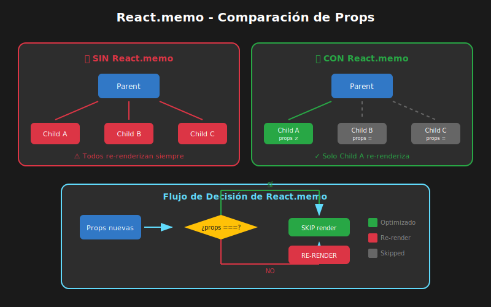

# 02 - React.memo y Comparación de Props

## 🎯 Objetivos de Aprendizaje

- Comprender qué es `React.memo` y cuándo usarlo
- Implementar comparadores personalizados
- Conocer las limitaciones de `React.memo`
- Aplicar el patrón correctamente

---

## 📖 ¿Qué es React.memo?

`React.memo` es un **Higher-Order Component (HOC)** que memoriza el resultado de un componente. Si las props no cambian, React reutiliza el resultado anterior en lugar de re-renderizar.

```typescript
// Sintaxis básica
const MemoizedComponent = React.memo(OriginalComponent);

// Con TypeScript
const MemoizedComponent = React.memo<Props>(OriginalComponent);
```

### Antes y Después



**Sin React.memo:**

| Componente | Props      | Resultado |
| ---------- | ---------- | --------- |
| Child A    | Cualquiera | RE-RENDER |
| Child B    | Cualquiera | RE-RENDER |
| Child C    | Cualquiera | RE-RENDER |

> Todos los hijos re-renderizan cuando el padre re-renderiza.

**Con React.memo:**

| Componente | Props     | Resultado |
| ---------- | --------- | --------- |
| Child A    | Cambiaron | RE-RENDER |
| Child B    | Iguales   | SKIP ✅   |
| Child C    | Iguales   | SKIP ✅   |

> Solo re-renderiza si las props realmente cambiaron.

---

## 🔧 Implementación Básica

### Ejemplo: Lista de Productos

```typescript
import { memo, useState } from 'react';

// ==============================================
// TIPOS
// ==============================================
interface Product {
  id: number;
  name: string;
  price: number;
}

interface ProductItemProps {
  product: Product;
  onSelect: (id: number) => void;
}

// ==============================================
// COMPONENTE SIN MEMORIZAR
// ==============================================
function ProductItem({ product, onSelect }: ProductItemProps) {
  console.log(`Renderizando: ${product.name}`);

  return (
    <li onClick={() => onSelect(product.id)}>
      {product.name} - ${product.price}
    </li>
  );
}

// ==============================================
// COMPONENTE MEMORIZADO
// ==============================================
const MemoizedProductItem = memo(function ProductItem({
  product,
  onSelect
}: ProductItemProps) {
  console.log(`Renderizando: ${product.name}`);

  return (
    <li onClick={() => onSelect(product.id)}>
      {product.name} - ${product.price}
    </li>
  );
});

// Alternativa: memorizar después de definir
// const MemoizedProductItem = memo(ProductItem);
```

### Uso en el Padre

```typescript
function ProductList() {
  const [products] = useState<Product[]>([
    { id: 1, name: 'Laptop', price: 999 },
    { id: 2, name: 'Mouse', price: 29 },
    { id: 3, name: 'Keyboard', price: 79 },
  ]);
  const [selectedId, setSelectedId] = useState<number | null>(null);

  // ⚠️ PROBLEMA: Esta función se recrea en cada render
  const handleSelect = (id: number) => {
    setSelectedId(id);
  };

  return (
    <div>
      <p>Seleccionado: {selectedId}</p>
      <ul>
        {products.map(product => (
          <MemoizedProductItem
            key={product.id}
            product={product}
            onSelect={handleSelect}  // ← Nueva referencia cada vez
          />
        ))}
      </ul>
    </div>
  );
}
```

### ⚠️ El Problema de las Funciones

```typescript
// En cada render del padre:
const handleSelect = (id: number) => { ... };

// React compara props:
// prevProps.onSelect === nextProps.onSelect
// false! (nueva referencia)

// Resultado: React.memo NO funciona
```

**Solución**: Usar `useCallback` (lo veremos en el siguiente tema).

---

## 🔍 Comparación Superficial vs Profunda

### Comparación Superficial (Por Defecto)

`React.memo` usa **comparación superficial** (shallow comparison):

```typescript
// Comparación superficial:
// - Primitivos: compara por valor
// - Objetos/Arrays: compara por referencia

const prevProps = { name: 'Ana', data: { age: 25 } };
const nextProps = { name: 'Ana', data: { age: 25 } };

// Primitivos: ✅ iguales
prevProps.name === nextProps.name; // true

// Objetos: ❌ diferentes referencias
prevProps.data === nextProps.data; // false (aunque contenido sea igual)

// Resultado: React.memo RE-RENDERIZA (props "diferentes")
```

### Ejemplo Visual

```
┌─────────────────────────────────────────────────────────────────┐
│                    COMPARACIÓN SUPERFICIAL                       │
├─────────────────────────────────────────────────────────────────┤
│                                                                  │
│   prevProps                    nextProps                         │
│   ─────────                    ─────────                         │
│                                                                  │
│   name: "Ana"  ══════════════  name: "Ana"     ✅ Igual         │
│                                                                  │
│   data: ──┐                    data: ──┐                         │
│           │                            │                         │
│           ▼                            ▼                         │
│   ┌─────────────┐              ┌─────────────┐                  │
│   │ { age: 25 } │              │ { age: 25 } │  ❌ Diferente    │
│   │ ref: 0x001  │              │ ref: 0x002  │     referencia   │
│   └─────────────┘              └─────────────┘                  │
│                                                                  │
│   Resultado: RE-RENDER (aunque el contenido sea igual)          │
│                                                                  │
└─────────────────────────────────────────────────────────────────┘
```

---

## 🎨 Comparador Personalizado

Puedes proporcionar una función de comparación personalizada:

```typescript
const MemoizedComponent = memo(Component, arePropsEqual);

// arePropsEqual(prevProps, nextProps) => boolean
// true = props iguales, NO re-renderizar
// false = props diferentes, SÍ re-renderizar
```

### Ejemplo: Comparación Profunda

```typescript
import { memo } from 'react';

interface UserCardProps {
  user: {
    id: number;
    name: string;
    email: string;
  };
  onEdit: (id: number) => void;
}

// Función de comparación personalizada
function areUserPropsEqual(
  prevProps: UserCardProps,
  nextProps: UserCardProps
): boolean {
  // Comparar solo el ID del usuario (si el ID no cambia, no re-renderizar)
  return prevProps.user.id === nextProps.user.id;
}

// Componente memorizado con comparador custom
const UserCard = memo(function UserCard({ user, onEdit }: UserCardProps) {
  console.log(`Renderizando UserCard: ${user.name}`);

  return (
    <div className="user-card">
      <h3>{user.name}</h3>
      <p>{user.email}</p>
      <button onClick={() => onEdit(user.id)}>Editar</button>
    </div>
  );
}, areUserPropsEqual);

export { UserCard };
```

### Ejemplo: Ignorar Ciertas Props

```typescript
interface ItemProps {
  item: Item;
  onDelete: (id: number) => void;
  onEdit: (id: number) => void;
  isHighlighted: boolean;
}

const MemoizedItem = memo(function Item({
  item,
  onDelete,
  onEdit,
  isHighlighted
}: ItemProps) {
  return (
    <div className={isHighlighted ? 'highlighted' : ''}>
      <span>{item.name}</span>
      <button onClick={() => onEdit(item.id)}>Editar</button>
      <button onClick={() => onDelete(item.id)}>Eliminar</button>
    </div>
  );
}, (prevProps, nextProps) => {
  // Solo re-renderizar si cambia el item o el highlight
  // Ignorar cambios en funciones (asumimos que hacen lo mismo)
  return (
    prevProps.item.id === nextProps.item.id &&
    prevProps.item.name === nextProps.item.name &&
    prevProps.isHighlighted === nextProps.isHighlighted
  );
});
```

---

## ⚠️ Limitaciones y Errores Comunes

### 1. Objetos/Arrays Inline en Props

```typescript
// ❌ MAL - Objeto nuevo en cada render
<MemoizedChild config={{ theme: 'dark', size: 'large' }} />

// ❌ MAL - Array nuevo en cada render
<MemoizedChild items={[1, 2, 3]} />

// ❌ MAL - Función nueva en cada render
<MemoizedChild onClick={() => console.log('click')} />

// ✅ BIEN - Objetos estables
const config = useMemo(() => ({ theme: 'dark', size: 'large' }), []);
<MemoizedChild config={config} />

// ✅ BIEN - Arrays estables
const items = useMemo(() => [1, 2, 3], []);
<MemoizedChild items={items} />

// ✅ BIEN - Funciones estables
const handleClick = useCallback(() => console.log('click'), []);
<MemoizedChild onClick={handleClick} />
```

### 2. Children como Props

```typescript
// ❌ PROBLEMA - children es un objeto nuevo cada render
<MemoizedCard>
  <p>Contenido</p>  {/* Nueva referencia cada vez */}
</MemoizedCard>

// El componente se re-renderiza aunque parezca igual
```

### 3. Context y Memo

```typescript
// ⚠️ React.memo NO previene re-renders por cambios de Context

const MemoizedComponent = memo(function Component() {
  // Si ThemeContext cambia, este componente RE-RENDERIZA
  // aunque tenga memo
  const theme = useContext(ThemeContext);
  return <div style={{ color: theme.primary }}>...</div>;
});
```

---

## 🎯 Cuándo Usar React.memo

### ✅ USAR cuando:

| Situación                                          | Ejemplo                                |
| -------------------------------------------------- | -------------------------------------- |
| Componentes que renderizan frecuentemente          | Items en una lista                     |
| Componentes con render costoso                     | Gráficos, tablas grandes               |
| Props primitivas o referencias estables            | `id`, `name`, funciones memorizadas    |
| El componente padre re-renderiza por otros motivos | Actualización de estado no relacionado |

### ❌ NO USAR cuando:

| Situación                                           | Razón                                     |
| --------------------------------------------------- | ----------------------------------------- |
| Componente siempre recibe props diferentes          | Memo añade overhead sin beneficio         |
| Render es muy rápido                                | Comparación puede ser más cara que render |
| Props incluyen funciones inline                     | Memo no funcionará sin useCallback        |
| El componente usa Context que cambia frecuentemente | Memo no previene re-renders por Context   |

---

## 📊 Medición del Impacto

### Antes de Optimizar

```typescript
function ProductList({ products }: { products: Product[] }) {
  console.time('ProductList render');

  const result = (
    <ul>
      {products.map(product => (
        <ProductItem key={product.id} product={product} />
      ))}
    </ul>
  );

  console.timeEnd('ProductList render');
  return result;
}
```

### Con Profiler API

```typescript
import { Profiler, ProfilerOnRenderCallback } from 'react';

const onRender: ProfilerOnRenderCallback = (
  id,
  phase,
  actualDuration,
  baseDuration,
  startTime,
  commitTime
) => {
  console.log({
    componente: id,
    fase: phase,
    duracionActual: `${actualDuration.toFixed(2)}ms`,
    duracionBase: `${baseDuration.toFixed(2)}ms`,
  });
};

function App() {
  return (
    <Profiler id="ProductList" onRender={onRender}>
      <ProductList products={products} />
    </Profiler>
  );
}
```

---

## 📝 Ejemplo Completo: Lista Optimizada

```typescript
import { memo, useState, useCallback } from 'react';

// ==============================================
// TIPOS
// ==============================================
interface Task {
  id: number;
  title: string;
  completed: boolean;
}

interface TaskItemProps {
  task: Task;
  onToggle: (id: number) => void;
  onDelete: (id: number) => void;
}

// ==============================================
// COMPONENTE ITEM MEMORIZADO
// ==============================================
const TaskItem = memo(function TaskItem({
  task,
  onToggle,
  onDelete
}: TaskItemProps) {
  console.log(`Renderizando: ${task.title}`);

  return (
    <li className={task.completed ? 'completed' : ''}>
      <input
        type="checkbox"
        checked={task.completed}
        onChange={() => onToggle(task.id)}
      />
      <span>{task.title}</span>
      <button onClick={() => onDelete(task.id)}>×</button>
    </li>
  );
});

// ==============================================
// COMPONENTE PADRE
// ==============================================
function TaskList() {
  const [tasks, setTasks] = useState<Task[]>([
    { id: 1, title: 'Aprender React.memo', completed: false },
    { id: 2, title: 'Practicar useMemo', completed: false },
    { id: 3, title: 'Dominar useCallback', completed: true },
  ]);

  // ✅ Funciones estables con useCallback
  const handleToggle = useCallback((id: number) => {
    setTasks(prev => prev.map(task =>
      task.id === id ? { ...task, completed: !task.completed } : task
    ));
  }, []);

  const handleDelete = useCallback((id: number) => {
    setTasks(prev => prev.filter(task => task.id !== id));
  }, []);

  return (
    <ul>
      {tasks.map(task => (
        <TaskItem
          key={task.id}
          task={task}
          onToggle={handleToggle}
          onDelete={handleDelete}
        />
      ))}
    </ul>
  );
}

export { TaskList };
```

---

## ✅ Checklist de Comprensión

- [ ] ¿Qué hace `React.memo`?
- [ ] ¿Qué tipo de comparación usa por defecto?
- [ ] ¿Cuándo necesitas un comparador personalizado?
- [ ] ¿Por qué las funciones inline rompen `React.memo`?
- [ ] ¿Cuándo NO deberías usar `React.memo`?

---

## 🔗 Siguiente

Ahora que entiendes `React.memo`, necesitas aprender cómo crear props estables con `useMemo` y `useCallback`.

➡️ [03 - useMemo y useCallback](03-usememo-usecallback.md)
