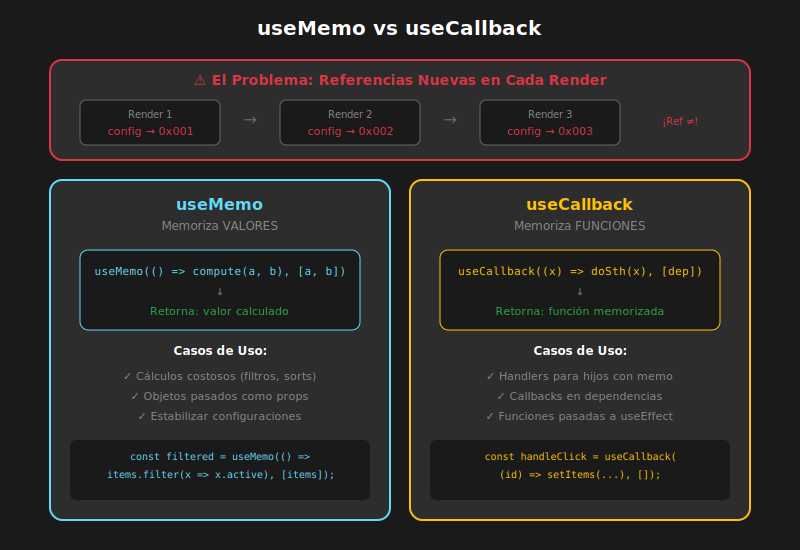

# 03 - useMemo y useCallback

## 🎯 Objetivos de Aprendizaje

- Comprender cuándo y por qué usar `useMemo`
- Dominar `useCallback` para estabilizar funciones
- Diferenciar entre ambos hooks
- Evitar errores comunes con dependencias

---

## 📖 El Problema que Resuelven



En React, cada render crea nuevas referencias para objetos, arrays y funciones:

```typescript
function Component() {
  // ⚠️ En CADA render:
  const config = { theme: 'dark' };     // Nueva referencia
  const items = [1, 2, 3];              // Nueva referencia
  const handleClick = () => {};         // Nueva referencia

  // Esto rompe React.memo en componentes hijos
  return <MemoizedChild config={config} onClick={handleClick} />;
}
```

**Problema de Referencias:**

| Variable      | Render 1                         | Render 2                         | ¿Iguales?             |
| ------------- | -------------------------------- | -------------------------------- | --------------------- |
| `config`      | `{ theme: 'dark' }` (ref: 0x001) | `{ theme: 'dark' }` (ref: 0x002) | ❌ No (diferente ref) |
| `handleClick` | `() => {}` (ref: 0x003)          | `() => {}` (ref: 0x004)          | ❌ No (diferente ref) |

> ⚠️ **Contenido igual, pero referencias diferentes!** React.memo ve props "diferentes" y causa RE-RENDER.

---

## 🧠 useMemo: Memorizar Valores

### Sintaxis

```typescript
const memoizedValue = useMemo(() => computeValue(a, b), [a, b]);
```

- **Primer argumento**: Función que calcula el valor
- **Segundo argumento**: Array de dependencias
- **Retorna**: El valor memorizado

### ¿Cuándo se Recalcula?

```typescript
const memoizedValue = useMemo(() => expensiveCalculation(data), [data]);

// Render 1: data = [1,2,3] → Calcula y guarda resultado
// Render 2: data = [1,2,3] → Misma referencia, retorna valor guardado
// Render 3: data = [1,2,3,4] → Nueva referencia, RECALCULA
```

### Caso de Uso 1: Cálculos Costosos

```typescript
interface Product {
  id: number;
  name: string;
  price: number;
  category: string;
}

function ProductDashboard({ products }: { products: Product[] }) {
  const [filter, setFilter] = useState('');
  const [sortBy, setSortBy] = useState<'name' | 'price'>('name');

  // ❌ SIN useMemo: Se recalcula en CADA render
  const processedProducts = products
    .filter(p => p.name.toLowerCase().includes(filter.toLowerCase()))
    .sort((a, b) => sortBy === 'price' ? a.price - b.price : a.name.localeCompare(b.name));

  // ✅ CON useMemo: Solo recalcula si cambian las dependencias
  const processedProducts = useMemo(() => {
    console.log('Procesando productos...');
    return products
      .filter(p => p.name.toLowerCase().includes(filter.toLowerCase()))
      .sort((a, b) =>
        sortBy === 'price'
          ? a.price - b.price
          : a.name.localeCompare(b.name)
      );
  }, [products, filter, sortBy]);

  return (
    <div>
      <input
        value={filter}
        onChange={e => setFilter(e.target.value)}
        placeholder="Buscar..."
      />
      <select value={sortBy} onChange={e => setSortBy(e.target.value as 'name' | 'price')}>
        <option value="name">Por nombre</option>
        <option value="price">Por precio</option>
      </select>
      <ProductList products={processedProducts} />
    </div>
  );
}
```

### Caso de Uso 2: Objetos como Props

```typescript
function Parent() {
  const [count, setCount] = useState(0);

  // ❌ SIN useMemo: MemoizedChild re-renderiza en cada click
  const config = { theme: 'dark', size: 'large' };

  // ✅ CON useMemo: config mantiene la misma referencia
  const config = useMemo(() => ({
    theme: 'dark',
    size: 'large'
  }), []); // Sin dependencias = nunca cambia

  return (
    <div>
      <button onClick={() => setCount(c => c + 1)}>
        Count: {count}
      </button>
      <MemoizedChild config={config} />
    </div>
  );
}
```

### Caso de Uso 3: Arrays Derivados

```typescript
function UserList({ users, departmentId }: Props) {
  // ✅ Solo recalcula cuando users o departmentId cambian
  const filteredUsers = useMemo(() => {
    return users.filter(user => user.departmentId === departmentId);
  }, [users, departmentId]);

  // ✅ Solo recalcula estadísticas cuando filteredUsers cambia
  const stats = useMemo(() => ({
    total: filteredUsers.length,
    active: filteredUsers.filter(u => u.active).length,
    avgAge: filteredUsers.reduce((sum, u) => sum + u.age, 0) / filteredUsers.length || 0,
  }), [filteredUsers]);

  return (
    <div>
      <Stats data={stats} />
      <List users={filteredUsers} />
    </div>
  );
}
```

---

## 🔧 useCallback: Memorizar Funciones

### Sintaxis

```typescript
const memoizedFunction = useCallback(
  (args) => {
    // lógica
  },
  [dependencies],
);
```

- **Primer argumento**: La función a memorizar
- **Segundo argumento**: Array de dependencias
- **Retorna**: La misma referencia de función entre renders

### Equivalencia con useMemo

```typescript
// useCallback es azúcar sintáctica para useMemo con funciones

// Esto:
const handleClick = useCallback(() => {
  console.log('clicked');
}, []);

// Es equivalente a:
const handleClick = useMemo(() => {
  return () => {
    console.log('clicked');
  };
}, []);
```

### Caso de Uso Principal: Props para Componentes Memorizados

```typescript
interface TodoItemProps {
  todo: Todo;
  onToggle: (id: number) => void;
  onDelete: (id: number) => void;
}

const TodoItem = memo(function TodoItem({
  todo,
  onToggle,
  onDelete
}: TodoItemProps) {
  console.log(`Renderizando: ${todo.text}`);
  return (
    <li>
      <input
        type="checkbox"
        checked={todo.completed}
        onChange={() => onToggle(todo.id)}
      />
      <span>{todo.text}</span>
      <button onClick={() => onDelete(todo.id)}>×</button>
    </li>
  );
});

function TodoList() {
  const [todos, setTodos] = useState<Todo[]>([]);
  const [filter, setFilter] = useState('all');

  // ✅ Funciones estables - no cambian entre renders
  const handleToggle = useCallback((id: number) => {
    setTodos(prev => prev.map(todo =>
      todo.id === id ? { ...todo, completed: !todo.completed } : todo
    ));
  }, []); // Sin dependencias porque usamos función de actualización

  const handleDelete = useCallback((id: number) => {
    setTodos(prev => prev.filter(todo => todo.id !== id));
  }, []);

  // Filtrar todos (con useMemo)
  const filteredTodos = useMemo(() => {
    switch (filter) {
      case 'active':
        return todos.filter(t => !t.completed);
      case 'completed':
        return todos.filter(t => t.completed);
      default:
        return todos;
    }
  }, [todos, filter]);

  return (
    <div>
      <FilterButtons filter={filter} onFilterChange={setFilter} />
      <ul>
        {filteredTodos.map(todo => (
          <TodoItem
            key={todo.id}
            todo={todo}
            onToggle={handleToggle}  // ✅ Referencia estable
            onDelete={handleDelete}   // ✅ Referencia estable
          />
        ))}
      </ul>
    </div>
  );
}
```

---

## 📊 Comparación: useMemo vs useCallback

| Aspecto                | useMemo                           | useCallback             |
| ---------------------- | --------------------------------- | ----------------------- |
| **Memoriza**           | Cualquier valor                   | Solo funciones          |
| **Ejecuta la función** | Sí, y guarda el resultado         | No, guarda la función   |
| **Uso principal**      | Cálculos costosos, objetos/arrays | Callbacks como props    |
| **Equivalente**        | `useMemo(() => fn, deps)`         | `useCallback(fn, deps)` |

---

## ⚠️ Errores Comunes y Soluciones

### Error 1: Dependencias Faltantes

```typescript
function SearchResults({ query, data }: Props) {
  // ❌ MAL: Falta 'data' en dependencias
  const results = useMemo(() => {
    return data.filter((item) => item.includes(query));
  }, [query]); // ← Falta 'data'

  // ✅ BIEN: Todas las dependencias incluidas
  const results = useMemo(() => {
    return data.filter((item) => item.includes(query));
  }, [query, data]);
}
```

### Error 2: Dependencias Innecesarias

```typescript
function Counter() {
  const [count, setCount] = useState(0);

  // ❌ MAL: 'count' en dependencias causa nueva función cada cambio
  const handleIncrement = useCallback(() => {
    setCount(count + 1);
  }, [count]); // ← Se recrea en cada incremento

  // ✅ BIEN: Usar función de actualización, sin dependencias
  const handleIncrement = useCallback(() => {
    setCount((prev) => prev + 1);
  }, []); // ← Estable para siempre
}
```

### Error 3: Usar useMemo/useCallback para Todo

```typescript
// ❌ MAL: Optimización prematura innecesaria
function SimpleComponent() {
  // Esto NO necesita useMemo
  const greeting = useMemo(() => 'Hola', []);

  // Esto NO necesita useCallback (no se pasa a componentes memorizados)
  const handleClick = useCallback(() => {
    console.log('clicked');
  }, []);

  return <button onClick={handleClick}>{greeting}</button>;
}

// ✅ BIEN: Simple y directo
function SimpleComponent() {
  const greeting = 'Hola';
  const handleClick = () => console.log('clicked');

  return <button onClick={handleClick}>{greeting}</button>;
}
```

### Error 4: Objetos en Dependencias

```typescript
function Component({ user }: { user: User }) {
  // ❌ PROBLEMA: user es objeto, puede tener nueva referencia aunque contenido sea igual
  const userGreeting = useMemo(() => {
    return `Hola, ${user.name}!`;
  }, [user]); // ← Se recalcula si user tiene nueva referencia

  // ✅ MEJOR: Depender de valores primitivos específicos
  const userGreeting = useMemo(() => {
    return `Hola, ${user.name}!`;
  }, [user.name]); // ← Solo recalcula si el nombre cambia
}
```

---

## 🎯 Reglas de Oro

### Cuándo usar useMemo

```typescript
// ✅ USAR para:

// 1. Cálculos costosos (O(n) o peor)
const sorted = useMemo(() =>
  [...items].sort((a, b) => a.value - b.value),
  [items]
);

// 2. Objetos pasados a componentes memorizados
const config = useMemo(() => ({ theme, size }), [theme, size]);
<MemoizedComponent config={config} />

// 3. Valores usados en dependencias de useEffect
const filters = useMemo(() => ({ min, max }), [min, max]);
useEffect(() => {
  fetchData(filters);
}, [filters]);
```

### Cuándo usar useCallback

```typescript
// ✅ USAR para:

// 1. Funciones pasadas a componentes memorizados
const handleClick = useCallback(() => {
  doSomething(id);
}, [id]);
<MemoizedButton onClick={handleClick} />

// 2. Funciones usadas en dependencias de useEffect
const fetchData = useCallback(async () => {
  const result = await api.get(`/data/${id}`);
  setData(result);
}, [id]);

useEffect(() => {
  fetchData();
}, [fetchData]);

// 3. Funciones pasadas a custom hooks que tienen dependencias
const handler = useCallback((event: Event) => {
  // ...
}, []);
useEventListener('resize', handler);
```

### Cuándo NO usar

```typescript
// ❌ NO USAR para:

// 1. Valores primitivos simples
const name = useMemo(() => 'John', []); // Innecesario

// 2. Cálculos triviales
const doubled = useMemo(() => count * 2, [count]); // Innecesario

// 3. Funciones que no se pasan como props a componentes memorizados
const logValue = useCallback(() => console.log(value), [value]); // Innecesario
```

---

## 📝 Ejemplo Completo: Dashboard Optimizado

```typescript
import { memo, useMemo, useCallback, useState } from 'react';

// ==============================================
// TIPOS
// ==============================================
interface Item {
  id: number;
  name: string;
  value: number;
  category: string;
}

interface ItemCardProps {
  item: Item;
  onEdit: (id: number) => void;
  onDelete: (id: number) => void;
}

interface StatsProps {
  total: number;
  average: number;
  max: number;
}

// ==============================================
// COMPONENTES MEMORIZADOS
// ==============================================
const ItemCard = memo(function ItemCard({
  item,
  onEdit,
  onDelete
}: ItemCardProps) {
  console.log(`Renderizando ItemCard: ${item.name}`);

  return (
    <div className="item-card">
      <h3>{item.name}</h3>
      <p>Valor: ${item.value}</p>
      <p>Categoría: {item.category}</p>
      <button onClick={() => onEdit(item.id)}>Editar</button>
      <button onClick={() => onDelete(item.id)}>Eliminar</button>
    </div>
  );
});

const Stats = memo(function Stats({ total, average, max }: StatsProps) {
  console.log('Renderizando Stats');

  return (
    <div className="stats">
      <div>Total items: {total}</div>
      <div>Promedio: ${average.toFixed(2)}</div>
      <div>Máximo: ${max}</div>
    </div>
  );
});

// ==============================================
// COMPONENTE PRINCIPAL
// ==============================================
function Dashboard() {
  const [items, setItems] = useState<Item[]>([
    { id: 1, name: 'Item A', value: 100, category: 'cat1' },
    { id: 2, name: 'Item B', value: 200, category: 'cat2' },
    { id: 3, name: 'Item C', value: 150, category: 'cat1' },
  ]);
  const [filter, setFilter] = useState('');
  const [selectedCategory, setSelectedCategory] = useState('all');

  // ✅ useMemo para filtrar items
  const filteredItems = useMemo(() => {
    console.log('Filtrando items...');
    return items.filter(item => {
      const matchesSearch = item.name.toLowerCase().includes(filter.toLowerCase());
      const matchesCategory = selectedCategory === 'all' || item.category === selectedCategory;
      return matchesSearch && matchesCategory;
    });
  }, [items, filter, selectedCategory]);

  // ✅ useMemo para calcular estadísticas
  const stats = useMemo(() => {
    console.log('Calculando estadísticas...');
    if (filteredItems.length === 0) {
      return { total: 0, average: 0, max: 0 };
    }

    const values = filteredItems.map(item => item.value);
    return {
      total: filteredItems.length,
      average: values.reduce((a, b) => a + b, 0) / values.length,
      max: Math.max(...values),
    };
  }, [filteredItems]);

  // ✅ useCallback para handlers estables
  const handleEdit = useCallback((id: number) => {
    console.log('Editando item:', id);
    // Lógica de edición...
  }, []);

  const handleDelete = useCallback((id: number) => {
    setItems(prev => prev.filter(item => item.id !== id));
  }, []);

  // ✅ useMemo para categorías únicas
  const categories = useMemo(() => {
    const cats = new Set(items.map(item => item.category));
    return ['all', ...Array.from(cats)];
  }, [items]);

  return (
    <div className="dashboard">
      <h1>Dashboard</h1>

      {/* Filtros */}
      <div className="filters">
        <input
          value={filter}
          onChange={e => setFilter(e.target.value)}
          placeholder="Buscar..."
        />
        <select
          value={selectedCategory}
          onChange={e => setSelectedCategory(e.target.value)}
        >
          {categories.map(cat => (
            <option key={cat} value={cat}>
              {cat === 'all' ? 'Todas las categorías' : cat}
            </option>
          ))}
        </select>
      </div>

      {/* Estadísticas memorizadas */}
      <Stats
        total={stats.total}
        average={stats.average}
        max={stats.max}
      />

      {/* Lista de items */}
      <div className="item-list">
        {filteredItems.map(item => (
          <ItemCard
            key={item.id}
            item={item}
            onEdit={handleEdit}
            onDelete={handleDelete}
          />
        ))}
      </div>
    </div>
  );
}

export { Dashboard };
```

---

## ✅ Checklist de Comprensión

- [ ] ¿Cuál es la diferencia entre `useMemo` y `useCallback`?
- [ ] ¿Por qué se necesitan dependencias?
- [ ] ¿Qué pasa si olvidas una dependencia?
- [ ] ¿Cuándo NO deberías usar estos hooks?
- [ ] ¿Cómo se combinan con `React.memo`?

---

## 🔗 Siguiente

Ahora que dominas las herramientas de memorización, aprende a medir su impacto con el **Profiler**.

➡️ [04 - Profiler API y DevTools](04-profiler-devtools.md)
