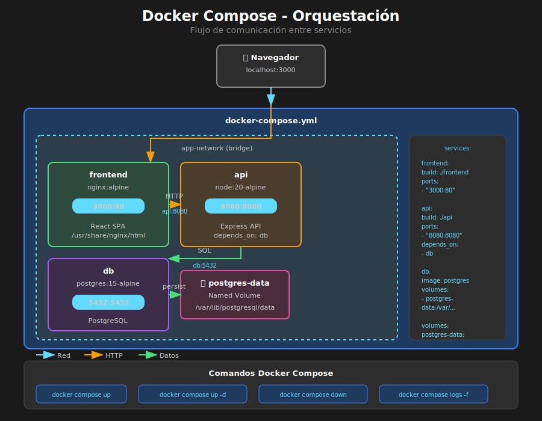

# Docker Compose



## 🎯 Objetivos

- Comprender qué es Docker Compose y sus casos de uso
- Escribir archivos docker-compose.yml
- Orquestar múltiples servicios
- Configurar redes y volúmenes

---

## 📋 Contenido

### 1. ¿Qué es Docker Compose?

Docker Compose es una herramienta para definir y ejecutar aplicaciones Docker multi-contenedor usando un archivo YAML.

#### El Problema que Resuelve

Sin Docker Compose, ejecutar múltiples contenedores requiere comandos largos:

```bash
# ❌ Sin Docker Compose - Tedioso y propenso a errores
docker network create mi-red

docker run -d \
  --name api \
  --network mi-red \
  -e DATABASE_URL=postgres://db:5432 \
  mi-api:latest

docker run -d \
  --name frontend \
  --network mi-red \
  -p 3000:80 \
  -e API_URL=http://api:8080 \
  mi-frontend:latest

docker run -d \
  --name db \
  --network mi-red \
  -v postgres-data:/var/lib/postgresql/data \
  postgres:15
```

Con Docker Compose:

```bash
# ✅ Con Docker Compose - Simple y reproducible
docker compose up
```

---

### 2. Estructura de docker-compose.yml

```yaml
# Versión del formato (opcional en Compose v2+)
version: '3.8'

# Definición de servicios (contenedores)
services:
  frontend:
    build: ./frontend
    ports:
      - '3000:80'
    environment:
      - API_URL=http://api:8080
    depends_on:
      - api

  api:
    build: ./api
    ports:
      - '8080:8080'
    environment:
      - DATABASE_URL=postgres://db:5432/mydb
    depends_on:
      - db

  db:
    image: postgres:15-alpine
    volumes:
      - postgres-data:/var/lib/postgresql/data
    environment:
      - POSTGRES_DB=mydb
      - POSTGRES_USER=user
      - POSTGRES_PASSWORD=secret

# Volúmenes persistentes
volumes:
  postgres-data:

# Redes (opcional, se crea una por defecto)
networks:
  default:
    driver: bridge
```

---

### 3. Propiedades de Servicios

#### Build

```yaml
services:
  app:
    # Build desde Dockerfile
    build: .

    # Build con opciones
    build:
      context: ./frontend
      dockerfile: Dockerfile.prod
      args:
        - VITE_API_URL=https://api.example.com
```

#### Imagen

```yaml
services:
  db:
    # Usar imagen existente
    image: postgres:15-alpine

  app:
    # Build + tag
    build: .
    image: mi-app:latest
```

#### Puertos

```yaml
services:
  app:
    ports:
      # host:container
      - '3000:80'
      # Solo especificar container (puerto aleatorio en host)
      - '80'
      # Rango de puertos
      - '3000-3005:3000-3005'
```

#### Volúmenes

```yaml
services:
  app:
    volumes:
      # Named volume
      - data:/app/data
      # Bind mount (desarrollo)
      - ./src:/app/src
      # Read-only
      - ./config:/app/config:ro

volumes:
  data:
```

#### Variables de Entorno

```yaml
services:
  app:
    environment:
      # Lista
      - NODE_ENV=production
      - API_KEY=secret

    # O como objeto
    environment:
      NODE_ENV: production
      API_KEY: secret

    # Desde archivo
    env_file:
      - .env
      - .env.local
```

#### Dependencias

```yaml
services:
  frontend:
    depends_on:
      - api # Simple: espera que inicie

  api:
    depends_on:
      db:
        condition: service_healthy # Espera health check
```

#### Health Checks

```yaml
services:
  api:
    healthcheck:
      test: ['CMD', 'curl', '-f', 'http://localhost:8080/health']
      interval: 30s
      timeout: 10s
      retries: 3
      start_period: 40s
```

#### Restart Policies

```yaml
services:
  app:
    restart: always # Siempre reiniciar
    # Opciones: no, always, on-failure, unless-stopped
```

---

### 4. Ejemplo Completo: React + API + Base de Datos

```yaml
# docker-compose.yml
version: '3.8'

services:
  # ============================================
  # FRONTEND - React con Nginx
  # ============================================
  frontend:
    build:
      context: ./frontend
      dockerfile: Dockerfile
      args:
        - VITE_API_URL=http://localhost:8080
    ports:
      - '3000:80'
    depends_on:
      - api
    networks:
      - app-network

  # ============================================
  # API - Node.js/Express
  # ============================================
  api:
    build:
      context: ./api
      dockerfile: Dockerfile
    ports:
      - '8080:8080'
    environment:
      - NODE_ENV=production
      - DATABASE_URL=postgres://user:secret@db:5432/mydb
      - JWT_SECRET=super-secret-key
    depends_on:
      db:
        condition: service_healthy
    networks:
      - app-network
    restart: unless-stopped

  # ============================================
  # DATABASE - PostgreSQL
  # ============================================
  db:
    image: postgres:15-alpine
    environment:
      - POSTGRES_DB=mydb
      - POSTGRES_USER=user
      - POSTGRES_PASSWORD=secret
    volumes:
      - postgres-data:/var/lib/postgresql/data
      - ./init.sql:/docker-entrypoint-initdb.d/init.sql
    ports:
      - '5432:5432'
    healthcheck:
      test: ['CMD-SHELL', 'pg_isready -U user -d mydb']
      interval: 10s
      timeout: 5s
      retries: 5
    networks:
      - app-network

# ============================================
# VOLUMES
# ============================================
volumes:
  postgres-data:
    driver: local

# ============================================
# NETWORKS
# ============================================
networks:
  app-network:
    driver: bridge
```

---

### 5. Compose para Desarrollo

Para desarrollo local con hot reload:

```yaml
# docker-compose.dev.yml
version: '3.8'

services:
  frontend:
    build:
      context: ./frontend
      dockerfile: Dockerfile.dev
    ports:
      - '5173:5173'
    volumes:
      # Montar código fuente para hot reload
      - ./frontend/src:/app/src
      - ./frontend/public:/app/public
      # No montar node_modules (usar los del contenedor)
      - /app/node_modules
    environment:
      - VITE_API_URL=http://localhost:8080
    command: npm run dev -- --host

  api:
    build:
      context: ./api
      dockerfile: Dockerfile.dev
    ports:
      - '8080:8080'
    volumes:
      - ./api/src:/app/src
      - /app/node_modules
    environment:
      - NODE_ENV=development
      - DATABASE_URL=postgres://user:secret@db:5432/mydb
    command: npm run dev

  db:
    image: postgres:15-alpine
    environment:
      - POSTGRES_DB=mydb
      - POSTGRES_USER=user
      - POSTGRES_PASSWORD=secret
    ports:
      - '5432:5432'
    volumes:
      - postgres-dev-data:/var/lib/postgresql/data

volumes:
  postgres-dev-data:
```

**Dockerfile.dev para React:**

```dockerfile
# frontend/Dockerfile.dev
FROM node:20-alpine

WORKDIR /app

COPY package*.json ./
RUN npm install

COPY . .

EXPOSE 5173

CMD ["npm", "run", "dev", "--", "--host"]
```

---

### 6. Comandos de Docker Compose

```bash
# Iniciar todos los servicios
docker compose up

# Iniciar en segundo plano
docker compose up -d

# Iniciar servicio específico
docker compose up frontend

# Construir imágenes antes de iniciar
docker compose up --build

# Detener servicios
docker compose down

# Detener y eliminar volúmenes
docker compose down -v

# Ver logs
docker compose logs

# Ver logs de servicio específico
docker compose logs -f frontend

# Ver estado de servicios
docker compose ps

# Ejecutar comando en servicio
docker compose exec frontend sh

# Escalar servicio
docker compose up -d --scale api=3
```

---

### 7. Múltiples Archivos Compose

```bash
# Desarrollo
docker compose -f docker-compose.yml -f docker-compose.dev.yml up

# Producción
docker compose -f docker-compose.yml -f docker-compose.prod.yml up

# O usando archivos override (automático)
# docker-compose.yml + docker-compose.override.yml
docker compose up
```

---

### 8. Variables de Entorno y .env

```bash
# .env
POSTGRES_USER=myuser
POSTGRES_PASSWORD=supersecret
POSTGRES_DB=mydb
API_PORT=8080
```

```yaml
# docker-compose.yml
services:
  db:
    image: postgres:15-alpine
    environment:
      - POSTGRES_USER=${POSTGRES_USER}
      - POSTGRES_PASSWORD=${POSTGRES_PASSWORD}
      - POSTGRES_DB=${POSTGRES_DB}

  api:
    ports:
      - '${API_PORT}:8080'
```

---

### 9. Redes en Docker Compose

Por defecto, Compose crea una red y conecta todos los servicios. Los servicios pueden comunicarse usando el nombre del servicio como hostname:

```yaml
services:
  frontend:
    # Puede acceder a api como http://api:8080
    environment:
      - API_URL=http://api:8080

  api:
    # Puede acceder a db como postgres://db:5432
    environment:
      - DATABASE_URL=postgres://user:pass@db:5432/mydb

  db:
    # Escucha en puerto 5432
```

---

## ✅ Checklist de Verificación

- [ ] docker-compose.yml válido (sin errores de sintaxis)
- [ ] Servicios definidos correctamente
- [ ] Puertos mapeados sin conflictos
- [ ] Variables de entorno configuradas
- [ ] Volúmenes para persistencia
- [ ] depends_on para orden de inicio
- [ ] `docker compose up` funciona
- [ ] Servicios se comunican entre sí

---

## 📚 Recursos Adicionales

- [Docker Compose Documentation](https://docs.docker.com/compose/)
- [Compose File Reference](https://docs.docker.com/compose/compose-file/)
- [Compose Networking](https://docs.docker.com/compose/networking/)
