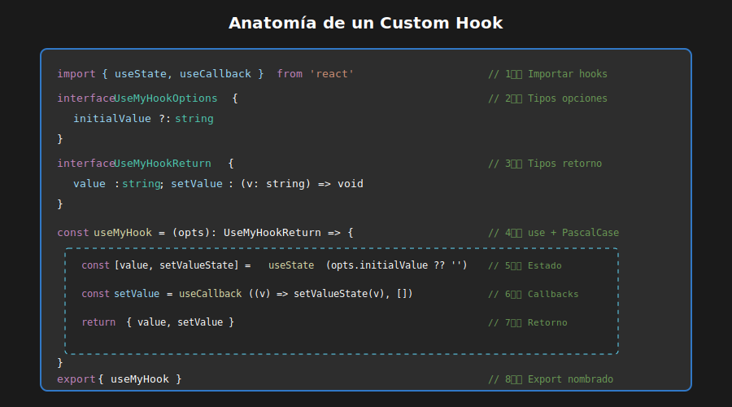

# 📘 Custom Hooks: Fundamentos

## 🎯 Objetivos

- Entender qué son los custom hooks y por qué son útiles
- Aprender la anatomía de un custom hook
- Conocer las reglas para crear hooks
- Crear hooks básicos reutilizables

---

## 1. ¿Qué es un Custom Hook?



Un **custom hook** es una función de JavaScript/TypeScript que:

1. Comienza con el prefijo `use`
2. Puede llamar a otros hooks (useState, useEffect, etc.)
3. Encapsula lógica reutilizable entre componentes
4. Retorna valores y/o funciones

```typescript
// ============================================
// QUÉ: Custom hook básico para toggle
// PARA: Reutilizar lógica de encendido/apagado
// IMPACTO: Evita duplicar código en componentes
// ============================================

import { useState, useCallback } from 'react';

// El nombre SIEMPRE empieza con "use"
const useToggle = (initialValue: boolean = false) => {
  // Puede usar otros hooks
  const [value, setValue] = useState(initialValue);

  // Funciones derivadas del estado
  const toggle = useCallback(() => setValue((prev) => !prev), []);
  const setTrue = useCallback(() => setValue(true), []);
  const setFalse = useCallback(() => setValue(false), []);

  // Retorna estado y funciones
  return { value, toggle, setTrue, setFalse };
};

export { useToggle };
```

### Uso del Hook

```tsx
// En cualquier componente
const Modal: React.FC = () => {
  const { value: isOpen, toggle, setFalse } = useToggle(false);

  return (
    <>
      <button onClick={toggle}>Abrir Modal</button>
      {isOpen && (
        <div className="modal">
          <p>Contenido del modal</p>
          <button onClick={setFalse}>Cerrar</button>
        </div>
      )}
    </>
  );
};
```

---

## 2. ¿Por Qué Custom Hooks?

### ❌ Sin Custom Hooks: Lógica Duplicada

```tsx
// Componente A
const ComponentA: React.FC = () => {
  const [count, setCount] = useState(0);
  const increment = () => setCount((prev) => prev + 1);
  const decrement = () => setCount((prev) => prev - 1);
  const reset = () => setCount(0);
  // ...mismo código en otros componentes
};

// Componente B - DUPLICADO
const ComponentB: React.FC = () => {
  const [count, setCount] = useState(0);
  const increment = () => setCount((prev) => prev + 1);
  const decrement = () => setCount((prev) => prev - 1);
  const reset = () => setCount(0);
  // ...código idéntico
};
```

### ✅ Con Custom Hook: Lógica Reutilizable

```typescript
// ============================================
// QUÉ: Custom hook para contador con opciones
// PARA: Reutilizar lógica de contador en múltiples componentes
// IMPACTO: Una sola implementación testeada para toda la app
// ============================================

// hooks/useCounter.ts
import { useState, useCallback } from 'react';

interface UseCounterOptions {
  min?: number;
  max?: number;
  step?: number;
}

interface UseCounterReturn {
  count: number;
  increment: () => void;
  decrement: () => void;
  reset: () => void;
  setCount: (value: number) => void;
}

const useCounter = (
  initialValue: number = 0,
  options: UseCounterOptions = {},
): UseCounterReturn => {
  const { min = -Infinity, max = Infinity, step = 1 } = options;
  const [count, setCountState] = useState(initialValue);

  const setCount = useCallback(
    (value: number) => {
      setCountState(Math.min(Math.max(value, min), max));
    },
    [min, max],
  );

  const increment = useCallback(() => {
    setCountState((prev) => Math.min(prev + step, max));
  }, [step, max]);

  const decrement = useCallback(() => {
    setCountState((prev) => Math.max(prev - step, min));
  }, [step, min]);

  const reset = useCallback(() => {
    setCountState(initialValue);
  }, [initialValue]);

  return { count, increment, decrement, reset, setCount };
};

export { useCounter };
export type { UseCounterOptions, UseCounterReturn };
```

```tsx
// Ahora en cualquier componente
const ComponentA: React.FC = () => {
  const { count, increment, decrement, reset } = useCounter(0, {
    min: 0,
    max: 10,
  });
  // ¡Lógica encapsulada y reutilizable!
};

const ComponentB: React.FC = () => {
  const { count, increment } = useCounter(5, { step: 5 });
  // Mismo hook, diferentes opciones
};
```

---

## 3. Anatomía de un Custom Hook

```typescript
// ============================================
// ANATOMÍA COMPLETA DE UN CUSTOM HOOK
// ============================================

import { useState, useEffect, useCallback, useMemo } from 'react';

// 1️⃣ TIPOS: Definir interfaces para opciones y retorno
interface UseExampleOptions {
  initialValue?: string;
  validate?: (value: string) => boolean;
}

interface UseExampleReturn {
  value: string;
  setValue: (newValue: string) => void;
  isValid: boolean;
  reset: () => void;
}

// 2️⃣ HOOK: Función que empieza con "use"
const useExample = (options: UseExampleOptions = {}): UseExampleReturn => {
  // 3️⃣ DESTRUCTURING: Extraer opciones con defaults
  const { initialValue = '', validate = () => true } = options;

  // 4️⃣ ESTADO: Usar hooks nativos
  const [value, setValueState] = useState(initialValue);

  // 5️⃣ VALORES DERIVADOS: useMemo para cálculos
  const isValid = useMemo(() => validate(value), [value, validate]);

  // 6️⃣ CALLBACKS: useCallback para funciones estables
  const setValue = useCallback((newValue: string) => {
    setValueState(newValue);
  }, []);

  const reset = useCallback(() => {
    setValueState(initialValue);
  }, [initialValue]);

  // 7️⃣ EFECTOS: useEffect si es necesario
  useEffect(() => {
    // Efecto opcional
    console.log('Valor cambió:', value);
  }, [value]);

  // 8️⃣ RETORNO: Objeto con estado y funciones
  return { value, setValue, isValid, reset };
};

// 9️⃣ EXPORT: Nombrado para tree-shaking
export { useExample };
export type { UseExampleOptions, UseExampleReturn };
```

---

## 4. Reglas de los Hooks


### Regla 1: Solo llamar hooks en el nivel superior

```typescript
// ❌ MAL: Hook dentro de condicional
const useBadHook = (condition: boolean) => {
  if (condition) {
    const [value, setValue] = useState(''); // ERROR
  }
  return null;
};

// ✅ BIEN: Hook siempre se ejecuta
const useGoodHook = (condition: boolean) => {
  const [value, setValue] = useState('');

  // La condición va en la lógica, no en el hook
  const result = condition ? value : null;
  return result;
};
```

### Regla 2: Solo llamar hooks desde funciones React

```typescript
// ❌ MAL: Hook en función regular
function regularFunction() {
  const [value] = useState(''); // ERROR
}

// ✅ BIEN: Hook en componente o custom hook
const MyComponent: React.FC = () => {
  const [value] = useState(''); // OK en componente
  return <div>{value}</div>;
};

const useMyHook = () => {
  const [value] = useState(''); // OK en custom hook
  return value;
};
```

### Regla 3: El nombre debe empezar con "use"

```typescript
// ❌ MAL: No empieza con "use"
const getCounter = () => {
  const [count, setCount] = useState(0);
  return { count, setCount };
};

// ✅ BIEN: Empieza con "use"
const useCounter = () => {
  const [count, setCount] = useState(0);
  return { count, setCount };
};
```

---

## 5. Tipado de Custom Hooks

### Tipos Explícitos para Retorno

```typescript
// ============================================
// QUÉ: Hook useInput con tipado explícito
// PARA: Manejar inputs de forma reutilizable y type-safe
// IMPACTO: Autocompletado en IDE y errores en tiempo de compilación
// ============================================

// Definir interface para el retorno
interface UseInputReturn {
  value: string;
  onChange: (e: React.ChangeEvent<HTMLInputElement>) => void;
  reset: () => void;
  bind: {
    value: string;
    onChange: (e: React.ChangeEvent<HTMLInputElement>) => void;
  };
}

// Especificar tipo de retorno
const useInput = (initialValue: string = ''): UseInputReturn => {
  const [value, setValue] = useState(initialValue);

  const onChange = useCallback((e: React.ChangeEvent<HTMLInputElement>) => {
    setValue(e.target.value);
  }, []);

  const reset = useCallback(() => {
    setValue(initialValue);
  }, [initialValue]);

  // Objeto para spread en input: <input {...bind} />
  const bind = useMemo(() => ({ value, onChange }), [value, onChange]);

  return { value, onChange, reset, bind };
};
```

### Uso con TypeScript

```tsx
const LoginForm: React.FC = () => {
  const email = useInput('');
  const password = useInput('');

  const handleSubmit = (e: React.FormEvent) => {
    e.preventDefault();
    console.log('Login:', email.value, password.value);
    email.reset();
    password.reset();
  };

  return (
    <form onSubmit={handleSubmit}>
      {/* Spread del objeto bind */}
      <input
        type="email"
        placeholder="Email"
        {...email.bind}
      />
      <input
        type="password"
        placeholder="Password"
        {...password.bind}
      />
      <button type="submit">Login</button>
    </form>
  );
};
```

---

## 6. Hook vs Función Regular

| Característica      | Custom Hook             | Función Regular      |
| ------------------- | ----------------------- | -------------------- |
| Puede usar hooks    | ✅ Sí                   | ❌ No                |
| Nombre              | `useSomething`          | `getSomething`       |
| Estado reactivo     | ✅ Causa re-renders     | ❌ No reactivo       |
| Efectos secundarios | ✅ Con useEffect        | ❌ Sin ciclo de vida |
| Compartir estado    | Cada instancia es única | Sin estado           |

```typescript
// ============================================
// QUÉ: Comparación entre hook y función regular
// PARA: Entender cuándo usar cada uno
// IMPACTO: Elegir la herramienta correcta para cada caso
// ============================================

// FUNCIÓN REGULAR: Solo calcula, no tiene estado
const formatDate = (date: Date): string => {
  return date.toLocaleDateString('es-ES');
};

// CUSTOM HOOK: Tiene estado y causa re-renders
const useCurrentDate = () => {
  const [date, setDate] = useState(new Date());

  useEffect(() => {
    const timer = setInterval(() => {
      setDate(new Date());
    }, 1000);

    return () => clearInterval(timer);
  }, []);

  return date;
};

// USO
const DateDisplay: React.FC = () => {
  const currentDate = useCurrentDate(); // Re-render cada segundo
  const formatted = formatDate(currentDate); // Solo formatea

  return <p>Fecha: {formatted}</p>;
};
```

---

## 7. Ejemplos Básicos Completos

### useBoolean

```typescript
// ============================================
// QUÉ: Hook useBoolean para estados booleanos
// PARA: Simplificar toggles, modales, dropdowns, etc.
// IMPACTO: API clara y consistente para estados on/off
// ============================================

import { useState, useCallback } from 'react';

interface UseBooleanReturn {
  value: boolean;
  setTrue: () => void;
  setFalse: () => void;
  toggle: () => void;
  setValue: (value: boolean) => void;
}

const useBoolean = (initialValue: boolean = false): UseBooleanReturn => {
  const [value, setValue] = useState(initialValue);

  const setTrue = useCallback(() => setValue(true), []);
  const setFalse = useCallback(() => setValue(false), []);
  const toggle = useCallback(() => setValue((prev) => !prev), []);

  return { value, setTrue, setFalse, toggle, setValue };
};

export { useBoolean };
```

### usePrevious

```typescript
// ============================================
// QUÉ: Hook usePrevious para recordar valor anterior
// PARA: Comparar estados entre renders
// IMPACTO: Útil para animaciones, validaciones, analytics
// ============================================

import { useRef, useEffect } from 'react';

const usePrevious = <T,>(value: T): T | undefined => {
  // useRef persiste entre renders sin causar re-render
  const ref = useRef<T | undefined>(undefined);

  useEffect(() => {
    ref.current = value;
  }, [value]);

  // Retorna el valor ANTERIOR (antes de este render)
  return ref.current;
};

export { usePrevious };

// Uso
const Counter: React.FC = () => {
  const [count, setCount] = useState(0);
  const previousCount = usePrevious(count);

  return (
    <div>
      <p>Actual: {count}</p>
      <p>Anterior: {previousCount ?? 'N/A'}</p>
      <button onClick={() => setCount(c => c + 1)}>+1</button>
    </div>
  );
};
```

### useUpdateEffect

```typescript
// ============================================
// QUÉ: Hook useUpdateEffect que ignora el primer render
// PARA: Ejecutar efectos solo en actualizaciones
// IMPACTO: Evita lógica innecesaria en el mount inicial
// ============================================

import { useEffect, useRef } from 'react';

// useEffect que NO se ejecuta en el primer render
const useUpdateEffect = (
  effect: React.EffectCallback,
  deps?: React.DependencyList
): void => {
  const isFirstRender = useRef(true);

  useEffect(() => {
    if (isFirstRender.current) {
      isFirstRender.current = false;
      return;
    }

    return effect();
    // eslint-disable-next-line react-hooks/exhaustive-deps
  }, deps);
};

export { useUpdateEffect };

// Uso: Solo ejecuta cuando cambia, no en mount
const SearchResults: React.FC<{ query: string }> = ({ query }) => {
  useUpdateEffect(() => {
    console.log('Query cambió a:', query);
    // Fetch nuevos resultados...
  }, [query]);

  return <div>Resultados para: {query}</div>;
};
```

---

## 📚 Recursos Adicionales

- [React Docs: Custom Hooks](https://react.dev/learn/reusing-logic-with-custom-hooks)
- [useHooks.com](https://usehooks.com/)
- [React TypeScript Cheatsheet: Hooks](https://react-typescript-cheatsheet.netlify.app/docs/basic/getting-started/hooks)

---

## ✅ Checklist de Comprensión

- [ ] Entiendo qué es un custom hook y para qué sirve
- [ ] Conozco las 3 reglas de los hooks
- [ ] Sé la diferencia entre hook y función regular
- [ ] Puedo tipar correctamente un custom hook
- [ ] Entiendo cuándo usar useCallback en hooks

---

_Siguiente: [02-patrones-custom-hooks.md](02-patrones-custom-hooks.md)_
