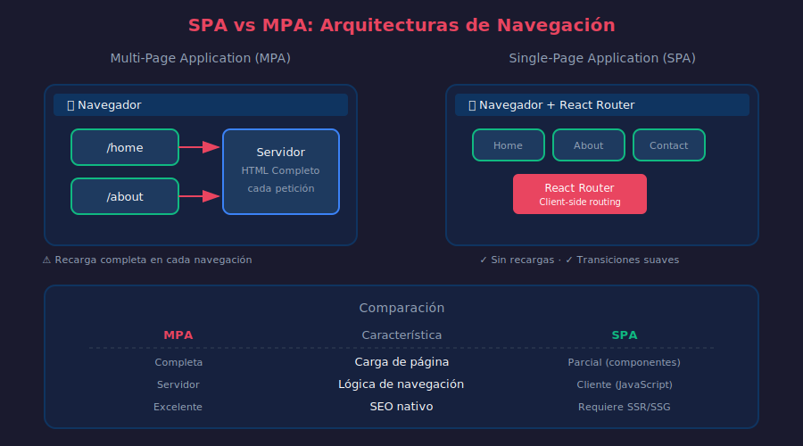

# 📘 Fundamentos de Routing en SPAs

## 🎯 Objetivos

- Entender la diferencia entre SPA y MPA
- Comprender cómo funciona el client-side routing
- Conocer los beneficios y limitaciones del routing en React

---

## 1. SPA vs MPA



### Multi-Page Application (MPA)

En una aplicación tradicional **MPA**:

```
Usuario clickea enlace
       ↓
Navegador solicita nueva página al servidor
       ↓
Servidor procesa y devuelve HTML completo
       ↓
Navegador descarga y renderiza toda la página
       ↓
Se pierde el estado de JavaScript
```

**Características MPA:**

- Cada navegación = request al servidor
- Página completa se recarga
- El estado se pierde entre navegaciones
- SEO nativo (cada página tiene URL única)
- Tiempo de carga inicial rápido (solo HTML necesario)

### Single-Page Application (SPA)

En una **SPA** como las que construimos con React:

```
Usuario clickea enlace
       ↓
JavaScript intercepta el click
       ↓
Actualiza la URL (History API)
       ↓
Renderiza nuevo componente
       ↓
Estado de la aplicación se mantiene
```

**Características SPA:**

- Una sola carga inicial de HTML/JS/CSS
- Navegación sin recargar la página
- Estado se mantiene entre "páginas"
- Experiencia más fluida (tipo app nativa)
- Requiere JavaScript habilitado

---

## 2. ¿Qué es Client-Side Routing?

```typescript
// ============================================
// QUÉ: Client-side routing manipula la URL sin request al servidor
// PARA: Navegar entre vistas sin recargar la página
// IMPACTO: UX fluida, estado persistente, transiciones suaves
// ============================================

// El navegador provee la History API
window.history.pushState({ page: 1 }, 'Título', '/nueva-url');

// React Router abstrae esto para nosotros
// En lugar de manipular history directamente, usamos componentes
```

### History API del Navegador

```typescript
// ============================================
// QUÉ: API nativa del navegador para manipular el historial
// PARA: Cambiar URL sin recargar la página
// IMPACTO: Base sobre la que React Router funciona
// ============================================

// Agregar entrada al historial
window.history.pushState(state, title, url);

// Reemplazar entrada actual
window.history.replaceState(state, title, url);

// Navegar hacia atrás/adelante
window.history.back();
window.history.forward();
window.history.go(-2); // Ir 2 páginas atrás

// Escuchar cambios de navegación
window.addEventListener('popstate', (event) => {
  console.log('Navegación:', event.state);
});
```

---

## 3. ¿Por Qué React Router?

Sin una librería de routing, tendríamos que:

```tsx
// ============================================
// QUÉ: Routing manual (NO RECOMENDADO)
// PARA: Entender por qué necesitamos React Router
// IMPACTO: Código complejo, difícil de mantener
// ============================================

import { useState, useEffect } from 'react';

const App: React.FC = () => {
  const [currentPath, setCurrentPath] = useState(window.location.pathname);

  useEffect(() => {
    // Escuchar navegación del navegador
    const handlePopState = () => {
      setCurrentPath(window.location.pathname);
    };

    window.addEventListener('popstate', handlePopState);
    return () => window.removeEventListener('popstate', handlePopState);
  }, []);

  // Función para navegar
  const navigate = (path: string) => {
    window.history.pushState({}, '', path);
    setCurrentPath(path);
  };

  // Renderizar según la ruta
  return (
    <div>
      <nav>
        <button onClick={() => navigate('/')}>Home</button>
        <button onClick={() => navigate('/about')}>About</button>
        <button onClick={() => navigate('/contact')}>Contact</button>
      </nav>

      {currentPath === '/' && <HomePage />}
      {currentPath === '/about' && <AboutPage />}
      {currentPath === '/contact' && <ContactPage />}
      {!['/', 'about', '/contact'].includes(currentPath) && <NotFound />}
    </div>
  );
};
```

**Problemas de este enfoque:**

- ❌ No soporta rutas dinámicas (`/users/:id`)
- ❌ No maneja query strings (`?search=react`)
- ❌ No soporta layouts anidados
- ❌ No tiene protección de rutas
- ❌ No maneja loading states
- ❌ Difícil de escalar

---

## 4. React Router v6

**React Router** es la librería estándar para routing en React.

### Versión 6: Cambios Importantes

| Característica  | v5                     | v6                     |
| --------------- | ---------------------- | ---------------------- |
| Definir rutas   | `<Switch>` + `<Route>` | `<Routes>` + `<Route>` |
| Exact match     | `exact` prop           | Por defecto            |
| Rutas anidadas  | Componentes separados  | `<Outlet>` + children  |
| Redirección     | `<Redirect>`           | `<Navigate>`           |
| Acceso a params | `useParams()` + HOC    | Solo `useParams()`     |
| Navegación      | `useHistory()`         | `useNavigate()`        |

### Instalación

```bash
# Instalar React Router para web
pnpm add react-router-dom

# Tipos incluidos en v6 (no necesitas @types)
```

### Arquitectura de React Router v6

```
BrowserRouter (Proveedor de contexto)
    │
    ├── Routes (Contenedor de rutas)
    │      │
    │      ├── Route path="/" element={<Home />}
    │      │
    │      ├── Route path="/about" element={<About />}
    │      │
    │      └── Route path="/users/:id" element={<UserProfile />}
    │
    └── Link / NavLink (Navegación declarativa)
```

---

## 5. Tipos de Routers

React Router ofrece diferentes routers según el caso de uso:

```typescript
// ============================================
// QUÉ: Diferentes tipos de routers disponibles
// PARA: Elegir el apropiado según el deployment
// IMPACTO: URLs limpias vs compatibilidad con hosting
// ============================================

import {
  BrowserRouter, // URLs limpias: /about
  HashRouter, // URLs con hash: /#/about
  MemoryRouter, // Sin URL (para tests)
  StaticRouter, // Para SSR (Server-Side Rendering)
} from 'react-router-dom';
```

### BrowserRouter (Recomendado)

```tsx
// URLs limpias usando History API
// Requiere configuración del servidor para SPA

import { BrowserRouter } from 'react-router-dom';

const App: React.FC = () => (
  <BrowserRouter>{/* Tu aplicación */}</BrowserRouter>
);

// URLs resultantes:
// https://miapp.com/
// https://miapp.com/about
// https://miapp.com/users/123
```

### HashRouter (Fallback)

```tsx
// URLs con hash, no requiere configuración del servidor
// Útil para hosting estático simple (GitHub Pages)

import { HashRouter } from 'react-router-dom';

const App: React.FC = () => <HashRouter>{/* Tu aplicación */}</HashRouter>;

// URLs resultantes:
// https://miapp.com/#/
// https://miapp.com/#/about
// https://miapp.com/#/users/123
```

### MemoryRouter (Testing)

```tsx
// No manipula la URL del navegador
// Perfecto para tests

import { MemoryRouter } from 'react-router-dom';
import { render } from '@testing-library/react';

test('renders home page', () => {
  render(
    <MemoryRouter initialEntries={['/']}>
      <App />
    </MemoryRouter>,
  );
  // ...assertions
});
```

---

## 6. Configuración del Servidor

Para que **BrowserRouter** funcione correctamente, el servidor debe redirigir todas las rutas a `index.html`:

### Vite (desarrollo)

```typescript
// vite.config.ts - Ya configurado por defecto
export default defineConfig({
  // El servidor de desarrollo maneja esto automáticamente
});
```

### Nginx (producción)

```nginx
# nginx.conf
server {
    listen 80;
    root /usr/share/nginx/html;
    index index.html;

    location / {
        try_files $uri $uri/ /index.html;
    }
}
```

### Vercel

```json
// vercel.json
{
  "rewrites": [{ "source": "/(.*)", "destination": "/index.html" }]
}
```

### Netlify

```toml
# netlify.toml
[[redirects]]
  from = "/*"
  to = "/index.html"
  status = 200
```

---

## 7. Beneficios y Limitaciones

### ✅ Beneficios del Client-Side Routing

1. **Experiencia fluida**: Sin recargas de página
2. **Estado persistente**: No se pierde entre navegaciones
3. **Transiciones animadas**: Control total sobre el UI
4. **Carga bajo demanda**: Code splitting por rutas
5. **Modo offline**: Con Service Workers

### ⚠️ Limitaciones a Considerar

1. **SEO**: Requiere SSR o pre-rendering para crawlers
2. **Carga inicial**: Bundle más grande al inicio
3. **JavaScript requerido**: No funciona sin JS
4. **Configuración servidor**: Necesario para URLs limpias
5. **Historial del navegador**: Complejidad adicional

---

## 📚 Recursos Adicionales

- [React Router Docs](https://reactrouter.com/)
- [History API - MDN](https://developer.mozilla.org/en-US/docs/Web/API/History_API)
- [SPA vs MPA - Patterns](https://www.patterns.dev/posts/rendering-patterns)

---

## ✅ Checklist de Comprensión

- [ ] Entiendo la diferencia entre SPA y MPA
- [ ] Comprendo cómo funciona la History API
- [ ] Sé por qué necesitamos React Router
- [ ] Conozco los diferentes tipos de routers
- [ ] Entiendo la configuración necesaria del servidor

---

_Siguiente: [02-react-router-basico.md](02-react-router-basico.md)_
