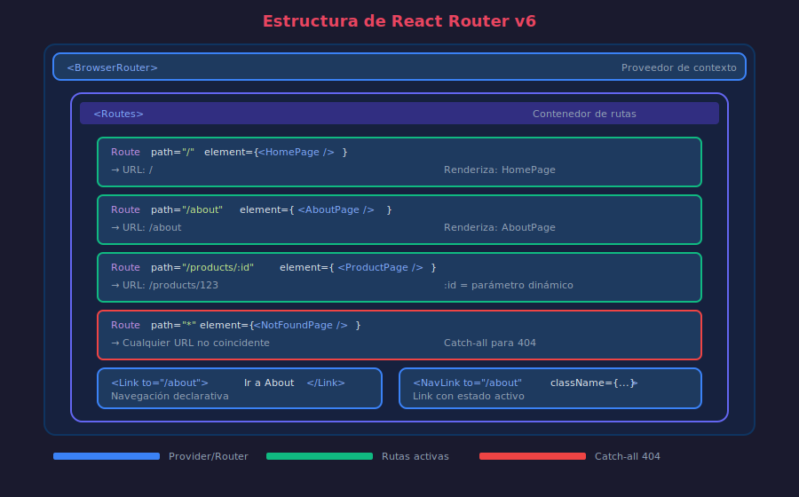

# 📘 React Router: Configuración Básica

## 🎯 Objetivos

- Configurar React Router en un proyecto TypeScript
- Entender Routes, Route y sus props
- Implementar navegación con Link y NavLink
- Manejar rutas no encontradas (404)

---

## 1. Setup Inicial



### Instalación

```bash
# Instalar React Router DOM
pnpm add react-router-dom
```

### Configuración en main.tsx

```tsx
// ============================================
// QUÉ: Envolver la aplicación con BrowserRouter
// PARA: Habilitar routing en toda la aplicación
// IMPACTO: Todos los componentes hijos tienen acceso al router
// ============================================

// src/main.tsx
import React from 'react';
import ReactDOM from 'react-dom/client';
import { BrowserRouter } from 'react-router-dom';
import App from './App';
import './index.css';

ReactDOM.createRoot(document.getElementById('root')!).render(
  <React.StrictMode>
    <BrowserRouter>
      <App />
    </BrowserRouter>
  </React.StrictMode>,
);
```

---

## 2. Definiendo Rutas

### Routes y Route

```tsx
// ============================================
// QUÉ: Definir las rutas de la aplicación
// PARA: Mapear URLs a componentes específicos
// IMPACTO: Cada URL renderiza el componente correspondiente
// ============================================

// src/App.tsx
import { Routes, Route } from 'react-router-dom';

// Páginas
import { HomePage } from './pages/HomePage';
import { AboutPage } from './pages/AboutPage';
import { ContactPage } from './pages/ContactPage';
import { NotFoundPage } from './pages/NotFoundPage';

const App: React.FC = () => {
  return (
    <div className="app">
      {/* Navegación (siempre visible) */}
      <nav>
        <a href="/">Home</a>
        <a href="/about">About</a>
        <a href="/contact">Contact</a>
      </nav>

      {/* Rutas (cambian según URL) */}
      <Routes>
        <Route
          path="/"
          element={<HomePage />}
        />
        <Route
          path="/about"
          element={<AboutPage />}
        />
        <Route
          path="/contact"
          element={<ContactPage />}
        />
        <Route
          path="*"
          element={<NotFoundPage />}
        />
      </Routes>
    </div>
  );
};

export default App;
```

### Props de Route

```tsx
// ============================================
// QUÉ: Propiedades disponibles en el componente Route
// PARA: Configurar cómo se comporta cada ruta
// IMPACTO: Control granular sobre el matching de rutas
// ============================================

import { Routes, Route } from 'react-router-dom';

<Routes>
  {/* Ruta básica */}
  <Route
    path="/about"
    element={<AboutPage />}
  />

  {/* Ruta con parámetro dinámico */}
  <Route
    path="/users/:userId"
    element={<UserProfile />}
  />

  {/* Ruta index (hija por defecto) */}
  <Route
    index
    element={<HomePage />}
  />

  {/* Ruta catch-all (404) */}
  <Route
    path="*"
    element={<NotFoundPage />}
  />

  {/* Ruta con case-insensitive */}
  <Route
    path="/About"
    caseSensitive={false}
    element={<AboutPage />}
  />
</Routes>;
```

---

## 3. Navegación con Link

⚠️ **Importante**: No uses `<a href>` para navegación interna. Causa recarga completa.

### Link vs anchor tag

```tsx
// ============================================
// QUÉ: Componente Link para navegación sin recarga
// PARA: Navegar entre rutas manteniendo el estado de la SPA
// IMPACTO: Experiencia fluida sin perder el estado
// ============================================

import { Link } from 'react-router-dom';

const Navigation: React.FC = () => {
  return (
    <nav>
      {/* ❌ MAL: Recarga toda la página */}
      <a href="/about">About (recarga)</a>

      {/* ✅ BIEN: Navegación SPA */}
      <Link to="/about">About</Link>
      <Link to="/">Home</Link>
      <Link to="/contact">Contact</Link>
    </nav>
  );
};
```

### Props de Link

```tsx
// ============================================
// QUÉ: Propiedades del componente Link
// PARA: Personalizar el comportamiento de navegación
// IMPACTO: Control sobre scroll, state y reemplazo de historial
// ============================================

import { Link } from 'react-router-dom';

const NavigationExamples: React.FC = () => {
  return (
    <nav>
      {/* Navegación básica */}
      <Link to="/products">Productos</Link>

      {/* Con query string */}
      <Link to="/products?category=electronics">Electrónica</Link>

      {/* Con hash */}
      <Link to="/about#team">Nuestro Equipo</Link>

      {/* Objeto to para más control */}
      <Link
        to={{
          pathname: '/products',
          search: '?sort=price',
          hash: '#featured',
        }}>
        Productos Destacados
      </Link>

      {/* Pasar estado (no visible en URL) */}
      <Link
        to="/checkout"
        state={{ fromCart: true, items: 5 }}>
        Checkout
      </Link>

      {/* Reemplazar historial (no agrega entrada) */}
      <Link
        to="/login"
        replace>
        Login
      </Link>

      {/* Prevenir scroll al top */}
      <Link
        to="/products"
        preventScrollReset>
        Ver más
      </Link>
    </nav>
  );
};
```

---

## 4. NavLink para Navegación Activa

```tsx
// ============================================
// QUÉ: NavLink agrega estilos cuando la ruta está activa
// PARA: Indicar visualmente la página actual
// IMPACTO: Mejor UX con feedback visual de ubicación
// ============================================

import { NavLink } from 'react-router-dom';

const MainNav: React.FC = () => {
  return (
    <nav className="main-nav">
      {/* Clase activa automática */}
      <NavLink to="/">Home</NavLink>
      {/* Agrega clase "active" cuando la URL es "/" */}

      {/* Estilos personalizados según estado */}
      <NavLink
        to="/about"
        className={({ isActive, isPending }) =>
          isActive
            ? 'nav-link active'
            : isPending
              ? 'nav-link pending'
              : 'nav-link'
        }>
        About
      </NavLink>

      {/* Estilos inline según estado */}
      <NavLink
        to="/contact"
        style={({ isActive }) => ({
          fontWeight: isActive ? 'bold' : 'normal',
          color: isActive ? '#61DAFB' : '#ffffff',
        })}>
        Contact
      </NavLink>

      {/* Children como función */}
      <NavLink to="/products">
        {({ isActive }) => (
          <span className={isActive ? 'active' : ''}>
            Productos {isActive && '✓'}
          </span>
        )}
      </NavLink>
    </nav>
  );
};
```

### NavLink con end prop

```tsx
// ============================================
// QUÉ: Prop end para matching exacto en NavLink
// PARA: Evitar que rutas padre estén "activas" en hijas
// IMPACTO: Solo se marca activa la ruta exacta
// ============================================

<nav>
  {/* Sin end: "/" estaría activo en /about, /contact, etc. */}
  <NavLink
    to="/"
    end>
    Home
  </NavLink>

  {/* /products estaría activo en /products/123 sin end */}
  <NavLink
    to="/products"
    end>
    Productos
  </NavLink>

  {/* /products activo en /products/123 (sin end) */}
  <NavLink to="/products">Todos los Productos</NavLink>
</nav>
```

---

## 5. Estructura de Páginas

### Organización Recomendada

```
src/
├── pages/
│   ├── HomePage.tsx
│   ├── AboutPage.tsx
│   ├── ContactPage.tsx
│   ├── NotFoundPage.tsx
│   └── index.ts
├── components/
│   ├── layout/
│   │   ├── Header.tsx
│   │   ├── Footer.tsx
│   │   └── Navigation.tsx
│   └── ui/
│       └── ...
├── App.tsx
└── main.tsx
```

### Ejemplo de Página

```tsx
// ============================================
// QUÉ: Componente de página tipado
// PARA: Representar una vista completa de la aplicación
// IMPACTO: Componentes reutilizables y mantenibles
// ============================================

// src/pages/HomePage.tsx
import { Link } from 'react-router-dom';

const HomePage: React.FC = () => {
  return (
    <main className="home-page">
      <h1>Bienvenido a Mi App</h1>
      <p>Esta es la página principal.</p>

      <section className="quick-links">
        <h2>Explora</h2>
        <Link to="/products">Ver Productos</Link>
        <Link to="/about">Sobre Nosotros</Link>
      </section>
    </main>
  );
};

export { HomePage };
```

### Barrel Export

```tsx
// src/pages/index.ts
export { HomePage } from './HomePage';
export { AboutPage } from './AboutPage';
export { ContactPage } from './ContactPage';
export { NotFoundPage } from './NotFoundPage';
```

---

## 6. Página 404 (Not Found)

```tsx
// ============================================
// QUÉ: Página para rutas no encontradas
// PARA: Manejar URLs inválidas con gracia
// IMPACTO: Mejor UX, evita pantallas en blanco
// ============================================

// src/pages/NotFoundPage.tsx
import { Link, useLocation } from 'react-router-dom';

const NotFoundPage: React.FC = () => {
  const location = useLocation();

  return (
    <main className="not-found-page">
      <h1>404</h1>
      <h2>Página no encontrada</h2>
      <p>
        La ruta <code>{location.pathname}</code> no existe.
      </p>
      <Link to="/">Volver al inicio</Link>
    </main>
  );
};

export { NotFoundPage };
```

### Configuración de la ruta 404

```tsx
// src/App.tsx
import { Routes, Route } from 'react-router-dom';
import { HomePage, AboutPage, NotFoundPage } from './pages';

const App: React.FC = () => {
  return (
    <Routes>
      <Route
        path="/"
        element={<HomePage />}
      />
      <Route
        path="/about"
        element={<AboutPage />}
      />
      {/* Ruta catch-all: SIEMPRE al final */}
      <Route
        path="*"
        element={<NotFoundPage />}
      />
    </Routes>
  );
};
```

---

## 7. Ejemplo Completo

```tsx
// ============================================
// QUÉ: Aplicación completa con React Router básico
// PARA: Ver todos los conceptos integrados
// IMPACTO: Base sólida para aplicaciones más complejas
// ============================================

// src/App.tsx
import { Routes, Route, NavLink } from 'react-router-dom';
import { HomePage, AboutPage, ContactPage, NotFoundPage } from './pages';
import './App.css';

const App: React.FC = () => {
  return (
    <div className="app">
      {/* Header con navegación */}
      <header className="header">
        <h1>Mi App</h1>
        <nav className="nav">
          <NavLink
            to="/"
            end
            className={({ isActive }) => (isActive ? 'active' : '')}>
            Home
          </NavLink>
          <NavLink
            to="/about"
            className={({ isActive }) => (isActive ? 'active' : '')}>
            About
          </NavLink>
          <NavLink
            to="/contact"
            className={({ isActive }) => (isActive ? 'active' : '')}>
            Contact
          </NavLink>
        </nav>
      </header>

      {/* Contenido principal */}
      <main className="main">
        <Routes>
          <Route
            path="/"
            element={<HomePage />}
          />
          <Route
            path="/about"
            element={<AboutPage />}
          />
          <Route
            path="/contact"
            element={<ContactPage />}
          />
          <Route
            path="*"
            element={<NotFoundPage />}
          />
        </Routes>
      </main>

      {/* Footer */}
      <footer className="footer">
        <p>&copy; 2026 Mi App</p>
      </footer>
    </div>
  );
};

export default App;
```

### CSS Básico

```css
/* src/App.css */
.app {
  min-height: 100vh;
  display: flex;
  flex-direction: column;
}

.header {
  background: #1a1a1a;
  padding: 1rem 2rem;
  display: flex;
  justify-content: space-between;
  align-items: center;
}

.nav {
  display: flex;
  gap: 1rem;
}

.nav a {
  color: #888;
  text-decoration: none;
  padding: 0.5rem 1rem;
  border-radius: 4px;
  transition: all 0.2s;
}

.nav a:hover {
  color: #fff;
}

.nav a.active {
  color: #61dafb;
  background: rgba(97, 218, 251, 0.1);
}

.main {
  flex: 1;
  padding: 2rem;
}

.footer {
  background: #1a1a1a;
  padding: 1rem;
  text-align: center;
}
```

---

## 📚 Recursos Adicionales

- [React Router Tutorial](https://reactrouter.com/en/main/start/tutorial)
- [Routes Component API](https://reactrouter.com/en/main/components/routes)
- [Link Component API](https://reactrouter.com/en/main/components/link)

---

## ✅ Checklist de Comprensión

- [ ] Sé configurar BrowserRouter en main.tsx
- [ ] Entiendo la diferencia entre Link y anchor tag
- [ ] Puedo usar NavLink con estilos activos
- [ ] Sé configurar una página 404 con path="\*"
- [ ] Conozco las props principales de Route

---

_Siguiente: [03-rutas-dinamicas.md](03-rutas-dinamicas.md)_
