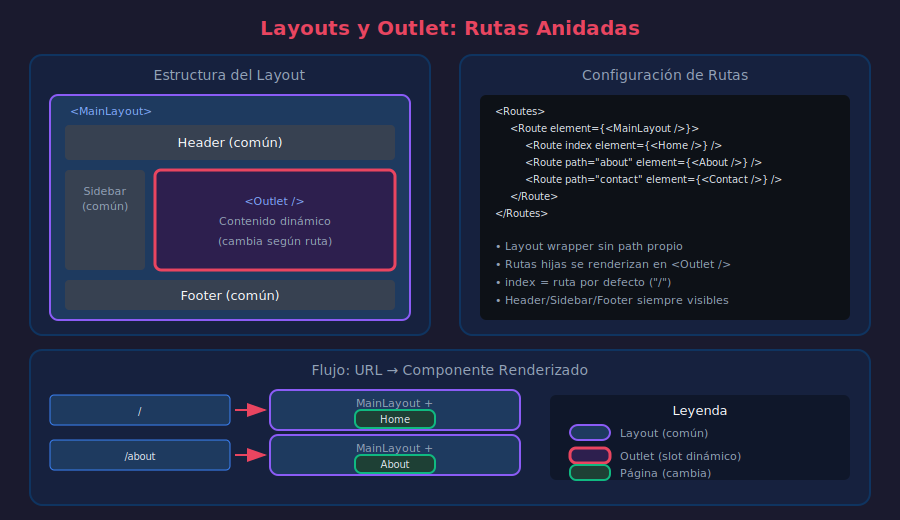

# 📘 Navegación Avanzada: Layouts y Rutas Anidadas

## 🎯 Objetivos

- Implementar layouts reutilizables con Outlet
- Crear rutas anidadas para estructuras complejas
- Usar rutas index para páginas por defecto
- Organizar rutas de forma escalable

---

## 1. El Concepto de Layout



### ¿Por qué Layouts?

En aplicaciones reales, muchas páginas comparten estructura:

```
┌─────────────────────────────────────────┐
│              HEADER (común)             │
├─────────┬───────────────────────────────┤
│         │                               │
│ SIDEBAR │      CONTENIDO (cambia)       │
│ (común) │                               │
│         │                               │
├─────────┴───────────────────────────────┤
│              FOOTER (común)             │
└─────────────────────────────────────────┘
```

Sin layouts, repetimos código:

```tsx
// ❌ Sin layouts: repetición de código
const HomePage: React.FC = () => (
  <div>
    <Header />
    <Sidebar />
    <main>Contenido Home</main>
    <Footer />
  </div>
);

const AboutPage: React.FC = () => (
  <div>
    <Header />
    <Sidebar />
    <main>Contenido About</main>
    <Footer />
  </div>
);

// ...repetir en cada página
```

---

## 2. Outlet: El "Slot" para Rutas Hijas

```tsx
// ============================================
// QUÉ: Outlet renderiza el componente de la ruta hija activa
// PARA: Crear layouts que envuelven contenido dinámico
// IMPACTO: DRY - Define la estructura una vez, úsala en múltiples rutas
// ============================================

import { Outlet } from 'react-router-dom';

// Layout que envuelve las páginas
const MainLayout: React.FC = () => {
  return (
    <div className="layout">
      <Header />

      <div className="layout-body">
        <Sidebar />

        <main className="content">
          {/* Outlet renderiza la ruta hija activa */}
          <Outlet />
        </main>
      </div>

      <Footer />
    </div>
  );
};

export { MainLayout };
```

### Configuración de Rutas con Layout

```tsx
// ============================================
// QUÉ: Rutas anidadas bajo un layout común
// PARA: Estructura jerárquica de navegación
// IMPACTO: Código organizado, UI consistente
// ============================================

import { Routes, Route } from 'react-router-dom';
import { MainLayout } from './layouts/MainLayout';
import { HomePage, AboutPage, ContactPage } from './pages';

const App: React.FC = () => {
  return (
    <Routes>
      {/* Layout wrapper */}
      <Route element={<MainLayout />}>
        {/* Rutas hijas - se renderizan en <Outlet /> */}
        <Route
          path="/"
          element={<HomePage />}
        />
        <Route
          path="/about"
          element={<AboutPage />}
        />
        <Route
          path="/contact"
          element={<ContactPage />}
        />
      </Route>
    </Routes>
  );
};

// URL "/"       → MainLayout + HomePage
// URL "/about"  → MainLayout + AboutPage
// URL "/contact"→ MainLayout + ContactPage
```

---

## 3. Rutas Index

```tsx
// ============================================
// QUÉ: Ruta que se muestra por defecto en un layout
// PARA: Definir qué renderizar cuando no hay ruta hija específica
// IMPACTO: Evita páginas en blanco en rutas padre
// ============================================

import { Routes, Route } from 'react-router-dom';

const App: React.FC = () => {
  return (
    <Routes>
      <Route
        path="/"
        element={<MainLayout />}>
        {/* index = se muestra en "/" exactamente */}
        <Route
          index
          element={<HomePage />}
        />
        <Route
          path="about"
          element={<AboutPage />}
        />
      </Route>

      <Route
        path="/dashboard"
        element={<DashboardLayout />}>
        {/* index = se muestra en "/dashboard" exactamente */}
        <Route
          index
          element={<DashboardOverview />}
        />
        <Route
          path="analytics"
          element={<AnalyticsPage />}
        />
        <Route
          path="settings"
          element={<SettingsPage />}
        />
      </Route>
    </Routes>
  );
};

// /dashboard           → DashboardLayout + DashboardOverview
// /dashboard/analytics → DashboardLayout + AnalyticsPage
// /dashboard/settings  → DashboardLayout + SettingsPage
```

---

## 4. Rutas Anidadas Profundas

```tsx
// ============================================
// QUÉ: Múltiples niveles de rutas anidadas
// PARA: Estructuras complejas tipo admin/dashboard
// IMPACTO: Cada nivel puede tener su propio layout
// ============================================

import { Routes, Route, Outlet } from 'react-router-dom';

// Layout de Admin
const AdminLayout: React.FC = () => (
  <div className="admin">
    <AdminSidebar />
    <div className="admin-content">
      <Outlet />
    </div>
  </div>
);

// Layout de Productos (sub-layout)
const ProductsLayout: React.FC = () => (
  <div className="products-section">
    <h2>Gestión de Productos</h2>
    <nav>
      <NavLink to="/admin/products">Lista</NavLink>
      <NavLink to="/admin/products/new">Crear</NavLink>
    </nav>
    <Outlet />
  </div>
);

const App: React.FC = () => {
  return (
    <Routes>
      {/* Rutas públicas */}
      <Route
        path="/"
        element={<PublicLayout />}>
        <Route
          index
          element={<HomePage />}
        />
        <Route
          path="about"
          element={<AboutPage />}
        />
      </Route>

      {/* Rutas de Admin (anidadas) */}
      <Route
        path="/admin"
        element={<AdminLayout />}>
        <Route
          index
          element={<AdminDashboard />}
        />

        {/* Sub-layout de productos */}
        <Route
          path="products"
          element={<ProductsLayout />}>
          <Route
            index
            element={<ProductList />}
          />
          <Route
            path="new"
            element={<ProductCreate />}
          />
          <Route
            path=":productId"
            element={<ProductDetail />}
          />
          <Route
            path=":productId/edit"
            element={<ProductEdit />}
          />
        </Route>

        {/* Sub-layout de usuarios */}
        <Route
          path="users"
          element={<UsersLayout />}>
          <Route
            index
            element={<UserList />}
          />
          <Route
            path=":userId"
            element={<UserDetail />}
          />
        </Route>
      </Route>
    </Routes>
  );
};

// Estructura de URLs:
// /admin                      → AdminLayout > AdminDashboard
// /admin/products             → AdminLayout > ProductsLayout > ProductList
// /admin/products/new         → AdminLayout > ProductsLayout > ProductCreate
// /admin/products/123         → AdminLayout > ProductsLayout > ProductDetail
// /admin/products/123/edit    → AdminLayout > ProductsLayout > ProductEdit
// /admin/users                → AdminLayout > UsersLayout > UserList
// /admin/users/456            → AdminLayout > UsersLayout > UserDetail
```

---

## 5. Outlet con Contexto

```tsx
// ============================================
// QUÉ: Pasar datos del layout a las rutas hijas
// PARA: Compartir estado/funciones entre layout e hijos
// IMPACTO: Comunicación layout ↔ página sin Context API
// ============================================

import { Outlet, useOutletContext } from 'react-router-dom';

// Tipos para el contexto
interface DashboardContext {
  user: User;
  sidebarOpen: boolean;
  toggleSidebar: () => void;
}

// Layout que provee contexto
const DashboardLayout: React.FC = () => {
  const [sidebarOpen, setSidebarOpen] = useState(true);
  const { user } = useAuth();

  const toggleSidebar = () => setSidebarOpen((prev) => !prev);

  // Contexto para rutas hijas
  const outletContext: DashboardContext = {
    user,
    sidebarOpen,
    toggleSidebar,
  };

  return (
    <div className={`dashboard ${sidebarOpen ? 'sidebar-open' : ''}`}>
      <Sidebar isOpen={sidebarOpen} />
      <main>
        {/* Pasar contexto a Outlet */}
        <Outlet context={outletContext} />
      </main>
    </div>
  );
};

// Página hija que consume el contexto
const DashboardPage: React.FC = () => {
  const { user, sidebarOpen, toggleSidebar } =
    useOutletContext<DashboardContext>();

  return (
    <div>
      <h1>Bienvenido, {user.name}</h1>
      <button onClick={toggleSidebar}>
        {sidebarOpen ? 'Cerrar' : 'Abrir'} sidebar
      </button>
    </div>
  );
};

// Hook personalizado para tipo seguro
const useDashboardContext = () => {
  return useOutletContext<DashboardContext>();
};
```

---

## 6. Múltiples Layouts

```tsx
// ============================================
// QUÉ: Diferentes layouts según el tipo de página
// PARA: Auth tiene un layout, Dashboard otro, Marketing otro
// IMPACTO: UI adaptada a cada sección de la app
// ============================================

// Layout público (marketing)
const PublicLayout: React.FC = () => (
  <div className="public-layout">
    <MarketingHeader />
    <Outlet />
    <MarketingFooter />
  </div>
);

// Layout de autenticación (login, register)
const AuthLayout: React.FC = () => (
  <div className="auth-layout">
    <div className="auth-card">
      <Logo />
      <Outlet />
    </div>
  </div>
);

// Layout de aplicación (dashboard)
const AppLayout: React.FC = () => (
  <div className="app-layout">
    <AppHeader />
    <div className="app-body">
      <AppSidebar />
      <main className="app-content">
        <Outlet />
      </main>
    </div>
  </div>
);

// Configuración de rutas
const App: React.FC = () => {
  return (
    <Routes>
      {/* Páginas públicas (marketing) */}
      <Route element={<PublicLayout />}>
        <Route
          path="/"
          element={<LandingPage />}
        />
        <Route
          path="/features"
          element={<FeaturesPage />}
        />
        <Route
          path="/pricing"
          element={<PricingPage />}
        />
      </Route>

      {/* Páginas de autenticación */}
      <Route element={<AuthLayout />}>
        <Route
          path="/login"
          element={<LoginPage />}
        />
        <Route
          path="/register"
          element={<RegisterPage />}
        />
        <Route
          path="/forgot-password"
          element={<ForgotPasswordPage />}
        />
      </Route>

      {/* Aplicación (requiere auth) */}
      <Route element={<AppLayout />}>
        <Route
          path="/app"
          element={<Dashboard />}
        />
        <Route
          path="/app/projects"
          element={<ProjectsPage />}
        />
        <Route
          path="/app/settings"
          element={<SettingsPage />}
        />
      </Route>

      {/* 404 sin layout */}
      <Route
        path="*"
        element={<NotFoundPage />}
      />
    </Routes>
  );
};
```

---

## 7. Organización de Archivos

### Estructura Recomendada

```
src/
├── layouts/
│   ├── MainLayout.tsx
│   ├── AuthLayout.tsx
│   ├── DashboardLayout.tsx
│   └── index.ts
├── pages/
│   ├── public/
│   │   ├── HomePage.tsx
│   │   ├── AboutPage.tsx
│   │   └── index.ts
│   ├── auth/
│   │   ├── LoginPage.tsx
│   │   ├── RegisterPage.tsx
│   │   └── index.ts
│   ├── dashboard/
│   │   ├── DashboardPage.tsx
│   │   ├── SettingsPage.tsx
│   │   └── index.ts
│   └── index.ts
├── components/
│   └── ...
├── routes/
│   └── AppRoutes.tsx
├── App.tsx
└── main.tsx
```

### Archivo de Rutas Centralizado

```tsx
// ============================================
// QUÉ: Configuración de rutas en archivo separado
// PARA: Mantener App.tsx limpio y rutas organizadas
// IMPACTO: Fácil mantenimiento y escalabilidad
// ============================================

// src/routes/AppRoutes.tsx
import { Routes, Route } from 'react-router-dom';
import { MainLayout, AuthLayout, DashboardLayout } from '../layouts';
import { HomePage, AboutPage } from '../pages/public';
import { LoginPage, RegisterPage } from '../pages/auth';
import { DashboardPage, SettingsPage } from '../pages/dashboard';
import { NotFoundPage } from '../pages';

const AppRoutes: React.FC = () => {
  return (
    <Routes>
      {/* Public */}
      <Route element={<MainLayout />}>
        <Route
          index
          element={<HomePage />}
        />
        <Route
          path="about"
          element={<AboutPage />}
        />
      </Route>

      {/* Auth */}
      <Route element={<AuthLayout />}>
        <Route
          path="login"
          element={<LoginPage />}
        />
        <Route
          path="register"
          element={<RegisterPage />}
        />
      </Route>

      {/* Dashboard */}
      <Route
        path="dashboard"
        element={<DashboardLayout />}>
        <Route
          index
          element={<DashboardPage />}
        />
        <Route
          path="settings"
          element={<SettingsPage />}
        />
      </Route>

      {/* 404 */}
      <Route
        path="*"
        element={<NotFoundPage />}
      />
    </Routes>
  );
};

export { AppRoutes };

// src/App.tsx
import { AppRoutes } from './routes/AppRoutes';

const App: React.FC = () => {
  return <AppRoutes />;
};

export default App;
```

---

## 8. Navegación Activa en Layouts

```tsx
// ============================================
// QUÉ: NavLink con estilos activos en sidebar/header
// PARA: Indicar visualmente la sección actual
// IMPACTO: UX mejorada con feedback visual claro
// ============================================

import { NavLink } from 'react-router-dom';

const DashboardSidebar: React.FC = () => {
  // Función helper para clases
  const getLinkClass = ({ isActive }: { isActive: boolean }) =>
    `sidebar-link ${isActive ? 'active' : ''}`;

  return (
    <aside className="sidebar">
      <nav>
        <NavLink
          to="/dashboard"
          end
          className={getLinkClass}>
          📊 Overview
        </NavLink>

        <NavLink
          to="/dashboard/projects"
          className={getLinkClass}>
          📁 Proyectos
        </NavLink>

        <NavLink
          to="/dashboard/team"
          className={getLinkClass}>
          👥 Equipo
        </NavLink>

        <NavLink
          to="/dashboard/settings"
          className={getLinkClass}>
          ⚙️ Configuración
        </NavLink>
      </nav>
    </aside>
  );
};
```

---

## 📚 Recursos Adicionales

- [Outlet API](https://reactrouter.com/en/main/components/outlet)
- [Route Nesting](https://reactrouter.com/en/main/start/concepts#nested-routes)
- [Layout Routes](https://reactrouter.com/en/main/start/concepts#layout-routes)

---

## ✅ Checklist de Comprensión

- [ ] Entiendo el concepto de Outlet como "slot"
- [ ] Sé crear layouts reutilizables
- [ ] Puedo configurar rutas anidadas
- [ ] Entiendo cuándo usar rutas index
- [ ] Sé pasar contexto a través de Outlet

---

_Siguiente: [05-rutas-protegidas.md](05-rutas-protegidas.md)_
