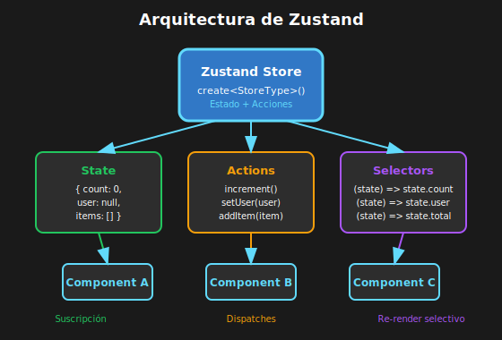

# 📘 Introducción a Zustand

## 🎯 Objetivos

- Instalar y configurar Zustand
- Crear tu primer store
- Entender la API básica de Zustand
- Usar el store en componentes React

---

## 1. ¿Qué es Zustand?



Zustand (alemán para "estado") es una librería de gestión de estado minimalista para React.

### Características Principales

| Característica     | Descripción                    |
| ------------------ | ------------------------------ |
| **Minimalista**    | ~1KB, sin boilerplate          |
| **TypeScript**     | Soporte completo de tipos      |
| **Sin Provider**   | No necesita envolver la app    |
| **Selectores**     | Re-renders optimizados         |
| **Middleware**     | Persist, devtools, immer, etc. |
| **Fuera de React** | Funciona sin componentes       |

---

## 2. Instalación

```bash
# Con pnpm (recomendado)
pnpm add zustand

# Con yarn
yarn add zustand
```

---

## 3. Primer Store

```tsx
// ============================================
// QUÉ: Crear un store con Zustand
// PARA: Centralizar estado y acciones
// IMPACTO: Estado accesible desde cualquier componente
// ============================================

// src/stores/counterStore.ts
import { create } from 'zustand';

// 1. Definir la interface del store
interface CounterStore {
  // Estado
  count: number;

  // Acciones
  increment: () => void;
  decrement: () => void;
  reset: () => void;
  setCount: (value: number) => void;
}

// 2. Crear el store con create()
const useCounterStore = create<CounterStore>((set) => ({
  // Estado inicial
  count: 0,

  // Acciones que modifican el estado
  increment: () => set((state) => ({ count: state.count + 1 })),
  decrement: () => set((state) => ({ count: state.count - 1 })),
  reset: () => set({ count: 0 }),
  setCount: (value) => set({ count: value }),
}));

export { useCounterStore };
```

### Anatomía de `create()`

```tsx
// ============================================
// QUÉ: La función create() de Zustand
// PARA: Entender cómo funciona internamente
// IMPACTO: Mejor comprensión para stores complejos
// ============================================

const useStore = create<StoreType>((set, get, store) => ({
  // set: función para actualizar el estado
  // get: función para leer el estado actual
  // store: referencia al store completo (avanzado)

  value: 0,

  // Usar set para actualizar
  updateValue: (newValue) => set({ value: newValue }),

  // Usar set con función para acceder al estado previo
  increment: () => set((state) => ({ value: state.value + 1 })),

  // Usar get para leer el estado actual
  doubleValue: () => {
    const current = get().value;
    set({ value: current * 2 });
  },
}));
```

---

## 4. Usar el Store en Componentes

### Método 1: Selector Individual

```tsx
// ============================================
// QUÉ: Seleccionar valores específicos del store
// PARA: Evitar re-renders innecesarios
// IMPACTO: Componente solo se re-renderiza si ESE valor cambia
// ============================================

import { useCounterStore } from '../stores/counterStore';

const CounterDisplay: React.FC = () => {
  // Solo suscribirse a 'count'
  const count = useCounterStore((state) => state.count);

  console.log('CounterDisplay render'); // Solo cuando count cambia

  return <p>Contador: {count}</p>;
};

const IncrementButton: React.FC = () => {
  // Solo suscribirse a 'increment'
  const increment = useCounterStore((state) => state.increment);

  console.log('IncrementButton render'); // Solo al montar

  return <button onClick={increment}>+1</button>;
};
```

### Método 2: Múltiples Selectores

```tsx
// ============================================
// QUÉ: Seleccionar múltiples valores
// PARA: Componentes que necesitan varios datos
// IMPACTO: Re-render cuando cualquiera de los valores cambia
// ============================================

const CounterControls: React.FC = () => {
  // Opción A: Selectores individuales
  const count = useCounterStore((state) => state.count);
  const increment = useCounterStore((state) => state.increment);
  const decrement = useCounterStore((state) => state.decrement);

  return (
    <div>
      <button onClick={decrement}>-</button>
      <span>{count}</span>
      <button onClick={increment}>+</button>
    </div>
  );
};
```

### Método 3: Selector de Objeto (con cuidado)

```tsx
// ============================================
// QUÉ: Seleccionar múltiples valores como objeto
// PARA: Conveniencia cuando necesitas varios valores
// IMPACTO: Requiere shallow para evitar re-renders
// ============================================

import { shallow } from 'zustand/shallow';

const CounterWithControls: React.FC = () => {
  // ⚠️ Sin shallow: re-render en CUALQUIER cambio del store
  // ✅ Con shallow: re-render solo si count, increment o decrement cambian
  const { count, increment, decrement } = useCounterStore(
    (state) => ({
      count: state.count,
      increment: state.increment,
      decrement: state.decrement,
    }),
    shallow, // Comparación superficial
  );

  return (
    <div>
      <button onClick={decrement}>-</button>
      <span>{count}</span>
      <button onClick={increment}>+</button>
    </div>
  );
};
```

---

## 5. Ejemplo Completo: Todo Store

```tsx
// ============================================
// QUÉ: Store de tareas con CRUD completo
// PARA: Ejemplo realista de gestión de estado
// IMPACTO: Base para aplicaciones con listas
// ============================================

// src/stores/todoStore.ts
import { create } from 'zustand';

interface Todo {
  id: number;
  text: string;
  completed: boolean;
}

interface TodoStore {
  todos: Todo[];
  addTodo: (text: string) => void;
  toggleTodo: (id: number) => void;
  removeTodo: (id: number) => void;
  clearCompleted: () => void;
}

const useTodoStore = create<TodoStore>((set) => ({
  todos: [],

  addTodo: (text) =>
    set((state) => ({
      todos: [
        ...state.todos,
        {
          id: Date.now(),
          text,
          completed: false,
        },
      ],
    })),

  toggleTodo: (id) =>
    set((state) => ({
      todos: state.todos.map((todo) =>
        todo.id === id ? { ...todo, completed: !todo.completed } : todo,
      ),
    })),

  removeTodo: (id) =>
    set((state) => ({
      todos: state.todos.filter((todo) => todo.id !== id),
    })),

  clearCompleted: () =>
    set((state) => ({
      todos: state.todos.filter((todo) => !todo.completed),
    })),
}));

export { useTodoStore };
export type { Todo };
```

### Componentes que Usan el Store

```tsx
// src/components/TodoList.tsx
import { useTodoStore } from '../stores/todoStore';

const TodoList: React.FC = () => {
  const todos = useTodoStore((state) => state.todos);
  const toggleTodo = useTodoStore((state) => state.toggleTodo);
  const removeTodo = useTodoStore((state) => state.removeTodo);

  if (todos.length === 0) {
    return <p>No hay tareas</p>;
  }

  return (
    <ul>
      {todos.map((todo) => (
        <li key={todo.id}>
          <input
            type="checkbox"
            checked={todo.completed}
            onChange={() => toggleTodo(todo.id)}
          />
          <span
            style={{
              textDecoration: todo.completed ? 'line-through' : 'none',
            }}>
            {todo.text}
          </span>
          <button onClick={() => removeTodo(todo.id)}>❌</button>
        </li>
      ))}
    </ul>
  );
};

// src/components/AddTodo.tsx
import { useState } from 'react';
import { useTodoStore } from '../stores/todoStore';

const AddTodo: React.FC = () => {
  const [text, setText] = useState('');
  const addTodo = useTodoStore((state) => state.addTodo);

  const handleSubmit = (e: React.FormEvent) => {
    e.preventDefault();
    if (text.trim()) {
      addTodo(text.trim());
      setText('');
    }
  };

  return (
    <form onSubmit={handleSubmit}>
      <input
        value={text}
        onChange={(e) => setText(e.target.value)}
        placeholder="Nueva tarea..."
      />
      <button type="submit">Agregar</button>
    </form>
  );
};

// src/components/TodoStats.tsx
const TodoStats: React.FC = () => {
  const todos = useTodoStore((state) => state.todos);
  const clearCompleted = useTodoStore((state) => state.clearCompleted);

  const total = todos.length;
  const completed = todos.filter((t) => t.completed).length;
  const pending = total - completed;

  return (
    <div>
      <p>
        Total: {total} | Completadas: {completed} | Pendientes: {pending}
      </p>
      {completed > 0 && (
        <button onClick={clearCompleted}>Limpiar completadas</button>
      )}
    </div>
  );
};
```

---

## 6. Sin Provider

A diferencia de Context o Redux, Zustand **no necesita Provider**:

```tsx
// ============================================
// QUÉ: Zustand funciona sin envolver la app
// PARA: Simplicidad, menos boilerplate
// IMPACTO: Importa el hook y úsalo directamente
// ============================================

// ❌ Context/Redux: necesita Provider
const App = () => (
  <Provider store={store}>
    <CartProvider>
      <AuthProvider>
        <App />
      </AuthProvider>
    </CartProvider>
  </Provider>
);

// ✅ Zustand: sin Provider
const App = () => (
  <div>
    <Header /> {/* Puede usar useCartStore */}
    <MainContent /> {/* Puede usar useCartStore */}
    <Footer /> {/* Puede usar useCartStore */}
  </div>
);
```

---

## 📚 Recursos Adicionales

- [Zustand Documentation](https://docs.pmnd.rs/zustand/getting-started/introduction)
- [Zustand GitHub](https://github.com/pmndrs/zustand)
- [TypeScript Guide](https://docs.pmnd.rs/zustand/guides/typescript)

---

## ✅ Checklist de Comprensión

- [ ] Sé instalar Zustand
- [ ] Puedo crear un store básico con create()
- [ ] Entiendo set, get y la interface del store
- [ ] Sé usar selectores en componentes
- [ ] Entiendo por qué Zustand no necesita Provider

---

_Siguiente: [03-stores-y-acciones.md](03-stores-y-acciones.md)_
