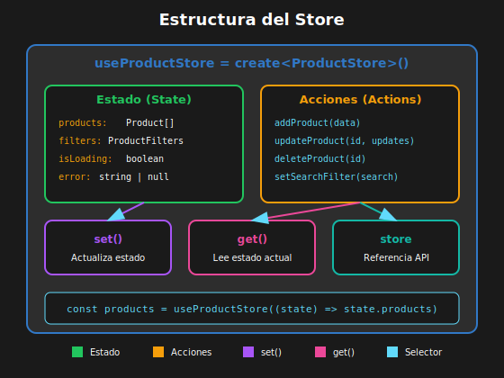

# 📘 Stores y Acciones Tipadas

## 🎯 Objetivos

- Estructurar stores complejos con TypeScript
- Crear acciones con payloads tipados
- Implementar acciones asíncronas
- Organizar stores con slices
- Usar get() para acceder al estado actual

---

## 1. Estructura de un Store Complejo



```tsx
// ============================================
// QUÉ: Store con estado complejo y múltiples acciones
// PARA: Aplicaciones reales con entidades relacionadas
// IMPACTO: Código organizado y mantenible
// ============================================

// src/stores/productStore.ts
import { create } from 'zustand';

// Tipos de dominio
interface Product {
  id: number;
  name: string;
  price: number;
  category: string;
  stock: number;
}

interface ProductFilters {
  search: string;
  category: string | null;
  minPrice: number | null;
  maxPrice: number | null;
}

// Interface del store
interface ProductStore {
  // Estado
  products: Product[];
  filters: ProductFilters;
  isLoading: boolean;
  error: string | null;

  // Acciones CRUD
  addProduct: (product: Omit<Product, 'id'>) => void;
  updateProduct: (id: number, updates: Partial<Product>) => void;
  deleteProduct: (id: number) => void;

  // Acciones de filtros
  setSearchFilter: (search: string) => void;
  setCategoryFilter: (category: string | null) => void;
  setPriceRange: (min: number | null, max: number | null) => void;
  clearFilters: () => void;

  // Acciones asíncronas
  fetchProducts: () => Promise<void>;
}

// Estado inicial de filtros
const initialFilters: ProductFilters = {
  search: '',
  category: null,
  minPrice: null,
  maxPrice: null,
};

// Crear el store
const useProductStore = create<ProductStore>((set, get) => ({
  // Estado inicial
  products: [],
  filters: initialFilters,
  isLoading: false,
  error: null,

  // Acciones CRUD
  addProduct: (productData) =>
    set((state) => ({
      products: [...state.products, { ...productData, id: Date.now() }],
    })),

  updateProduct: (id, updates) =>
    set((state) => ({
      products: state.products.map((product) =>
        product.id === id ? { ...product, ...updates } : product,
      ),
    })),

  deleteProduct: (id) =>
    set((state) => ({
      products: state.products.filter((product) => product.id !== id),
    })),

  // Acciones de filtros
  setSearchFilter: (search) =>
    set((state) => ({
      filters: { ...state.filters, search },
    })),

  setCategoryFilter: (category) =>
    set((state) => ({
      filters: { ...state.filters, category },
    })),

  setPriceRange: (minPrice, maxPrice) =>
    set((state) => ({
      filters: { ...state.filters, minPrice, maxPrice },
    })),

  clearFilters: () => set({ filters: initialFilters }),

  // Acción asíncrona
  fetchProducts: async () => {
    set({ isLoading: true, error: null });

    try {
      const response = await fetch('/api/products');
      if (!response.ok) throw new Error('Error al cargar productos');

      const products = await response.json();
      set({ products, isLoading: false });
    } catch (error) {
      set({
        error: error instanceof Error ? error.message : 'Error desconocido',
        isLoading: false,
      });
    }
  },
}));

export { useProductStore };
export type { Product, ProductFilters };
```

---

## 2. Acciones con Payload Tipado

```tsx
// ============================================
// QUÉ: Acciones que reciben datos estructurados
// PARA: Validación de tipos en tiempo de compilación
// IMPACTO: Menos errores, mejor autocompletado
// ============================================

interface CartItem {
  productId: number;
  quantity: number;
  price: number;
}

interface CartStore {
  items: CartItem[];

  // Acción con payload simple
  addItem: (item: CartItem) => void;

  // Acción con múltiples parámetros
  updateQuantity: (productId: number, quantity: number) => void;

  // Acción con payload parcial
  updateItem: (productId: number, updates: Partial<CartItem>) => void;

  // Acción sin payload
  clearCart: () => void;
}

const useCartStore = create<CartStore>((set) => ({
  items: [],

  addItem: (item) =>
    set((state) => {
      // Verificar si ya existe
      const existingIndex = state.items.findIndex(
        (i) => i.productId === item.productId,
      );

      if (existingIndex !== -1) {
        // Actualizar cantidad
        const newItems = [...state.items];
        newItems[existingIndex].quantity += item.quantity;
        return { items: newItems };
      }

      // Agregar nuevo
      return { items: [...state.items, item] };
    }),

  updateQuantity: (productId, quantity) =>
    set((state) => ({
      items:
        quantity <= 0
          ? state.items.filter((i) => i.productId !== productId)
          : state.items.map((i) =>
              i.productId === productId ? { ...i, quantity } : i,
            ),
    })),

  updateItem: (productId, updates) =>
    set((state) => ({
      items: state.items.map((i) =>
        i.productId === productId ? { ...i, ...updates } : i,
      ),
    })),

  clearCart: () => set({ items: [] }),
}));
```

---

## 3. Usando get() para Acciones Complejas

```tsx
// ============================================
// QUÉ: get() accede al estado actual dentro de acciones
// PARA: Lógica que depende del estado actual
// IMPACTO: Acciones más inteligentes y complejas
// ============================================

interface AuthStore {
  user: User | null;
  token: string | null;
  isAuthenticated: boolean;

  login: (credentials: Credentials) => Promise<void>;
  logout: () => void;
  refreshToken: () => Promise<void>;
  updateProfile: (updates: Partial<User>) => Promise<void>;
}

const useAuthStore = create<AuthStore>((set, get) => ({
  user: null,
  token: null,
  isAuthenticated: false,

  login: async (credentials) => {
    const response = await fetch('/api/login', {
      method: 'POST',
      body: JSON.stringify(credentials),
    });

    const { user, token } = await response.json();
    set({ user, token, isAuthenticated: true });
  },

  logout: () => {
    set({ user: null, token: null, isAuthenticated: false });
  },

  refreshToken: async () => {
    // Usar get() para acceder al token actual
    const currentToken = get().token;

    if (!currentToken) {
      throw new Error('No hay token para refrescar');
    }

    const response = await fetch('/api/refresh', {
      headers: { Authorization: `Bearer ${currentToken}` },
    });

    const { token } = await response.json();
    set({ token });
  },

  updateProfile: async (updates) => {
    // Usar get() para acceder al usuario y token actuales
    const { user, token } = get();

    if (!user || !token) {
      throw new Error('Usuario no autenticado');
    }

    const response = await fetch(`/api/users/${user.id}`, {
      method: 'PATCH',
      headers: {
        Authorization: `Bearer ${token}`,
        'Content-Type': 'application/json',
      },
      body: JSON.stringify(updates),
    });

    const updatedUser = await response.json();
    set({ user: updatedUser });
  },
}));
```

---

## 4. Organización con Slices

Para stores grandes, puedes dividir en "slices":

```tsx
// ============================================
// QUÉ: Dividir un store grande en módulos (slices)
// PARA: Mejor organización y mantenibilidad
// IMPACTO: Código modular, fácil de escalar
// ============================================

// src/stores/slices/userSlice.ts
import { StateCreator } from 'zustand';

interface User {
  id: number;
  name: string;
  email: string;
}

export interface UserSlice {
  user: User | null;
  setUser: (user: User | null) => void;
  updateUser: (updates: Partial<User>) => void;
}

export const createUserSlice: StateCreator<UserSlice> = (set) => ({
  user: null,
  setUser: (user) => set({ user }),
  updateUser: (updates) =>
    set((state) => ({
      user: state.user ? { ...state.user, ...updates } : null,
    })),
});

// src/stores/slices/cartSlice.ts
import { StateCreator } from 'zustand';

interface CartItem {
  id: number;
  name: string;
  price: number;
  quantity: number;
}

export interface CartSlice {
  cartItems: CartItem[];
  addToCart: (item: CartItem) => void;
  removeFromCart: (id: number) => void;
  clearCart: () => void;
}

export const createCartSlice: StateCreator<CartSlice> = (set) => ({
  cartItems: [],
  addToCart: (item) =>
    set((state) => ({
      cartItems: [...state.cartItems, item],
    })),
  removeFromCart: (id) =>
    set((state) => ({
      cartItems: state.cartItems.filter((item) => item.id !== id),
    })),
  clearCart: () => set({ cartItems: [] }),
});

// src/stores/slices/uiSlice.ts
import { StateCreator } from 'zustand';

export interface UISlice {
  sidebarOpen: boolean;
  theme: 'light' | 'dark';
  toggleSidebar: () => void;
  setTheme: (theme: 'light' | 'dark') => void;
}

export const createUISlice: StateCreator<UISlice> = (set) => ({
  sidebarOpen: true,
  theme: 'light',
  toggleSidebar: () => set((state) => ({ sidebarOpen: !state.sidebarOpen })),
  setTheme: (theme) => set({ theme }),
});

// src/stores/appStore.ts - Combinar slices
import { create } from 'zustand';
import { createUserSlice, UserSlice } from './slices/userSlice';
import { createCartSlice, CartSlice } from './slices/cartSlice';
import { createUISlice, UISlice } from './slices/uiSlice';

type AppStore = UserSlice & CartSlice & UISlice;

const useAppStore = create<AppStore>()((...args) => ({
  ...createUserSlice(...args),
  ...createCartSlice(...args),
  ...createUISlice(...args),
}));

export { useAppStore };
```

---

## 5. Acciones que Acceden a Otros Slices

```tsx
// ============================================
// QUÉ: Slices que interactúan entre sí
// PARA: Lógica que involucra múltiples partes del estado
// IMPACTO: Acciones coordinadas entre slices
// ============================================

import { StateCreator } from 'zustand';
import { UserSlice } from './userSlice';
import { CartSlice } from './cartSlice';

// Tipo combinado para acceder a otros slices
type CombinedSlices = UserSlice & CartSlice & CheckoutSlice;

export interface CheckoutSlice {
  isProcessing: boolean;
  processCheckout: () => Promise<void>;
}

export const createCheckoutSlice: StateCreator<
  CombinedSlices, // Tipo del store completo
  [],
  [],
  CheckoutSlice // Tipo de este slice
> = (set, get) => ({
  isProcessing: false,

  processCheckout: async () => {
    set({ isProcessing: true });

    // Acceder a otros slices con get()
    const { user, cartItems, clearCart } = get();

    if (!user) {
      throw new Error('Debe iniciar sesión');
    }

    if (cartItems.length === 0) {
      throw new Error('El carrito está vacío');
    }

    try {
      await fetch('/api/checkout', {
        method: 'POST',
        body: JSON.stringify({
          userId: user.id,
          items: cartItems,
        }),
      });

      // Llamar acción de otro slice
      clearCart();
    } finally {
      set({ isProcessing: false });
    }
  },
});
```

---

## 6. Tipos Avanzados con Generics

```tsx
// ============================================
// QUÉ: Store genérico reutilizable
// PARA: Crear stores para diferentes entidades
// IMPACTO: DRY - evitar duplicación de código
// ============================================

interface Entity {
  id: number;
}

interface CRUDStore<T extends Entity> {
  items: T[];
  selectedId: number | null;
  isLoading: boolean;

  setItems: (items: T[]) => void;
  addItem: (item: Omit<T, 'id'>) => void;
  updateItem: (id: number, updates: Partial<T>) => void;
  deleteItem: (id: number) => void;
  selectItem: (id: number | null) => void;
  getSelectedItem: () => T | undefined;
}

// Factory para crear stores CRUD
const createCRUDStore = <T extends Entity>() => {
  return create<CRUDStore<T>>((set, get) => ({
    items: [],
    selectedId: null,
    isLoading: false,

    setItems: (items) => set({ items }),

    addItem: (itemData) =>
      set((state) => ({
        items: [...state.items, { ...itemData, id: Date.now() } as T],
      })),

    updateItem: (id, updates) =>
      set((state) => ({
        items: state.items.map((item) =>
          item.id === id ? { ...item, ...updates } : item,
        ),
      })),

    deleteItem: (id) =>
      set((state) => ({
        items: state.items.filter((item) => item.id !== id),
        selectedId: state.selectedId === id ? null : state.selectedId,
      })),

    selectItem: (id) => set({ selectedId: id }),

    getSelectedItem: () => {
      const { items, selectedId } = get();
      return items.find((item) => item.id === selectedId);
    },
  }));
};

// Usar la factory
interface Book {
  id: number;
  title: string;
  author: string;
}

interface Medicine {
  id: number;
  name: string;
  price: number;
}

const useBookStore = createCRUDStore<Book>();
const useMedicineStore = createCRUDStore<Medicine>();
```

---

## 📚 Recursos Adicionales

- [Zustand TypeScript Guide](https://docs.pmnd.rs/zustand/guides/typescript)
- [Zustand Slices Pattern](https://docs.pmnd.rs/zustand/guides/slices-pattern)
- [Zustand Best Practices](https://docs.pmnd.rs/zustand/guides/practice-with-no-store-actions)

---

## ✅ Checklist de Comprensión

- [ ] Sé estructurar stores complejos con TypeScript
- [ ] Puedo crear acciones con payloads tipados
- [ ] Entiendo cuándo usar get() vs set()
- [ ] Sé organizar stores grandes con slices
- [ ] Puedo crear stores genéricos reutilizables

---

_Siguiente: [04-selectores-y-performance.md](04-selectores-y-performance.md)_
