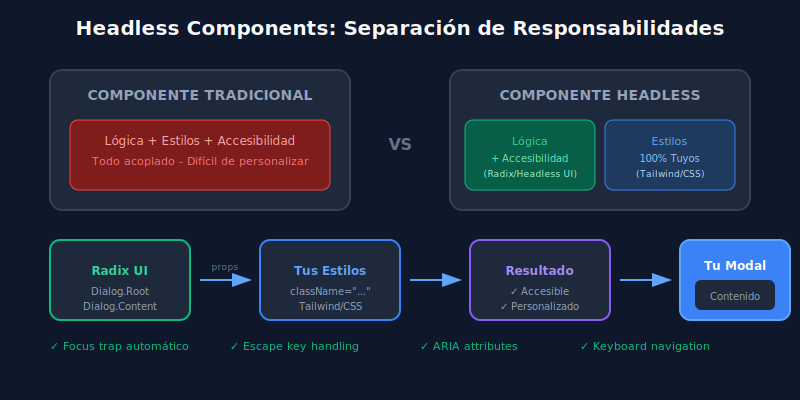

# 01 - Componentes Headless: Radix UI y Headless UI

## 🎯 Objetivos de Aprendizaje

- Comprender qué son los componentes headless y sus beneficios
- Implementar componentes accesibles con Radix UI
- Usar el patrón Compound Components
- Integrar componentes headless con Tailwind CSS

---

## 📖 ¿Qué son los Componentes Headless?

Los **componentes headless** (sin cabeza) son componentes de UI que proporcionan toda la **lógica y accesibilidad** pero **sin estilos predefinidos**. Tú controlas completamente la apariencia visual.

### Analogía Simple

Imagina un automóvil:

- **Componentes tradicionales** (MUI, Ant Design): Auto completo con diseño fijo
- **Componentes headless**: Motor, transmisión y sistema eléctrico... tú diseñas la carrocería

### Beneficios

| Beneficio         | Descripción                                                      |
| ----------------- | ---------------------------------------------------------------- |
| **Accesibilidad** | ARIA attributes, focus management, keyboard navigation incluidos |
| **Flexibilidad**  | Control total sobre estilos y markup                             |
| **Consistencia**  | Comportamiento probado y estándar                                |
| **Bundle size**   | Sin CSS innecesario                                              |

### Diagrama: Headless vs Traditional Components



---

## 🧩 Radix UI Primitives

[Radix UI](https://www.radix-ui.com/) es la librería headless más popular para React. Provee primitivos accesibles y sin estilos.

### Instalación

```bash
# Instalar el componente que necesites
pnpm add @radix-ui/react-dialog
pnpm add @radix-ui/react-dropdown-menu
pnpm add @radix-ui/react-tooltip
pnpm add @radix-ui/react-tabs
```

### Anatomía de un Componente Radix

Cada componente Radix sigue un patrón de **partes composables**:

```tsx
import * as Dialog from '@radix-ui/react-dialog';

// Cada parte es un componente separado
<Dialog.Root>           {/* Estado y contexto */}
  <Dialog.Trigger>      {/* Botón que abre */}
  <Dialog.Portal>       {/* Renderiza fuera del DOM tree */}
    <Dialog.Overlay>    {/* Fondo oscuro */}
    <Dialog.Content>    {/* Contenido del modal */}
      <Dialog.Title>    {/* Título (accesibilidad) */}
      <Dialog.Description> {/* Descripción (accesibilidad) */}
      <Dialog.Close>    {/* Botón de cerrar */}
    </Dialog.Content>
  </Dialog.Portal>
</Dialog.Root>
```

---

## 💻 Ejemplo: Dialog con Radix + Tailwind

```tsx
// components/Modal.tsx
import * as Dialog from '@radix-ui/react-dialog';
import { X } from 'lucide-react';

interface ModalProps {
  trigger: React.ReactNode;
  title: string;
  description?: string;
  children: React.ReactNode;
}

export const Modal: React.FC<ModalProps> = ({
  trigger,
  title,
  description,
  children,
}) => {
  return (
    <Dialog.Root>
      {/* Trigger: el elemento que abre el modal */}
      <Dialog.Trigger asChild>{trigger}</Dialog.Trigger>

      {/* Portal: renderiza fuera del DOM principal */}
      <Dialog.Portal>
        {/* Overlay: fondo oscuro con animación */}
        <Dialog.Overlay
          className="
            fixed inset-0 z-50 
            bg-black/50 backdrop-blur-sm
            data-[state=open]:animate-in 
            data-[state=closed]:animate-out
            data-[state=closed]:fade-out-0 
            data-[state=open]:fade-in-0
          "
        />

        {/* Content: el modal en sí */}
        <Dialog.Content
          className="
            fixed left-1/2 top-1/2 z-50
            w-full max-w-lg -translate-x-1/2 -translate-y-1/2
            rounded-lg bg-gray-900 p-6 shadow-xl
            border border-gray-700
            data-[state=open]:animate-in 
            data-[state=closed]:animate-out
            data-[state=closed]:fade-out-0 
            data-[state=open]:fade-in-0
            data-[state=closed]:zoom-out-95 
            data-[state=open]:zoom-in-95
          ">
          {/* Título - requerido para accesibilidad */}
          <Dialog.Title className="text-xl font-semibold text-white">
            {title}
          </Dialog.Title>

          {/* Descripción - opcional pero recomendada */}
          {description && (
            <Dialog.Description className="mt-2 text-gray-400">
              {description}
            </Dialog.Description>
          )}

          {/* Contenido del modal */}
          <div className="mt-4">{children}</div>

          {/* Botón de cerrar */}
          <Dialog.Close
            className="
              absolute right-4 top-4 
              rounded-full p-1
              text-gray-400 hover:text-white
              hover:bg-gray-700/50
              transition-colors
            "
            aria-label="Cerrar">
            <X size={20} />
          </Dialog.Close>
        </Dialog.Content>
      </Dialog.Portal>
    </Dialog.Root>
  );
};
```

### Uso del Modal

```tsx
// App.tsx
import { Modal } from './components/Modal';

function App() {
  return (
    <Modal
      trigger={
        <button className="px-4 py-2 bg-blue-600 rounded-lg text-white">
          Abrir Modal
        </button>
      }
      title="Confirmar acción"
      description="Esta acción no se puede deshacer.">
      <p className="text-gray-300">¿Estás seguro de que deseas continuar?</p>

      <div className="mt-6 flex justify-end gap-3">
        <Dialog.Close asChild>
          <button className="px-4 py-2 bg-gray-700 rounded-lg text-white">
            Cancelar
          </button>
        </Dialog.Close>
        <button className="px-4 py-2 bg-red-600 rounded-lg text-white">
          Eliminar
        </button>
      </div>
    </Modal>
  );
}
```

---

## 🎨 Data Attributes para Estilos

Radix expone **data attributes** para estilizar estados:

```css
/* Estados disponibles */
[data-state='open'] {
} /* Componente abierto */
[data-state='closed'] {
} /* Componente cerrado */
[data-state='checked'] {
} /* Checkbox/Radio marcado */
[data-state='unchecked'] {
}
[data-disabled] {
} /* Elemento deshabilitado */
[data-highlighted] {
} /* Item resaltado (menús) */
```

### Ejemplo con Tailwind

```tsx
<Dialog.Overlay
  className="
    data-[state=open]:bg-black/50
    data-[state=closed]:bg-transparent
    transition-colors
  "
/>
```

---

## 🔧 Prop `asChild`

El prop `asChild` permite usar tu propio elemento como el componente Radix:

```tsx
// Sin asChild: Radix renderiza su propio <button>
<Dialog.Trigger>
  Click me
</Dialog.Trigger>

// Con asChild: usa TU elemento, Radix solo añade props
<Dialog.Trigger asChild>
  <button className="mi-boton-personalizado">
    Click me
  </button>
</Dialog.Trigger>

// También funciona con componentes custom
<Dialog.Trigger asChild>
  <MyCustomButton variant="primary">
    Click me
  </MyCustomButton>
</Dialog.Trigger>
```

---

## 📦 Más Componentes Radix Comunes

### Dropdown Menu

```tsx
import * as DropdownMenu from '@radix-ui/react-dropdown-menu';

<DropdownMenu.Root>
  <DropdownMenu.Trigger asChild>
    <button>Opciones</button>
  </DropdownMenu.Trigger>

  <DropdownMenu.Portal>
    <DropdownMenu.Content className="bg-gray-800 rounded-lg p-2 shadow-xl">
      <DropdownMenu.Item className="px-3 py-2 rounded hover:bg-gray-700 cursor-pointer">
        Editar
      </DropdownMenu.Item>
      <DropdownMenu.Item className="px-3 py-2 rounded hover:bg-gray-700 cursor-pointer">
        Duplicar
      </DropdownMenu.Item>
      <DropdownMenu.Separator className="h-px bg-gray-700 my-1" />
      <DropdownMenu.Item className="px-3 py-2 rounded hover:bg-red-900/50 text-red-400 cursor-pointer">
        Eliminar
      </DropdownMenu.Item>
    </DropdownMenu.Content>
  </DropdownMenu.Portal>
</DropdownMenu.Root>;
```

### Tooltip

```tsx
import * as Tooltip from '@radix-ui/react-tooltip';

<Tooltip.Provider>
  <Tooltip.Root>
    <Tooltip.Trigger asChild>
      <button>Hover me</button>
    </Tooltip.Trigger>
    <Tooltip.Portal>
      <Tooltip.Content
        className="bg-gray-800 px-3 py-1.5 rounded text-sm text-white"
        sideOffset={5}>
        Información adicional
        <Tooltip.Arrow className="fill-gray-800" />
      </Tooltip.Content>
    </Tooltip.Portal>
  </Tooltip.Root>
</Tooltip.Provider>;
```

---

## 🎯 Headless UI (Alternativa)

[Headless UI](https://headlessui.com/) es de los creadores de Tailwind, integración perfecta:

```bash
pnpm add @headlessui/react
```

```tsx
import { Dialog, Transition } from '@headlessui/react';
import { Fragment, useState } from 'react';

function MyDialog() {
  const [isOpen, setIsOpen] = useState(false);

  return (
    <>
      <button onClick={() => setIsOpen(true)}>Abrir</button>

      <Transition
        appear
        show={isOpen}
        as={Fragment}>
        <Dialog
          onClose={() => setIsOpen(false)}
          className="relative z-50">
          {/* Overlay */}
          <Transition.Child
            as={Fragment}
            enter="ease-out duration-300"
            enterFrom="opacity-0"
            enterTo="opacity-100"
            leave="ease-in duration-200"
            leaveFrom="opacity-100"
            leaveTo="opacity-0">
            <div className="fixed inset-0 bg-black/50" />
          </Transition.Child>

          {/* Content */}
          <div className="fixed inset-0 flex items-center justify-center">
            <Transition.Child
              as={Fragment}
              enter="ease-out duration-300"
              enterFrom="opacity-0 scale-95"
              enterTo="opacity-100 scale-100"
              leave="ease-in duration-200"
              leaveFrom="opacity-100 scale-100"
              leaveTo="opacity-0 scale-95">
              <Dialog.Panel className="bg-gray-900 rounded-lg p-6 max-w-md">
                <Dialog.Title className="text-xl font-bold text-white">
                  Título
                </Dialog.Title>
                <p className="mt-2 text-gray-400">Contenido del diálogo...</p>
              </Dialog.Panel>
            </Transition.Child>
          </div>
        </Dialog>
      </Transition>
    </>
  );
}
```

---

## 📊 Radix vs Headless UI

| Aspecto         | Radix UI               | Headless UI            |
| --------------- | ---------------------- | ---------------------- |
| **Creador**     | WorkOS                 | Tailwind Labs          |
| **Componentes** | 30+ primitivos         | 10+ componentes        |
| **API**         | Compound components    | Props-based            |
| **Animaciones** | Data attributes        | Transition component   |
| **Bundle**      | Instalación individual | Paquete único          |
| **Tailwind**    | Compatible             | Diseñado para Tailwind |

### ¿Cuál elegir?

- **Radix UI**: Más componentes, máxima flexibilidad, proyectos grandes
- **Headless UI**: Integración Tailwind perfecta, proyectos medianos

---

## ✅ Checklist de Aprendizaje

- [ ] Entender qué son componentes headless
- [ ] Instalar y usar Radix UI primitives
- [ ] Aplicar estilos con data attributes
- [ ] Usar prop `asChild` correctamente
- [ ] Implementar Dialog, Dropdown, Tooltip
- [ ] Conocer la alternativa Headless UI

---

## 🔗 Recursos

- [Radix UI Documentation](https://www.radix-ui.com/docs/primitives)
- [Headless UI Documentation](https://headlessui.com/)
- [shadcn/ui (Radix + Tailwind)](https://ui.shadcn.com/)

---

[← Volver al índice](../README.md) | [Siguiente: Framer Motion →](./02-framer-motion.md)
