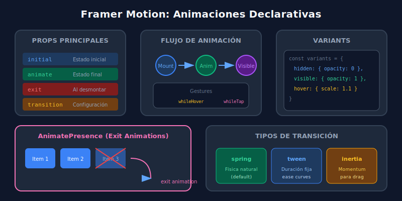

# 02 - Animaciones con Framer Motion

## 🎯 Objetivos de Aprendizaje

- Comprender los fundamentos de Framer Motion
- Implementar animaciones declarativas en React
- Usar variants para animaciones complejas
- Aplicar gestures y AnimatePresence
- Crear transiciones suaves entre estados

---

## 📖 ¿Qué es Framer Motion?

[Framer Motion](https://www.framer.com/motion/) es una librería de animaciones para React que permite crear animaciones fluidas de forma **declarativa**.

### Instalación

```bash
pnpm add framer-motion
```

### ¿Por qué Framer Motion?

| Característica        | Beneficio                                  |
| --------------------- | ------------------------------------------ |
| **Declarativo**       | Describe el estado final, no los pasos     |
| **Spring physics**    | Animaciones naturales basadas en física    |
| **Gestures**          | Soporte nativo para hover, tap, drag       |
| **Layout animations** | Anima cambios de layout automáticamente    |
| **Exit animations**   | AnimatePresence para animaciones de salida |

### Diagrama: Flujo de Animación en Framer Motion



---

## 🚀 Fundamentos: motion components

El componente `motion` es la base de Framer Motion:

```tsx
import { motion } from 'framer-motion';

// Cualquier elemento HTML puede ser animado
<motion.div />
<motion.span />
<motion.button />
<motion.svg />
<motion.img />
```

### Animación Básica

```tsx
import { motion } from 'framer-motion';

function BasicAnimation() {
  return (
    <motion.div
      // Estado inicial
      initial={{ opacity: 0, y: 20 }}
      // Estado animado
      animate={{ opacity: 1, y: 0 }}
      // Configuración de transición
      transition={{ duration: 0.5 }}
      className="p-4 bg-blue-600 rounded-lg">
      ¡Aparezco con animación!
    </motion.div>
  );
}
```

### Props Principales

| Prop         | Descripción                                    |
| ------------ | ---------------------------------------------- |
| `initial`    | Estado inicial (antes de montar)               |
| `animate`    | Estado objetivo de la animación                |
| `exit`       | Estado al desmontar (requiere AnimatePresence) |
| `transition` | Configuración de la transición                 |
| `whileHover` | Estado mientras hover                          |
| `whileTap`   | Estado mientras click/tap                      |
| `whileFocus` | Estado mientras focus                          |
| `whileDrag`  | Estado mientras se arrastra                    |

---

## 🎨 Transiciones

### Tipos de Transición

```tsx
// Tween: animación basada en duración
<motion.div
  animate={{ x: 100 }}
  transition={{
    type: "tween",
    duration: 0.5,
    ease: "easeOut"
  }}
/>

// Spring: animación basada en física (default)
<motion.div
  animate={{ x: 100 }}
  transition={{
    type: "spring",
    stiffness: 300,  // Rigidez del resorte
    damping: 20      // Amortiguación
  }}
/>

// Inertia: continúa el momentum
<motion.div
  drag
  dragTransition={{
    power: 0.8,
    timeConstant: 200
  }}
/>
```

### Easing Functions

```tsx
transition={{
  ease: "linear"        // Velocidad constante
  ease: "easeIn"        // Empieza lento
  ease: "easeOut"       // Termina lento
  ease: "easeInOut"     // Lento en ambos extremos
  ease: [0.6, 0.01, -0.05, 0.95]  // Cubic bezier custom
}}
```

---

## 🎭 Variants: Animaciones Complejas

Las **variants** permiten definir estados de animación reutilizables:

```tsx
import { motion } from 'framer-motion';

// Definir variants fuera del componente
const cardVariants = {
  hidden: {
    opacity: 0,
    y: 20,
    scale: 0.95,
  },
  visible: {
    opacity: 1,
    y: 0,
    scale: 1,
    transition: {
      duration: 0.4,
      ease: 'easeOut',
    },
  },
  hover: {
    scale: 1.02,
    boxShadow: '0 10px 30px rgba(0,0,0,0.3)',
    transition: {
      duration: 0.2,
    },
  },
};

function Card({ title }: { title: string }) {
  return (
    <motion.div
      variants={cardVariants}
      initial="hidden"
      animate="visible"
      whileHover="hover"
      className="p-6 bg-gray-800 rounded-xl">
      <h3 className="text-xl text-white">{title}</h3>
    </motion.div>
  );
}
```

### Propagación de Variants (Parent → Children)

```tsx
const containerVariants = {
  hidden: { opacity: 0 },
  visible: {
    opacity: 1,
    transition: {
      // Staggers: anima hijos secuencialmente
      staggerChildren: 0.1,
      delayChildren: 0.2,
    },
  },
};

const itemVariants = {
  hidden: { opacity: 0, x: -20 },
  visible: {
    opacity: 1,
    x: 0,
    transition: { duration: 0.3 },
  },
};

function List({ items }: { items: string[] }) {
  return (
    <motion.ul
      variants={containerVariants}
      initial="hidden"
      animate="visible">
      {items.map((item) => (
        <motion.li
          key={item}
          variants={itemVariants}
          className="p-2 text-white">
          {item}
        </motion.li>
      ))}
    </motion.ul>
  );
}
```

---

## ✋ Gestures

### Hover y Tap

```tsx
function InteractiveButton() {
  return (
    <motion.button
      whileHover={{
        scale: 1.05,
        backgroundColor: '#3b82f6',
      }}
      whileTap={{
        scale: 0.95,
      }}
      transition={{ type: 'spring', stiffness: 400, damping: 17 }}
      className="px-6 py-3 bg-blue-600 text-white rounded-lg">
      Click me
    </motion.button>
  );
}
```

### Drag

```tsx
function DraggableBox() {
  return (
    <motion.div
      drag // Habilita drag
      dragConstraints={{
        // Límites de arrastre
        top: -100,
        left: -100,
        right: 100,
        bottom: 100,
      }}
      dragElastic={0.2} // Elasticidad en los bordes
      whileDrag={{ scale: 1.1, cursor: 'grabbing' }}
      className="w-24 h-24 bg-purple-600 rounded-xl cursor-grab"
    />
  );
}
```

---

## 🚪 AnimatePresence: Animaciones de Salida

`AnimatePresence` permite animar elementos que se desmontan del DOM:

```tsx
import { motion, AnimatePresence } from 'framer-motion';
import { useState } from 'react';

function ToggleContent() {
  const [isVisible, setIsVisible] = useState(true);

  return (
    <>
      <button onClick={() => setIsVisible(!isVisible)}>Toggle</button>

      <AnimatePresence>
        {isVisible && (
          <motion.div
            initial={{ opacity: 0, height: 0 }}
            animate={{ opacity: 1, height: 'auto' }}
            exit={{ opacity: 0, height: 0 }}
            transition={{ duration: 0.3 }}
            className="overflow-hidden">
            <p className="p-4 bg-gray-800 text-white">
              Este contenido aparece y desaparece con animación
            </p>
          </motion.div>
        )}
      </AnimatePresence>
    </>
  );
}
```

### Animación de Lista con Eliminación

```tsx
import { motion, AnimatePresence } from 'framer-motion';
import { useState } from 'react';

interface Item {
  id: number;
  text: string;
}

function AnimatedList() {
  const [items, setItems] = useState<Item[]>([
    { id: 1, text: 'Item 1' },
    { id: 2, text: 'Item 2' },
    { id: 3, text: 'Item 3' },
  ]);

  const removeItem = (id: number) => {
    setItems(items.filter((item) => item.id !== id));
  };

  return (
    <ul className="space-y-2">
      <AnimatePresence>
        {items.map((item) => (
          <motion.li
            key={item.id}
            layout // Anima cambios de posición
            initial={{ opacity: 0, x: -50 }}
            animate={{ opacity: 1, x: 0 }}
            exit={{ opacity: 0, x: 50 }}
            transition={{ duration: 0.2 }}
            className="flex justify-between p-3 bg-gray-800 rounded-lg">
            <span className="text-white">{item.text}</span>
            <button
              onClick={() => removeItem(item.id)}
              className="text-red-400 hover:text-red-300">
              Eliminar
            </button>
          </motion.li>
        ))}
      </AnimatePresence>
    </ul>
  );
}
```

---

## 📐 Layout Animations

El prop `layout` anima automáticamente cambios de tamaño y posición:

```tsx
import { motion } from 'framer-motion';
import { useState } from 'react';

function ExpandableCard() {
  const [isExpanded, setIsExpanded] = useState(false);

  return (
    <motion.div
      layout // ← La magia
      onClick={() => setIsExpanded(!isExpanded)}
      className={`
        bg-gray-800 rounded-xl cursor-pointer overflow-hidden
        ${isExpanded ? 'p-8' : 'p-4'}
      `}
      transition={{ duration: 0.3, ease: 'easeInOut' }}>
      <motion.h2
        layout="position"
        className="text-xl text-white">
        Título
      </motion.h2>

      {isExpanded && (
        <motion.p
          initial={{ opacity: 0 }}
          animate={{ opacity: 1 }}
          className="mt-4 text-gray-400">
          Contenido expandido que aparece cuando clickeas...
        </motion.p>
      )}
    </motion.div>
  );
}
```

---

## 🎯 Ejemplo Completo: Card Animada

```tsx
import { motion, AnimatePresence } from 'framer-motion';
import { useState } from 'react';

interface CardProps {
  title: string;
  description: string;
  image: string;
}

const cardVariants = {
  hidden: { opacity: 0, y: 30 },
  visible: {
    opacity: 1,
    y: 0,
    transition: {
      duration: 0.4,
      ease: [0.25, 0.1, 0.25, 1],
    },
  },
  hover: {
    y: -8,
    transition: { duration: 0.2 },
  },
};

const imageVariants = {
  hover: {
    scale: 1.1,
    transition: { duration: 0.4 },
  },
};

export function AnimatedCard({ title, description, image }: CardProps) {
  const [isHovered, setIsHovered] = useState(false);

  return (
    <motion.article
      variants={cardVariants}
      initial="hidden"
      animate="visible"
      whileHover="hover"
      onHoverStart={() => setIsHovered(true)}
      onHoverEnd={() => setIsHovered(false)}
      className="overflow-hidden rounded-xl bg-gray-800 shadow-lg">
      {/* Imagen con zoom en hover */}
      <div className="overflow-hidden h-48">
        <motion.img
          src={image}
          alt={title}
          variants={imageVariants}
          className="w-full h-full object-cover"
        />
      </div>

      {/* Contenido */}
      <div className="p-4">
        <h3 className="text-lg font-semibold text-white">{title}</h3>

        <AnimatePresence>
          {isHovered && (
            <motion.p
              initial={{ opacity: 0, height: 0 }}
              animate={{ opacity: 1, height: 'auto' }}
              exit={{ opacity: 0, height: 0 }}
              className="text-gray-400 text-sm mt-2">
              {description}
            </motion.p>
          )}
        </AnimatePresence>
      </div>
    </motion.article>
  );
}
```

---

## 🛠️ Hooks de Framer Motion

### useAnimation: Control Programático

```tsx
import { motion, useAnimation } from 'framer-motion';
import { useEffect } from 'react';

function ControlledAnimation() {
  const controls = useAnimation();

  useEffect(() => {
    // Animación programática
    controls.start({
      x: 100,
      transition: { duration: 0.5 },
    });
  }, [controls]);

  const handleClick = async () => {
    await controls.start({ scale: 1.2 });
    await controls.start({ scale: 1 });
  };

  return (
    <motion.div
      animate={controls}
      onClick={handleClick}
      className="w-20 h-20 bg-blue-600 rounded-lg"
    />
  );
}
```

### useInView: Animar al Entrar en Viewport

```tsx
import { motion, useInView } from 'framer-motion';
import { useRef } from 'react';

function FadeInSection({ children }: { children: React.ReactNode }) {
  const ref = useRef(null);
  const isInView = useInView(ref, { once: true, margin: '-100px' });

  return (
    <motion.section
      ref={ref}
      initial={{ opacity: 0, y: 50 }}
      animate={isInView ? { opacity: 1, y: 0 } : { opacity: 0, y: 50 }}
      transition={{ duration: 0.6 }}>
      {children}
    </motion.section>
  );
}
```

---

## ✅ Checklist de Aprendizaje

- [ ] Usar componentes `motion.*`
- [ ] Aplicar `initial`, `animate`, `exit`
- [ ] Configurar transiciones (spring, tween)
- [ ] Crear y usar variants
- [ ] Implementar gestures (hover, tap, drag)
- [ ] Usar AnimatePresence para exit animations
- [ ] Aplicar layout animations

---

## 🔗 Recursos

- [Framer Motion Documentation](https://www.framer.com/motion/)
- [Framer Motion Examples](https://www.framer.com/motion/examples/)
- [Motion DevTools](https://motion.dev/tools)

---

[← Headless Components](./01-headless-components.md) | [Siguiente: Theming →](./03-theming-dark-mode.md)
