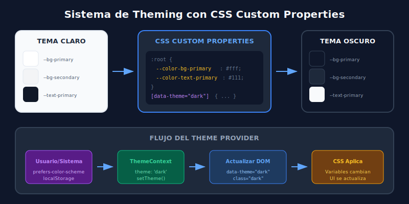

# 03 - Theming y Dark Mode

## 🎯 Objetivos de Aprendizaje

- Implementar sistema de temas con CSS Custom Properties
- Crear toggle dark/light mode funcional
- Persistir preferencia del usuario
- Respetar preferencia del sistema operativo
- Integrar theming con Tailwind CSS

---

## 📖 Fundamentos del Theming

Un **sistema de temas** permite cambiar la apariencia visual de una aplicación de forma consistente. Los componentes principales son:

| Componente                | Propósito                                    |
| ------------------------- | -------------------------------------------- |
| **Design Tokens**         | Variables de diseño (colores, spacing, etc.) |
| **CSS Custom Properties** | Variables CSS nativas (`--color-primary`)    |
| **ThemeProvider**         | Contexto React para el tema actual           |
| **Theme Switcher**        | UI para cambiar entre temas                  |

### Diagrama: Sistema de Theming



---

## 🎨 CSS Custom Properties (Variables CSS)

### Definición de Tokens

```css
/* styles/themes.css */

/* Tema claro (default) */
:root {
  /* Colores */
  --color-bg-primary: #ffffff;
  --color-bg-secondary: #f3f4f6;
  --color-bg-tertiary: #e5e7eb;

  --color-text-primary: #111827;
  --color-text-secondary: #4b5563;
  --color-text-muted: #9ca3af;

  --color-border: #e5e7eb;
  --color-border-focus: #3b82f6;

  --color-accent: #3b82f6;
  --color-accent-hover: #2563eb;

  /* Sombras */
  --shadow-sm: 0 1px 2px rgba(0, 0, 0, 0.05);
  --shadow-md: 0 4px 6px rgba(0, 0, 0, 0.1);
  --shadow-lg: 0 10px 15px rgba(0, 0, 0, 0.1);

  /* Spacing (opcional, Tailwind ya los tiene) */
  --radius-sm: 0.25rem;
  --radius-md: 0.5rem;
  --radius-lg: 1rem;
}

/* Tema oscuro */
[data-theme='dark'] {
  --color-bg-primary: #0f172a;
  --color-bg-secondary: #1e293b;
  --color-bg-tertiary: #334155;

  --color-text-primary: #f8fafc;
  --color-text-secondary: #cbd5e1;
  --color-text-muted: #64748b;

  --color-border: #334155;
  --color-border-focus: #60a5fa;

  --color-accent: #60a5fa;
  --color-accent-hover: #3b82f6;

  --shadow-sm: 0 1px 2px rgba(0, 0, 0, 0.3);
  --shadow-md: 0 4px 6px rgba(0, 0, 0, 0.4);
  --shadow-lg: 0 10px 15px rgba(0, 0, 0, 0.5);
}
```

### Uso de Variables

```css
/* components/Card.css */
.card {
  background-color: var(--color-bg-secondary);
  border: 1px solid var(--color-border);
  border-radius: var(--radius-lg);
  box-shadow: var(--shadow-md);
}

.card-title {
  color: var(--color-text-primary);
}

.card-description {
  color: var(--color-text-secondary);
}
```

---

## ⚛️ ThemeProvider con React Context

### Crear el Contexto

```tsx
// context/ThemeContext.tsx
import { createContext, useContext, useEffect, useState } from 'react';

type Theme = 'light' | 'dark' | 'system';

interface ThemeContextType {
  theme: Theme;
  resolvedTheme: 'light' | 'dark';
  setTheme: (theme: Theme) => void;
}

const ThemeContext = createContext<ThemeContextType | undefined>(undefined);

// Obtener preferencia del sistema
const getSystemTheme = (): 'light' | 'dark' => {
  if (typeof window === 'undefined') return 'light';
  return window.matchMedia('(prefers-color-scheme: dark)').matches
    ? 'dark'
    : 'light';
};

// Obtener tema guardado
const getStoredTheme = (): Theme => {
  if (typeof window === 'undefined') return 'system';
  return (localStorage.getItem('theme') as Theme) || 'system';
};

interface ThemeProviderProps {
  children: React.ReactNode;
  defaultTheme?: Theme;
}

export function ThemeProvider({
  children,
  defaultTheme = 'system',
}: ThemeProviderProps) {
  const [theme, setThemeState] = useState<Theme>(defaultTheme);
  const [resolvedTheme, setResolvedTheme] = useState<'light' | 'dark'>('light');

  // Inicializar tema al montar
  useEffect(() => {
    const stored = getStoredTheme();
    setThemeState(stored);
  }, []);

  // Resolver y aplicar tema
  useEffect(() => {
    const resolved = theme === 'system' ? getSystemTheme() : theme;
    setResolvedTheme(resolved);

    // Aplicar al DOM
    document.documentElement.setAttribute('data-theme', resolved);

    // También agregar clase para Tailwind
    if (resolved === 'dark') {
      document.documentElement.classList.add('dark');
    } else {
      document.documentElement.classList.remove('dark');
    }
  }, [theme]);

  // Escuchar cambios en preferencia del sistema
  useEffect(() => {
    if (theme !== 'system') return;

    const mediaQuery = window.matchMedia('(prefers-color-scheme: dark)');

    const handleChange = (e: MediaQueryListEvent) => {
      const newTheme = e.matches ? 'dark' : 'light';
      setResolvedTheme(newTheme);
      document.documentElement.setAttribute('data-theme', newTheme);

      if (newTheme === 'dark') {
        document.documentElement.classList.add('dark');
      } else {
        document.documentElement.classList.remove('dark');
      }
    };

    mediaQuery.addEventListener('change', handleChange);
    return () => mediaQuery.removeEventListener('change', handleChange);
  }, [theme]);

  // Función para cambiar tema
  const setTheme = (newTheme: Theme) => {
    setThemeState(newTheme);
    localStorage.setItem('theme', newTheme);
  };

  return (
    <ThemeContext.Provider value={{ theme, resolvedTheme, setTheme }}>
      {children}
    </ThemeContext.Provider>
  );
}

// Hook para consumir el contexto
export function useTheme() {
  const context = useContext(ThemeContext);
  if (context === undefined) {
    throw new Error('useTheme debe usarse dentro de ThemeProvider');
  }
  return context;
}
```

### Usar el Provider

```tsx
// main.tsx
import { StrictMode } from 'react';
import { createRoot } from 'react-dom/client';
import { ThemeProvider } from './context/ThemeContext';
import App from './App';
import './styles/themes.css';

createRoot(document.getElementById('root')!).render(
  <StrictMode>
    <ThemeProvider defaultTheme="system">
      <App />
    </ThemeProvider>
  </StrictMode>,
);
```

---

## 🔘 Theme Switcher Component

```tsx
// components/ThemeSwitcher.tsx
import { motion } from 'framer-motion';
import { Sun, Moon, Monitor } from 'lucide-react';
import { useTheme } from '../context/ThemeContext';

export function ThemeSwitcher() {
  const { theme, setTheme } = useTheme();

  const themes = [
    { value: 'light' as const, icon: Sun, label: 'Claro' },
    { value: 'dark' as const, icon: Moon, label: 'Oscuro' },
    { value: 'system' as const, icon: Monitor, label: 'Sistema' },
  ];

  return (
    <div className="flex items-center gap-1 p-1 rounded-lg bg-[var(--color-bg-tertiary)]">
      {themes.map(({ value, icon: Icon, label }) => (
        <button
          key={value}
          onClick={() => setTheme(value)}
          className="relative p-2 rounded-md transition-colors"
          aria-label={`Cambiar a tema ${label}`}>
          {theme === value && (
            <motion.div
              layoutId="theme-indicator"
              className="absolute inset-0 bg-[var(--color-accent)] rounded-md"
              transition={{ type: 'spring', stiffness: 500, damping: 30 }}
            />
          )}
          <Icon
            size={18}
            className={`relative z-10 transition-colors ${
              theme === value ? 'text-white' : 'text-[var(--color-text-muted)]'
            }`}
          />
        </button>
      ))}
    </div>
  );
}
```

### Toggle Simple (Solo Dark/Light)

```tsx
// components/ThemeToggle.tsx
import { motion } from 'framer-motion';
import { Sun, Moon } from 'lucide-react';
import { useTheme } from '../context/ThemeContext';

export function ThemeToggle() {
  const { resolvedTheme, setTheme } = useTheme();
  const isDark = resolvedTheme === 'dark';

  const toggleTheme = () => {
    setTheme(isDark ? 'light' : 'dark');
  };

  return (
    <button
      onClick={toggleTheme}
      className="
        relative w-14 h-8 rounded-full p-1
        bg-[var(--color-bg-tertiary)]
        transition-colors
      "
      aria-label={`Cambiar a tema ${isDark ? 'claro' : 'oscuro'}`}>
      {/* Track icons */}
      <Sun
        size={14}
        className="absolute left-2 top-1/2 -translate-y-1/2 text-yellow-500"
      />
      <Moon
        size={14}
        className="absolute right-2 top-1/2 -translate-y-1/2 text-blue-400"
      />

      {/* Thumb */}
      <motion.div
        className="w-6 h-6 rounded-full bg-white shadow-md"
        animate={{ x: isDark ? 24 : 0 }}
        transition={{ type: 'spring', stiffness: 500, damping: 30 }}
      />
    </button>
  );
}
```

---

## 🌙 Integración con Tailwind CSS

### Configurar Tailwind para Dark Mode

```javascript
// tailwind.config.js
/** @type {import('tailwindcss').Config} */
export default {
  content: ['./index.html', './src/**/*.{js,ts,jsx,tsx}'],

  // Usar clase 'dark' para activar dark mode
  darkMode: 'class',

  theme: {
    extend: {
      colors: {
        // Colores que usan CSS variables
        background: {
          primary: 'var(--color-bg-primary)',
          secondary: 'var(--color-bg-secondary)',
          tertiary: 'var(--color-bg-tertiary)',
        },
        foreground: {
          primary: 'var(--color-text-primary)',
          secondary: 'var(--color-text-secondary)',
          muted: 'var(--color-text-muted)',
        },
        border: 'var(--color-border)',
        accent: {
          DEFAULT: 'var(--color-accent)',
          hover: 'var(--color-accent-hover)',
        },
      },
      boxShadow: {
        'theme-sm': 'var(--shadow-sm)',
        'theme-md': 'var(--shadow-md)',
        'theme-lg': 'var(--shadow-lg)',
      },
    },
  },
  plugins: [],
};
```

### Uso en Componentes

```tsx
// Con clases Tailwind extendidas (usando CSS vars)
<div className="bg-background-primary text-foreground-primary">
  <h1 className="text-foreground-primary">Título</h1>
  <p className="text-foreground-secondary">Descripción</p>
</div>

// Con dark: modifier (sin CSS vars)
<div className="bg-white dark:bg-gray-900">
  <h1 className="text-gray-900 dark:text-white">Título</h1>
  <p className="text-gray-600 dark:text-gray-400">Descripción</p>
</div>
```

---

## 🎨 Transiciones Suaves de Tema

```css
/* styles/themes.css */

/* Transición suave al cambiar tema */
:root {
  /* ... variables ... */
}

/* Transición en todos los elementos */
*,
*::before,
*::after {
  transition:
    background-color 0.2s ease,
    border-color 0.2s ease,
    color 0.2s ease,
    box-shadow 0.2s ease;
}

/* Evitar transición al cargar la página */
.no-transitions * {
  transition: none !important;
}
```

```tsx
// Evitar flash al cargar
// Agregar script en index.html antes del body
<script>
  (function() {
    const theme = localStorage.getItem('theme');
    const systemDark = window.matchMedia('(prefers-color-scheme: dark)').matches;
    const resolved = theme === 'dark' || (theme === 'system' && systemDark) || (!theme && systemDark);

    if (resolved) {
      document.documentElement.classList.add('dark');
      document.documentElement.setAttribute('data-theme', 'dark');
    }

    // Agregar clase para prevenir transiciones
    document.documentElement.classList.add('no-transitions');

    // Remover después de que cargue
    window.addEventListener('load', () => {
      document.documentElement.classList.remove('no-transitions');
    });
  })();
</script>
```

---

## 💻 Ejemplo Completo: Card Temática

```tsx
// components/ThemedCard.tsx
import { motion } from 'framer-motion';

interface ThemedCardProps {
  title: string;
  description: string;
  children?: React.ReactNode;
}

export function ThemedCard({ title, description, children }: ThemedCardProps) {
  return (
    <motion.article
      initial={{ opacity: 0, y: 20 }}
      animate={{ opacity: 1, y: 0 }}
      whileHover={{ y: -4 }}
      className="
        p-6 rounded-xl
        bg-background-secondary
        border border-[var(--color-border)]
        shadow-theme-md
        transition-shadow hover:shadow-theme-lg
      ">
      <h3 className="text-xl font-semibold text-foreground-primary">{title}</h3>

      <p className="mt-2 text-foreground-secondary">{description}</p>

      {children && <div className="mt-4">{children}</div>}
    </motion.article>
  );
}
```

---

## 🔧 Theming con Styled Components

Si usas styled-components, el theming es con ThemeProvider:

```tsx
// theme.ts
export const lightTheme = {
  colors: {
    bgPrimary: '#ffffff',
    bgSecondary: '#f3f4f6',
    textPrimary: '#111827',
    textSecondary: '#4b5563',
    accent: '#3b82f6',
  },
  shadows: {
    md: '0 4px 6px rgba(0, 0, 0, 0.1)',
  },
};

export const darkTheme = {
  colors: {
    bgPrimary: '#0f172a',
    bgSecondary: '#1e293b',
    textPrimary: '#f8fafc',
    textSecondary: '#cbd5e1',
    accent: '#60a5fa',
  },
  shadows: {
    md: '0 4px 6px rgba(0, 0, 0, 0.4)',
  },
};

// App.tsx
import { ThemeProvider } from 'styled-components';
import { lightTheme, darkTheme } from './theme';

function App() {
  const [isDark, setIsDark] = useState(false);

  return (
    <ThemeProvider theme={isDark ? darkTheme : lightTheme}>
      <StyledApp>{/* ... */}</StyledApp>
    </ThemeProvider>
  );
}
```

---

## ✅ Checklist de Aprendizaje

- [ ] Definir Design Tokens como CSS Custom Properties
- [ ] Crear ThemeProvider con React Context
- [ ] Implementar persistencia en localStorage
- [ ] Respetar prefers-color-scheme
- [ ] Crear Theme Switcher con animación
- [ ] Integrar con Tailwind CSS dark mode
- [ ] Aplicar transiciones suaves al cambiar tema

---

## 🔗 Recursos

- [Tailwind CSS Dark Mode](https://tailwindcss.com/docs/dark-mode)
- [CSS Custom Properties (MDN)](https://developer.mozilla.org/en-US/docs/Web/CSS/Using_CSS_custom_properties)
- [prefers-color-scheme (MDN)](https://developer.mozilla.org/en-US/docs/Web/CSS/@media/prefers-color-scheme)

---

[← Framer Motion](./02-framer-motion.md) | [Siguiente: Design System →](./04-design-system.md)
