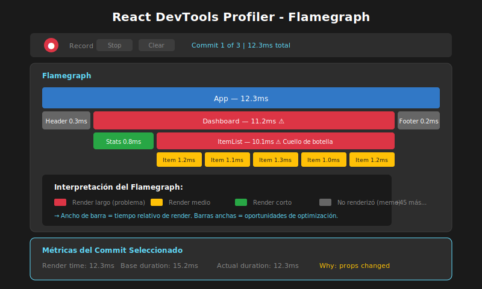

# 04 - Profiler API y React DevTools

## 🎯 Objetivos de Aprendizaje

- Usar React DevTools Profiler para identificar cuellos de botella
- Implementar el componente `<Profiler>` para métricas en código
- Interpretar flamegraphs y métricas de rendimiento
- Aplicar un flujo de trabajo de optimización basado en datos

---

## 📖 React DevTools Profiler

### Instalación

1. Instalar la extensión [React Developer Tools](https://reactjs.org/link/react-devtools) para tu navegador
2. Abrir DevTools (F12)
3. Ir a la pestaña **Profiler**

### La Interfaz del Profiler



```
┌─────────────────────────────────────────────────────────────────┐
│  React DevTools - Profiler                                       │
├─────────────────────────────────────────────────────────────────┤
│                                                                  │
│  [⏺ Start] [⏹ Stop] [⟲ Clear] [⚙ Settings]                     │
│                                                                  │
│  ┌─────────────────────────────────────────────────────────────┐│
│  │ Commit 1 of 5  │ Commit 2 of 5  │ Commit 3 of 5  │ ...      ││
│  │    12.3ms      │     2.1ms      │     0.8ms      │          ││
│  └─────────────────────────────────────────────────────────────┘│
│                                                                  │
│  Flamegraph:                                                     │
│  ┌─────────────────────────────────────────────────────────────┐│
│  │ App (12.3ms)                                                ││
│  │ ├── Header (0.5ms) ░░░                                      ││
│  │ ├── ProductList (10.2ms) ████████████████████               ││
│  │ │   ├── ProductItem (1.2ms) ██                              ││
│  │ │   ├── ProductItem (1.1ms) ██                              ││
│  │ │   ├── ProductItem (1.3ms) ██                              ││
│  │ │   └── ... (más items)                                     ││
│  │ └── Footer (0.3ms) ░                                        ││
│  └─────────────────────────────────────────────────────────────┘│
│                                                                  │
│  Leyenda: ████ Renderizó  ░░░ No renderizó (optimizado)        │
│                                                                  │
└─────────────────────────────────────────────────────────────────┘
```

### Métricas Clave

| Métrica             | Descripción                                  |
| ------------------- | -------------------------------------------- |
| **Render time**     | Tiempo que tardó el componente en renderizar |
| **Base duration**   | Tiempo estimado sin optimizaciones           |
| **Actual duration** | Tiempo real de render (con memo, etc.)       |
| **Commits**         | Cada actualización del DOM (un "commit")     |
| **Why did render**  | Razón por la que el componente renderizó     |

---

## 🔍 Flujo de Trabajo con Profiler

### Paso 1: Grabar una Sesión

1. Click en **Start profiling** (⏺)
2. Interactuar con la aplicación (filtrar, hacer click, escribir...)
3. Click en **Stop profiling** (⏹)

### Paso 2: Analizar Flamegraph

```
┌─────────────────────────────────────────────────────────────────┐
│                    LEYENDO EL FLAMEGRAPH                         │
├─────────────────────────────────────────────────────────────────┤
│                                                                  │
│   Ancho de barra = Tiempo de render                             │
│                                                                  │
│   App (12.3ms)                                                  │
│   ═══════════════════════════════════════════════════           │
│                                                                  │
│   ├── Sidebar (1.2ms)    ├── Main (10.8ms)                      │
│       ════════               ══════════════════════════════     │
│                              │                                   │
│                              ├── Header (0.3ms)                 │
│                              │   ═══                             │
│                              │                                   │
│                              └── ProductList (10.2ms) ◀── LENTO │
│                                  ══════════════════════════     │
│                                  │                               │
│                                  ├── Item (1.2ms)               │
│                                  ├── Item (1.1ms)               │
│                                  ├── Item (1.3ms)               │
│                                  └── ...                        │
│                                                                  │
│   Buscar: Barras anchas = Componentes lentos                    │
│                                                                  │
└─────────────────────────────────────────────────────────────────┘
```

### Paso 3: Identificar "Why did this render?"

En el panel derecho, al seleccionar un componente:

```
┌──────────────────────────────────────┐
│ ProductItem                           │
├──────────────────────────────────────┤
│ Rendered at: 12:34:56                │
│ Render duration: 1.2ms               │
│                                      │
│ Why did this render?                 │
│ ─────────────────────                │
│ • Props changed: onClick             │  ◀── ¡La función cambió!
│                                      │
│ Props:                               │
│ • product: {...}                     │
│ • onClick: () => {...} (changed)    │
└──────────────────────────────────────┘
```

### Paso 4: Activar "Highlight updates"

En la configuración de DevTools (⚙):

- ✅ **Highlight updates when components render**
- Los componentes que renderizan se iluminan con un borde de color

```
┌─────────────────────────────────────────────────────────────────┐
│                    HIGHLIGHT UPDATES                             │
├─────────────────────────────────────────────────────────────────┤
│                                                                  │
│   Al escribir en el filtro:                                     │
│                                                                  │
│   ┌─────────────────────────────────┐                           │
│   │ 🟢 Input (renderiza - esperado) │                           │
│   └─────────────────────────────────┘                           │
│   ┌─────────────────────────────────┐                           │
│   │ 🟡 ProductList (renderiza)      │                           │
│   │ ┌──────────┐ ┌──────────┐       │                           │
│   │ │🟡 Item 1 │ │🟡 Item 2 │ ...   │  ◀── ¿Deberían todos?    │
│   │ └──────────┘ └──────────┘       │                           │
│   └─────────────────────────────────┘                           │
│                                                                  │
│   Colores:                                                       │
│   🟢 Verde = render rápido                                      │
│   🟡 Amarillo = render moderado                                 │
│   🔴 Rojo = render lento                                        │
│                                                                  │
└─────────────────────────────────────────────────────────────────┘
```

---

## 🧩 Profiler API en Código

### El Componente `<Profiler>`

React proporciona un componente para medir rendimiento programáticamente:

```typescript
import { Profiler, ProfilerOnRenderCallback } from 'react';

// Callback que recibe las métricas
const onRender: ProfilerOnRenderCallback = (
  id,          // ID del Profiler
  phase,       // "mount" o "update"
  actualDuration,    // Tiempo de render real
  baseDuration,      // Tiempo sin optimizaciones
  startTime,         // Cuándo empezó el render
  commitTime         // Cuándo se hizo commit
) => {
  console.log(`[${id}] ${phase}: ${actualDuration.toFixed(2)}ms`);
};

function App() {
  return (
    <Profiler id="App" onRender={onRender}>
      <Header />
      <Profiler id="ProductList" onRender={onRender}>
        <ProductList products={products} />
      </Profiler>
      <Footer />
    </Profiler>
  );
}
```

### Ejemplo Completo con Logging

```typescript
import { Profiler, ProfilerOnRenderCallback, useState } from 'react';

// ==============================================
// SISTEMA DE MÉTRICAS
// ==============================================
interface RenderMetric {
  id: string;
  phase: 'mount' | 'update';
  actualDuration: number;
  baseDuration: number;
  timestamp: number;
}

const metrics: RenderMetric[] = [];

const recordRender: ProfilerOnRenderCallback = (
  id,
  phase,
  actualDuration,
  baseDuration,
  startTime,
  commitTime
) => {
  const metric: RenderMetric = {
    id,
    phase: phase as 'mount' | 'update',
    actualDuration,
    baseDuration,
    timestamp: commitTime,
  };

  metrics.push(metric);

  // Log en desarrollo
  if (process.env.NODE_ENV === 'development') {
    const saved = baseDuration - actualDuration;
    const savedPercent = ((saved / baseDuration) * 100).toFixed(1);

    console.log(
      `%c[Profiler] ${id}`,
      'color: #61dafb; font-weight: bold',
      {
        fase: phase,
        duracion: `${actualDuration.toFixed(2)}ms`,
        sinOptimizar: `${baseDuration.toFixed(2)}ms`,
        ahorrado: saved > 0 ? `${savedPercent}%` : 'N/A',
      }
    );
  }
};

// ==============================================
// USO EN COMPONENTES
// ==============================================
function Dashboard() {
  const [items, setItems] = useState<Item[]>([]);

  return (
    <Profiler id="Dashboard" onRender={recordRender}>
      <div className="dashboard">
        <Profiler id="Filters" onRender={recordRender}>
          <FilterPanel />
        </Profiler>

        <Profiler id="ItemList" onRender={recordRender}>
          <ItemList items={items} />
        </Profiler>

        <Profiler id="Stats" onRender={recordRender}>
          <Statistics items={items} />
        </Profiler>
      </div>
    </Profiler>
  );
}
```

### Reporte de Métricas

```typescript
// Función para generar reporte
function generateReport() {
  const grouped = metrics.reduce(
    (acc, m) => {
      if (!acc[m.id]) {
        acc[m.id] = { renders: 0, totalTime: 0, avgTime: 0 };
      }
      acc[m.id].renders += 1;
      acc[m.id].totalTime += m.actualDuration;
      return acc;
    },
    {} as Record<
      string,
      { renders: number; totalTime: number; avgTime: number }
    >,
  );

  // Calcular promedios
  Object.values(grouped).forEach((g) => {
    g.avgTime = g.totalTime / g.renders;
  });

  console.table(grouped);

  // Encontrar componentes más lentos
  const sorted = Object.entries(grouped).sort(
    ([, a], [, b]) => b.totalTime - a.totalTime,
  );

  console.log('🔴 Componentes más lentos:');
  sorted.slice(0, 5).forEach(([id, data]) => {
    console.log(
      `  ${id}: ${data.totalTime.toFixed(2)}ms total (${data.renders} renders)`,
    );
  });
}

// Llamar al final de una sesión de prueba
// generateReport();
```

---

## 📊 Interpretando las Métricas

### Actual Duration vs Base Duration

```
┌─────────────────────────────────────────────────────────────────┐
│              ACTUAL vs BASE DURATION                             │
├─────────────────────────────────────────────────────────────────┤
│                                                                  │
│   Base Duration: 50ms                                           │
│   ══════════════════════════════════════════════════            │
│   (Tiempo si TODOS los componentes renderizaran)                │
│                                                                  │
│   Actual Duration: 15ms                                         │
│   ═══════════════                                               │
│   (Tiempo real con React.memo, etc.)                            │
│                                                                  │
│   Ahorro: 70% ✅                                                │
│                                                                  │
│   ─────────────────────────────────────────────────────         │
│                                                                  │
│   Si Actual ≈ Base:                                             │
│   → Las optimizaciones NO están funcionando                     │
│   → Revisar React.memo, dependencias, referencias               │
│                                                                  │
│   Si Actual << Base:                                            │
│   → Las optimizaciones están funcionando ✅                     │
│                                                                  │
└─────────────────────────────────────────────────────────────────┘
```

### Umbrales de Rendimiento

| Duración | Evaluación   | Acción                                |
| -------- | ------------ | ------------------------------------- |
| < 5ms    | ✅ Excelente | No necesita optimización              |
| 5-16ms   | ⚠️ Aceptable | Monitorear, optimizar si es frecuente |
| 16-50ms  | 🟡 Lento     | Considerar optimización               |
| > 50ms   | 🔴 Muy lento | Optimización necesaria                |

> **16ms** es el presupuesto para 60 FPS (1000ms ÷ 60 = 16.67ms por frame)

---

## 🔧 Flujo de Optimización Completo

### El Proceso

```
┌─────────────────────────────────────────────────────────────────┐
│              FLUJO DE OPTIMIZACIÓN                               │
├─────────────────────────────────────────────────────────────────┤
│                                                                  │
│   1. MEDIR                                                       │
│   ─────────                                                      │
│   • Grabar sesión con Profiler                                  │
│   • Identificar componentes lentos                              │
│   • Capturar screenshots del flamegraph                         │
│                                                                  │
│           ▼                                                      │
│                                                                  │
│   2. ANALIZAR                                                    │
│   ──────────                                                     │
│   • ¿Por qué renderiza? (Why did this render?)                  │
│   • ¿Las props cambian innecesariamente?                        │
│   • ¿Hay cálculos costosos en cada render?                      │
│                                                                  │
│           ▼                                                      │
│                                                                  │
│   3. OPTIMIZAR                                                   │
│   ────────────                                                   │
│   • Aplicar React.memo donde haga falta                         │
│   • Agregar useMemo para cálculos                               │
│   • Agregar useCallback para funciones                          │
│                                                                  │
│           ▼                                                      │
│                                                                  │
│   4. VERIFICAR                                                   │
│   ────────────                                                   │
│   • Grabar nueva sesión                                         │
│   • Comparar antes/después                                      │
│   • Documentar mejoras                                          │
│                                                                  │
│           ▼                                                      │
│                                                                  │
│   5. REPETIR si es necesario                                    │
│                                                                  │
└─────────────────────────────────────────────────────────────────┘
```

### Ejemplo de Documentación Antes/Después

```markdown
## Optimización: ProductList

### Antes

- Componente: ProductList
- Renders por interacción: 100 (1 por cada item)
- Duración total: 45ms
- Problema: Todos los items re-renderizan al cambiar el carrito

### Cambios Aplicados

1. `React.memo` en ProductItem
2. `useCallback` para handleDelete y handleEdit
3. `useMemo` para filtrar productos

### Después

- Renders por interacción: 1 (solo el item afectado)
- Duración total: 3ms
- Mejora: 93% de reducción

### Capturas

[Antes: flamegraph-antes.png]
[Después: flamegraph-despues.png]
```

---

## 📝 Ejemplo: Antes y Después

### Código Original (Sin Optimización)

```typescript
function ProductDashboard() {
  const [products, setProducts] = useState<Product[]>(initialProducts);
  const [filter, setFilter] = useState('');
  const [cartCount, setCartCount] = useState(0);

  // ❌ Se recalcula en CADA render
  const filteredProducts = products.filter(p =>
    p.name.toLowerCase().includes(filter.toLowerCase())
  );

  // ❌ Nueva función en cada render
  const handleDelete = (id: number) => {
    setProducts(prev => prev.filter(p => p.id !== id));
  };

  return (
    <div>
      <input value={filter} onChange={e => setFilter(e.target.value)} />
      <button onClick={() => setCartCount(c => c + 1)}>
        Carrito: {cartCount}
      </button>
      {/* ❌ Todos re-renderizan en cada cambio */}
      {filteredProducts.map(p => (
        <ProductItem key={p.id} product={p} onDelete={handleDelete} />
      ))}
    </div>
  );
}

function ProductItem({ product, onDelete }) {
  console.log(`Render: ${product.name}`);
  return (
    <div>
      {product.name}
      <button onClick={() => onDelete(product.id)}>×</button>
    </div>
  );
}
```

### Código Optimizado

```typescript
import { memo, useMemo, useCallback, useState } from 'react';

// ✅ Componente memorizado
const ProductItem = memo(function ProductItem({
  product,
  onDelete
}: ProductItemProps) {
  console.log(`Render: ${product.name}`);
  return (
    <div>
      {product.name}
      <button onClick={() => onDelete(product.id)}>×</button>
    </div>
  );
});

function ProductDashboard() {
  const [products, setProducts] = useState<Product[]>(initialProducts);
  const [filter, setFilter] = useState('');
  const [cartCount, setCartCount] = useState(0);

  // ✅ Solo recalcula si products o filter cambian
  const filteredProducts = useMemo(() => {
    return products.filter(p =>
      p.name.toLowerCase().includes(filter.toLowerCase())
    );
  }, [products, filter]);

  // ✅ Referencia estable
  const handleDelete = useCallback((id: number) => {
    setProducts(prev => prev.filter(p => p.id !== id));
  }, []);

  return (
    <div>
      <input value={filter} onChange={e => setFilter(e.target.value)} />
      <button onClick={() => setCartCount(c => c + 1)}>
        Carrito: {cartCount}
      </button>
      {/* ✅ Solo re-renderiza si el producto o handler cambia */}
      {filteredProducts.map(p => (
        <ProductItem
          key={p.id}
          product={p}
          onDelete={handleDelete}
        />
      ))}
    </div>
  );
}
```

### Resultados en Profiler

```
ANTES:
─────
Click en "Carrito":
  App: 45ms
  └── ProductDashboard: 44ms
      ├── Input: 0.1ms
      └── ProductItem x100: 43ms (cada uno ~0.4ms)

DESPUÉS:
───────
Click en "Carrito":
  App: 2ms
  └── ProductDashboard: 1.5ms
      ├── Input: 0.1ms (no renderiza)
      └── ProductItem x100: 0ms (ninguno renderiza)

Mejora: 95.5% ✅
```

---

## ✅ Checklist de Comprensión

- [ ] ¿Cómo uso React DevTools Profiler?
- [ ] ¿Qué significa "Why did this render"?
- [ ] ¿Cuál es la diferencia entre actual y base duration?
- [ ] ¿Cómo uso el componente `<Profiler>` en código?
- [ ] ¿Cuál es el flujo de trabajo para optimizar?

---

## 🔗 Recursos Adicionales

- [React Profiler API](https://react.dev/reference/react/Profiler)
- [React DevTools](https://react.dev/learn/react-developer-tools)
- [Optimizing Performance](https://react.dev/learn/render-and-commit)

---

_Siguiente: Ejercicios prácticos para aplicar todo lo aprendido_
