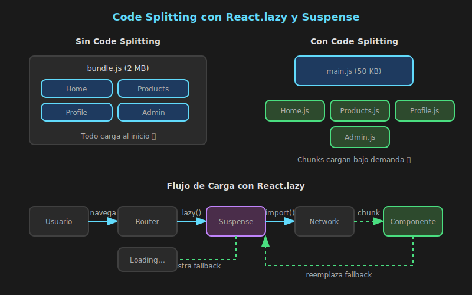

# Code Splitting y React.lazy



## 🎯 Objetivos

- Comprender qué es code splitting y por qué es importante
- Implementar lazy loading con `React.lazy`
- Configurar `Suspense` boundaries correctamente
- Manejar errores de carga con Error Boundaries

---

## 📋 Contenido

### 1. ¿Qué es Code Splitting?

Code splitting es una técnica que permite dividir el código de tu aplicación en múltiples "chunks" (fragmentos) que se cargan bajo demanda, en lugar de cargar todo el código al inicio.

#### El Problema del Bundle Único

Sin code splitting, tu aplicación React se empaqueta en un único archivo JavaScript:

| Métrica             | Bundle Único | Con Code Splitting |
| ------------------- | ------------ | ------------------ |
| Tamaño inicial      | 2 MB         | 200 KB             |
| Tiempo de carga     | 5 segundos   | 0.5 segundos       |
| Código no usado     | 80%          | 0%                 |
| Time to Interactive | Alto         | Bajo               |

#### Beneficios del Code Splitting

1. **Carga inicial más rápida**: Solo carga lo necesario para la primera vista
2. **Mejor TTI (Time to Interactive)**: La app responde más rápido
3. **Uso eficiente de caché**: Chunks cambian independientemente
4. **Mejor UX**: Usuarios no esperan por código que no usan

---

### 2. Dynamic Imports

La base del code splitting es la sintaxis de **dynamic import** de JavaScript:

```typescript
// ============================================
// IMPORTACIÓN ESTÁTICA (tradicional)
// ============================================
// Se carga siempre, incluso si no se usa
import { heavyCalculation } from './heavy-module';

// ============================================
// IMPORTACIÓN DINÁMICA (code splitting)
// ============================================
// Solo se carga cuando se necesita
const loadModule = async () => {
  const module = await import('./heavy-module');
  return module.heavyCalculation();
};
```

#### Cómo Funciona

1. **Build time**: Vite/Webpack detecta `import()` dinámico
2. **Bundle**: Crea un chunk separado para ese módulo
3. **Runtime**: El chunk se carga solo cuando se ejecuta `import()`

```typescript
// Ejemplo práctico: carga condicional
// El módulo de PDF solo se carga si el usuario quiere exportar
const handleExportPDF = async () => {
  // Muestra loading mientras carga
  setLoading(true);

  // Importa el módulo de PDF dinámicamente
  // Esto crea un chunk separado "pdf-export.[hash].js"
  const { generatePDF } = await import('./utils/pdf-export');

  // Genera el PDF
  const pdf = await generatePDF(data);

  setLoading(false);
  return pdf;
};
```

---

### 3. React.lazy

`React.lazy` permite renderizar componentes cargados dinámicamente como componentes normales:

```typescript
import { lazy, Suspense } from 'react';

// ============================================
// SIN LAZY (bundle único)
// ============================================
// import AdminDashboard from './pages/AdminDashboard';
// import Analytics from './pages/Analytics';
// import Settings from './pages/Settings';

// ============================================
// CON LAZY (code splitting)
// ============================================
// Cada componente se carga solo cuando se necesita
const AdminDashboard = lazy(() => import('./pages/AdminDashboard'));
const Analytics = lazy(() => import('./pages/Analytics'));
const Settings = lazy(() => import('./pages/Settings'));
```

#### Sintaxis de React.lazy

```typescript
// Forma básica
const Component = lazy(() => import('./Component'));

// Con named exports (requiere re-export)
// No funciona: lazy(() => import('./module').then(m => m.NamedExport))

// Solución para named exports:
// 1. Crear archivo intermedio que hace export default
// utils/ChartExport.ts
export { Chart as default } from './charts';

// 2. O usar esta sintaxis
const Chart = lazy(() =>
  import('./charts').then((module) => ({ default: module.Chart })),
);
```

#### Ejemplo Completo con Tipado

```typescript
// types/index.ts
export interface Product {
  id: number;
  name: string;
  price: number;
  category: string;
}

// pages/ProductDetail.tsx
import type { FC } from 'react';
import type { Product } from '../types';

interface ProductDetailProps {
  product: Product;
  onAddToCart: (id: number) => void;
}

const ProductDetail: FC<ProductDetailProps> = ({ product, onAddToCart }) => {
  return (
    <article className="product-detail">
      <h1>{product.name}</h1>
      <p className="price">${product.price}</p>
      <button onClick={() => onAddToCart(product.id)}>
        Agregar al carrito
      </button>
    </article>
  );
};

export default ProductDetail;

// App.tsx
import { lazy, Suspense } from 'react';

// Componente lazy con tipado inferido
const ProductDetail = lazy(() => import('./pages/ProductDetail'));
```

---

### 4. Suspense

`Suspense` es el componente que muestra un fallback mientras el componente lazy se está cargando:

```typescript
import { lazy, Suspense } from 'react';

const HeavyComponent = lazy(() => import('./HeavyComponent'));

// ============================================
// SUSPENSE BÁSICO
// ============================================
const App: FC = () => {
  return (
    <Suspense fallback={<div>Cargando...</div>}>
      <HeavyComponent />
    </Suspense>
  );
};
```

#### Fallbacks Apropiados

```typescript
// ============================================
// FALLBACK: SPINNER SIMPLE
// ============================================
const LoadingSpinner: FC = () => (
  <div className="loading-spinner" role="status" aria-label="Cargando">
    <div className="spinner" />
  </div>
);

// ============================================
// FALLBACK: SKELETON (mejor UX)
// ============================================
const ProductSkeleton: FC = () => (
  <div className="product-skeleton" aria-busy="true">
    <div className="skeleton-image" />
    <div className="skeleton-title" />
    <div className="skeleton-price" />
    <div className="skeleton-button" />
  </div>
);

// ============================================
// USO CON SKELETON
// ============================================
const ProductPage: FC = () => {
  return (
    <Suspense fallback={<ProductSkeleton />}>
      <ProductDetail product={product} onAddToCart={handleAdd} />
    </Suspense>
  );
};
```

#### Múltiples Suspense Boundaries

```typescript
// Puedes tener múltiples boundaries para control granular
const Dashboard: FC = () => {
  return (
    <div className="dashboard">
      {/* Header carga inmediatamente */}
      <Header />

      <main className="dashboard-content">
        {/* Sidebar con su propio loading state */}
        <Suspense fallback={<SidebarSkeleton />}>
          <Sidebar />
        </Suspense>

        {/* Contenido principal con su propio loading */}
        <Suspense fallback={<ContentSkeleton />}>
          <MainContent />
        </Suspense>

        {/* Widgets secundarios */}
        <Suspense fallback={<WidgetsSkeleton />}>
          <Widgets />
        </Suspense>
      </main>
    </div>
  );
};
```

---

### 5. Error Boundaries

Los Error Boundaries capturan errores en componentes lazy cuando falla la carga:

```typescript
import { Component, type ErrorInfo, type ReactNode } from 'react';

// ============================================
// INTERFAZ PARA PROPS Y STATE
// ============================================
interface ErrorBoundaryProps {
  children: ReactNode;
  fallback?: ReactNode;
  onError?: (error: Error, errorInfo: ErrorInfo) => void;
}

interface ErrorBoundaryState {
  hasError: boolean;
  error: Error | null;
}

// ============================================
// ERROR BOUNDARY COMPONENT
// ============================================
class ErrorBoundary extends Component<ErrorBoundaryProps, ErrorBoundaryState> {
  constructor(props: ErrorBoundaryProps) {
    super(props);
    this.state = { hasError: false, error: null };
  }

  // Se llama cuando hay un error en un hijo
  static getDerivedStateFromError(error: Error): ErrorBoundaryState {
    return { hasError: true, error };
  }

  // Para logging de errores
  componentDidCatch(error: Error, errorInfo: ErrorInfo): void {
    console.error('Error capturado:', error);
    console.error('Info del error:', errorInfo);
    this.props.onError?.(error, errorInfo);
  }

  // Método para reintentar
  handleRetry = (): void => {
    this.setState({ hasError: false, error: null });
  };

  render(): ReactNode {
    if (this.state.hasError) {
      // Renderiza fallback de error
      if (this.props.fallback) {
        return this.props.fallback;
      }

      return (
        <div className="error-fallback" role="alert">
          <h2>Algo salió mal</h2>
          <p>{this.state.error?.message}</p>
          <button onClick={this.handleRetry}>
            Reintentar
          </button>
        </div>
      );
    }

    return this.props.children;
  }
}

export default ErrorBoundary;
```

#### Uso con Componentes Lazy

```typescript
import { lazy, Suspense } from 'react';
import ErrorBoundary from './components/ErrorBoundary';

const HeavyChart = lazy(() => import('./components/HeavyChart'));

const Dashboard: FC = () => {
  return (
    <ErrorBoundary
      fallback={<ChartErrorFallback />}
      onError={(error) => logToService(error)}
    >
      <Suspense fallback={<ChartSkeleton />}>
        <HeavyChart data={chartData} />
      </Suspense>
    </ErrorBoundary>
  );
};
```

---

### 6. Code Splitting por Rutas

El patrón más común es dividir el código por rutas:

```typescript
// App.tsx
import { lazy, Suspense } from 'react';
import { BrowserRouter, Routes, Route } from 'react-router-dom';
import Layout from './components/Layout';
import PageLoader from './components/PageLoader';

// ============================================
// LAZY LOADING POR RUTAS
// ============================================
const Home = lazy(() => import('./pages/Home'));
const Products = lazy(() => import('./pages/Products'));
const ProductDetail = lazy(() => import('./pages/ProductDetail'));
const Cart = lazy(() => import('./pages/Cart'));
const Checkout = lazy(() => import('./pages/Checkout'));
const Profile = lazy(() => import('./pages/Profile'));
const NotFound = lazy(() => import('./pages/NotFound'));

const App: FC = () => {
  return (
    <BrowserRouter>
      <Layout>
        {/* Un solo Suspense para todas las rutas */}
        <Suspense fallback={<PageLoader />}>
          <Routes>
            <Route path="/" element={<Home />} />
            <Route path="/products" element={<Products />} />
            <Route path="/products/:id" element={<ProductDetail />} />
            <Route path="/cart" element={<Cart />} />
            <Route path="/checkout" element={<Checkout />} />
            <Route path="/profile" element={<Profile />} />
            <Route path="*" element={<NotFound />} />
          </Routes>
        </Suspense>
      </Layout>
    </BrowserRouter>
  );
};

export default App;
```

#### Prefetching de Rutas

```typescript
// Precargar rutas cuando el usuario hace hover
const ProductsLink: FC = () => {
  // Función para precargar el módulo
  const prefetchProducts = () => {
    import('./pages/Products');
  };

  return (
    <Link
      to="/products"
      onMouseEnter={prefetchProducts}
      onFocus={prefetchProducts}
    >
      Productos
    </Link>
  );
};

// O precargar después de la carga inicial
useEffect(() => {
  // Espera a que la app esté idle
  const prefetchRoutes = () => {
    import('./pages/Products');
    import('./pages/Profile');
  };

  // Usa requestIdleCallback si está disponible
  if ('requestIdleCallback' in window) {
    requestIdleCallback(prefetchRoutes);
  } else {
    setTimeout(prefetchRoutes, 2000);
  }
}, []);
```

---

### 7. Verificar Code Splitting

#### En Vite

```bash
# Build y ver chunks generados
pnpm build

# Output:
# dist/assets/index-[hash].js      # Chunk principal
# dist/assets/Home-[hash].js       # Chunk de Home
# dist/assets/Products-[hash].js   # Chunk de Products
# dist/assets/Profile-[hash].js    # Chunk de Profile
```

#### En Network Tab

1. Abre DevTools → Network
2. Navega entre rutas
3. Observa nuevos archivos `.js` cargando

| Ruta      | Archivo Cargado    | Tamaño |
| --------- | ------------------ | ------ |
| /         | Home-abc123.js     | 15 KB  |
| /products | Products-def456.js | 45 KB  |
| /profile  | Profile-ghi789.js  | 20 KB  |

#### Bundle Analyzer (Opcional)

```typescript
// vite.config.ts
import { defineConfig } from 'vite';
import react from '@vitejs/plugin-react';
import { visualizer } from 'rollup-plugin-visualizer';

export default defineConfig({
  plugins: [
    react(),
    visualizer({
      filename: 'dist/stats.html',
      open: true,
      gzipSize: true,
    }),
  ],
});
```

---

## ✅ Checklist de Verificación

- [ ] Entiendo la diferencia entre importación estática y dinámica
- [ ] Puedo implementar `React.lazy` para componentes
- [ ] Configuro `Suspense` con fallbacks apropiados
- [ ] Implemento Error Boundaries para manejar errores de carga
- [ ] Puedo verificar que el code splitting funciona en Network tab
- [ ] Conozco el patrón de code splitting por rutas

---

## 📚 Recursos Adicionales

- [React lazy - Documentación oficial](https://react.dev/reference/react/lazy)
- [Suspense - Documentación oficial](https://react.dev/reference/react/Suspense)
- [Code Splitting - Vite](https://vitejs.dev/guide/features.html#async-chunk-loading-optimization)

---

_Siguiente: [02-virtualizacion.md](02-virtualizacion.md) - Virtualización de Listas_
