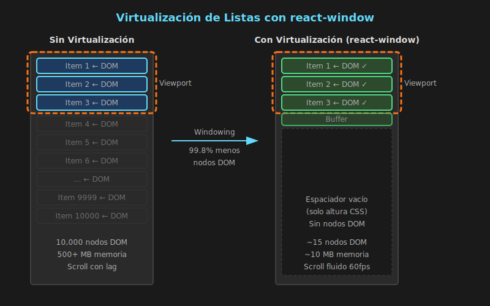

# Virtualización de Listas



## 🎯 Objetivos

- Comprender qué es la virtualización y por qué es necesaria
- Implementar listas virtualizadas con `react-window`
- Conocer la diferencia entre `FixedSizeList` y `VariableSizeList`
- Optimizar el rendimiento de listas con muchos elementos

---

## 📋 Contenido

### 1. El Problema de las Listas Largas

Cuando renderizas una lista grande en React, **cada item crea nodos en el DOM**:

| Items en Lista | Nodos DOM | Tiempo Render | Memoria  |
| -------------- | --------- | ------------- | -------- |
| 100            | ~300      | 50ms          | 5 MB     |
| 1,000          | ~3,000    | 500ms         | 50 MB    |
| 10,000         | ~30,000   | 5+ segundos   | 500+ MB  |
| 100,000        | ~300,000  | 💥 Crash      | 💥 Crash |

#### Ejemplo del Problema

```typescript
// ❌ PROBLEMA: Renderiza 10,000 items = 10,000 DOM nodes
const ProductList: FC<{ products: Product[] }> = ({ products }) => {
  return (
    <ul className="product-list">
      {products.map(product => (
        <li key={product.id} className="product-item">
          
          <h3>{product.name}</h3>
          <p>${product.price}</p>
        </li>
      ))}
    </ul>
  );
};

// Con 10,000 productos:
// - 10,000 elementos <li>
// - 10,000 elementos 
// - 10,000 elementos <h3>
// - 10,000 elementos <p>
// = 40,000+ nodos DOM 💀
```

---

### 2. ¿Qué es la Virtualización?

La virtualización (o "windowing") **solo renderiza los items visibles** en el viewport, reciclando los elementos del DOM mientras el usuario hace scroll.

#### Cómo Funciona

```
Sin virtualización (10,000 items):
┌─────────────────────┐
│ Item 1     ← DOM    │ ← Visible
│ Item 2     ← DOM    │ ← Visible
│ Item 3     ← DOM    │ ← Visible
│ Item 4     ← DOM    │ ← Visible
│ Item 5     ← DOM    │ ← Visible
├─────────────────────┤
│ Item 6     ← DOM    │ ← No visible
│ Item 7     ← DOM    │ ← No visible
│ ...                 │
│ Item 10000 ← DOM    │ ← No visible
└─────────────────────┘
Total: 10,000 nodos DOM

Con virtualización (10,000 items):
┌─────────────────────┐
│ Item 1     ← DOM    │ ← Visible
│ Item 2     ← DOM    │ ← Visible
│ Item 3     ← DOM    │ ← Visible
│ Item 4     ← DOM    │ ← Visible
│ Item 5     ← DOM    │ ← Visible
├─────────────────────┤
│ (espaciador vacío)  │ ← Solo altura
└─────────────────────┘
Total: ~10 nodos DOM (+ 2-3 buffer)
```

| Métrica        | Sin Virtualizar | Con Virtualizar |
| -------------- | --------------- | --------------- |
| DOM Nodes      | 10,000          | ~15             |
| Initial Render | 5 segundos      | 50ms            |
| Scroll Lag     | Sí              | No              |
| Memoria        | 500+ MB         | ~10 MB          |

---

### 3. react-window

`react-window` es la librería más popular y eficiente para virtualización en React.

#### Instalación

```bash
# Con pnpm
pnpm add react-window
pnpm add -D @types/react-window

# Con yarn
yarn add react-window
yarn add -D @types/react-window
```

#### Componentes Principales

| Componente         | Uso                                    |
| ------------------ | -------------------------------------- |
| `FixedSizeList`    | Todos los items tienen la misma altura |
| `VariableSizeList` | Items con alturas diferentes           |
| `FixedSizeGrid`    | Grid con celdas de tamaño fijo         |
| `VariableSizeGrid` | Grid con celdas de tamaño variable     |

---

### 4. FixedSizeList

Usa `FixedSizeList` cuando todos los items tienen la **misma altura**:

```typescript
import { FixedSizeList, type ListChildComponentProps } from 'react-window';

// ============================================
// DATOS DE EJEMPLO
// ============================================
interface Product {
  id: number;
  name: string;
  price: number;
}

const products: Product[] = Array.from({ length: 10000 }, (_, i) => ({
  id: i + 1,
  name: `Producto ${i + 1}`,
  price: Math.floor(Math.random() * 1000) + 10,
}));

// ============================================
// COMPONENTE DE FILA
// ============================================
// react-window pasa index y style a cada fila
interface RowProps extends ListChildComponentProps {
  data: Product[];
}

const Row: FC<RowProps> = ({ index, style, data }) => {
  const product = data[index];

  return (
    <div style={style} className="product-row">
      <span className="product-name">{product.name}</span>
      <span className="product-price">${product.price}</span>
    </div>
  );
};

// ============================================
// LISTA VIRTUALIZADA
// ============================================
const ProductList: FC = () => {
  return (
    <FixedSizeList
      height={500}          // Altura del contenedor
      width="100%"          // Ancho del contenedor
      itemCount={products.length}  // Total de items
      itemSize={50}         // Altura de cada item (fija)
      itemData={products}   // Datos pasados a cada fila
    >
      {Row}
    </FixedSizeList>
  );
};
```

#### Props Importantes de FixedSizeList

| Prop            | Tipo               | Descripción                       |
| --------------- | ------------------ | --------------------------------- |
| `height`        | `number`           | Altura del viewport en píxeles    |
| `width`         | `number \| string` | Ancho del viewport                |
| `itemCount`     | `number`           | Número total de items             |
| `itemSize`      | `number`           | Altura de cada item en píxeles    |
| `itemData`      | `any`              | Datos pasados al componente hijo  |
| `overscanCount` | `number`           | Items extra renderizados (buffer) |

---

### 5. VariableSizeList

Usa `VariableSizeList` cuando los items tienen **alturas diferentes**:

```typescript
import { VariableSizeList, type ListChildComponentProps } from 'react-window';
import { useRef, useCallback } from 'react';

// ============================================
// DATOS CON ALTURAS VARIABLES
// ============================================
interface Message {
  id: number;
  text: string;
  isExpanded: boolean;
}

const messages: Message[] = Array.from({ length: 1000 }, (_, i) => ({
  id: i + 1,
  text: `Mensaje ${i + 1}: ${'Lorem ipsum '.repeat(Math.floor(Math.random() * 10) + 1)}`,
  isExpanded: false,
}));

// ============================================
// COMPONENTE DE FILA
// ============================================
const MessageRow: FC<ListChildComponentProps<Message[]>> = ({
  index,
  style,
  data
}) => {
  const message = data[index];

  return (
    <div style={style} className="message-row">
      <p>{message.text}</p>
    </div>
  );
};

// ============================================
// LISTA CON TAMAÑOS VARIABLES
// ============================================
const MessageList: FC = () => {
  const listRef = useRef<VariableSizeList>(null);

  // Función que calcula la altura de cada item
  // Puede ser basada en contenido, o precalculada
  const getItemSize = useCallback((index: number): number => {
    const message = messages[index];
    // Altura base + altura por líneas de texto
    const lineCount = Math.ceil(message.text.length / 50);
    return 40 + (lineCount * 20);
  }, []);

  return (
    <VariableSizeList
      ref={listRef}
      height={600}
      width="100%"
      itemCount={messages.length}
      itemSize={getItemSize}      // Función en lugar de número
      itemData={messages}
      estimatedItemSize={80}      // Estimación para scroll
    >
      {MessageRow}
    </VariableSizeList>
  );
};
```

#### Resetear Caché de Tamaños

```typescript
// Si los tamaños cambian, resetea la caché
const handleDataChange = () => {
  // Resetea todos los tamaños cacheados
  listRef.current?.resetAfterIndex(0);
};

// O solo desde un índice específico
const handleItemExpand = (index: number) => {
  setMessages((prev) => {
    const updated = [...prev];
    updated[index].isExpanded = !updated[index].isExpanded;
    return updated;
  });
  // Resetea desde el item modificado
  listRef.current?.resetAfterIndex(index);
};
```

---

### 6. Pasar Datos Correctamente

#### Usando itemData

```typescript
// ============================================
// MANERA CORRECTA: itemData
// ============================================
interface ItemData {
  items: Product[];
  onDelete: (id: number) => void;
  onSelect: (id: number) => void;
}

const Row: FC<ListChildComponentProps<ItemData>> = ({
  index,
  style,
  data
}) => {
  const { items, onDelete, onSelect } = data;
  const item = items[index];

  return (
    <div style={style} className="product-row">
      <span>{item.name}</span>
      <button onClick={() => onSelect(item.id)}>Ver</button>
      <button onClick={() => onDelete(item.id)}>Eliminar</button>
    </div>
  );
};

const ProductList: FC = () => {
  const [products, setProducts] = useState<Product[]>(initialProducts);

  // Memoriza itemData para evitar re-renders
  const itemData = useMemo<ItemData>(() => ({
    items: products,
    onDelete: (id) => setProducts(p => p.filter(item => item.id !== id)),
    onSelect: (id) => console.log('Selected:', id),
  }), [products]);

  return (
    <FixedSizeList
      height={500}
      width="100%"
      itemCount={products.length}
      itemSize={60}
      itemData={itemData}
    >
      {Row}
    </FixedSizeList>
  );
};
```

---

### 7. Scroll Programático

```typescript
import { useRef } from 'react';
import { FixedSizeList } from 'react-window';

const ProductList: FC = () => {
  const listRef = useRef<FixedSizeList>(null);

  // Scroll a un índice específico
  const scrollToItem = (index: number) => {
    listRef.current?.scrollToItem(index, 'center');
    // Opciones: 'auto' | 'smart' | 'center' | 'end' | 'start'
  };

  // Scroll a top
  const scrollToTop = () => {
    listRef.current?.scrollTo(0);
  };

  // Scroll a bottom
  const scrollToBottom = () => {
    listRef.current?.scrollToItem(products.length - 1, 'end');
  };

  return (
    <div>
      <div className="controls">
        <button onClick={scrollToTop}>Ir al inicio</button>
        <button onClick={() => scrollToItem(500)}>Ir al #500</button>
        <button onClick={scrollToBottom}>Ir al final</button>
      </div>

      <FixedSizeList
        ref={listRef}
        height={500}
        width="100%"
        itemCount={products.length}
        itemSize={50}
        itemData={products}
      >
        {Row}
      </FixedSizeList>
    </div>
  );
};
```

---

### 8. Estilos y CSS

#### Importante: Respetar el style prop

```typescript
// ✅ CORRECTO: Aplica el style que pasa react-window
const Row: FC<ListChildComponentProps<Product[]>> = ({ index, style, data }) => {
  return (
    <div
      style={style}  // ¡OBLIGATORIO! Contiene position y transform
      className="row"
    >
      {data[index].name}
    </div>
  );
};

// ❌ INCORRECTO: Sobrescribe el style
const Row: FC<ListChildComponentProps<Product[]>> = ({ index, data }) => {
  return (
    <div style={{ padding: 10 }}> {/* Falta el style de react-window */}
      {data[index].name}
    </div>
  );
};
```

#### CSS para el contenido interno

```typescript
// Combinar styles correctamente
const Row: FC<ListChildComponentProps<Product[]>> = ({ index, style, data }) => {
  return (
    <div style={style}>
      {/* El contenido interno puede tener su propio estilo */}
      <div className="row-content">
        <span className="name">{data[index].name}</span>
        <span className="price">${data[index].price}</span>
      </div>
    </div>
  );
};
```

```css
/* styles.css */
.row-content {
  display: flex;
  justify-content: space-between;
  align-items: center;
  padding: 0 16px;
  height: 100%;
  border-bottom: 1px solid #eee;
}

.row-content:hover {
  background-color: #f5f5f5;
}
```

---

### 9. Cuándo Virtualizar

| Escenario             | ¿Virtualizar? | Razón                             |
| --------------------- | ------------- | --------------------------------- |
| Lista de 20-50 items  | No            | Overhead no vale la pena          |
| Lista de 100+ items   | Depende       | Evaluar performance real          |
| Lista de 500+ items   | Sí            | Beneficio claro                   |
| Lista de 1,000+ items | Definitivo    | Sin virtualización es inaceptable |
| Scroll infinito       | Sí            | Esencial para memoria             |
| Items muy complejos   | Sí            | Aunque sean pocos                 |

#### Medir Antes de Virtualizar

```typescript
// Antes de virtualizar, mide el rendimiento actual
console.time('render');
// ... renderizar lista
console.timeEnd('render');

// Si render < 16ms (60fps), quizás no necesitas virtualizar
// Si render > 100ms, definitivamente virtualiza
```

---

## ✅ Checklist de Verificación

- [ ] Entiendo el problema de renderizar listas largas
- [ ] Comprendo cómo funciona la virtualización
- [ ] Puedo implementar `FixedSizeList` para items de altura fija
- [ ] Puedo implementar `VariableSizeList` para items de altura variable
- [ ] Paso datos correctamente usando `itemData`
- [ ] Sé cuándo es apropiado virtualizar

---

## 📚 Recursos Adicionales

- [react-window Documentation](https://react-window.vercel.app/)
- [react-window GitHub](https://github.com/bvaughn/react-window)
- [Virtualizing large lists - web.dev](https://web.dev/virtualize-long-lists-react-window/)

---

_Siguiente: [03-web-vitals.md](03-web-vitals.md) - Web Vitals y Métricas_
