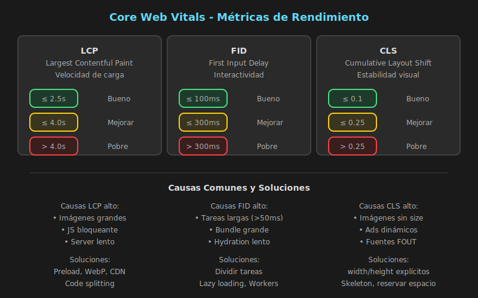

# Web Vitals y Métricas de Rendimiento



## 🎯 Objetivos

- Comprender qué son los Web Vitals y por qué importan
- Conocer las métricas LCP, FID, CLS y sus valores óptimos
- Implementar medición de Web Vitals en React
- Identificar y corregir problemas de rendimiento

---

## 📋 Contenido

### 1. ¿Qué son los Web Vitals?

Web Vitals son un conjunto de métricas definidas por Google que miden la **experiencia real del usuario** en una página web.

#### Las 3 Métricas Core

| Métrica | Nombre Completo          | Mide                                   |
| ------- | ------------------------ | -------------------------------------- |
| **LCP** | Largest Contentful Paint | Velocidad de carga percibida           |
| **FID** | First Input Delay        | Capacidad de respuesta a interacciones |
| **CLS** | Cumulative Layout Shift  | Estabilidad visual                     |

#### Valores Óptimos

| Métrica | Bueno   | Necesita Mejora | Pobre   |
| ------- | ------- | --------------- | ------- |
| LCP     | ≤ 2.5s  | 2.5s - 4.0s     | > 4.0s  |
| FID     | ≤ 100ms | 100ms - 300ms   | > 300ms |
| CLS     | ≤ 0.1   | 0.1 - 0.25      | > 0.25  |

#### ¿Por Qué Importan?

1. **SEO**: Google usa Web Vitals como factor de ranking
2. **UX**: Métricas correlacionan con satisfacción del usuario
3. **Conversiones**: Mejor performance = más conversiones
4. **Bounce Rate**: Sitios lentos tienen mayor tasa de abandono

---

### 2. LCP (Largest Contentful Paint)

LCP mide cuánto tarda en renderizarse el **elemento más grande visible** en el viewport.

#### ¿Qué Cuenta como LCP?

- Imágenes (``)
- Imágenes de fondo (CSS `background-image`)
- Elementos `<video>` con poster
- Elementos con texto (`<h1>`, `<p>`, etc.)

#### Problemas Comunes de LCP

| Problema                  | Solución                                 |
| ------------------------- | ---------------------------------------- |
| Imágenes grandes          | Optimizar, usar formatos modernos (WebP) |
| Render-blocking resources | Defer scripts, inline critical CSS       |
| Server response lento     | CDN, caching, optimizar backend          |
| Client-side rendering     | SSR, prerendering, o streaming           |

#### Optimizar LCP en React

```typescript
// ============================================
// PRECARGAR IMAGEN HERO (LCP CRÍTICO)
// ============================================
// En index.html
// <link rel="preload" href="/hero-image.webp" as="image">

// En React, asegurar que la imagen crítica cargue rápido
const HeroSection: FC = () => {
  return (
    <section className="hero">
      {/* Imagen optimizada con tamaño explícito */}
      
      <h1>Bienvenido a nuestra tienda</h1>
    </section>
  );
};

// ============================================
// LAZY LOAD IMÁGENES NO CRÍTICAS
// ============================================
const ProductCard: FC<{ product: Product }> = ({ product }) => {
  return (
    <article className="product-card">
      
      <h3>{product.name}</h3>
    </article>
  );
};
```

---

### 3. FID (First Input Delay)

FID mide el tiempo desde que el usuario **interactúa por primera vez** hasta que el navegador puede responder.

#### ¿Qué Causa FID Alto?

- JavaScript bloqueando el main thread
- Tareas largas (> 50ms)
- Parseo de bundles grandes
- Hydration de frameworks

#### Optimizar FID en React

```typescript
// ============================================
// PROBLEMA: TAREA LARGA BLOQUEA INTERACCIÓN
// ============================================
const ProductList: FC = () => {
  const [products, setProducts] = useState<Product[]>([]);

  useEffect(() => {
    // ❌ Si fetchProducts tarda mucho y hay procesamiento pesado,
    // puede bloquear el main thread
    const allProducts = fetchAndProcessHeavyData();
    setProducts(allProducts);
  }, []);

  return <div>...</div>;
};

// ============================================
// SOLUCIÓN: DIVIDIR TAREAS LARGAS
// ============================================
const ProductList: FC = () => {
  const [products, setProducts] = useState<Product[]>([]);
  const [isLoading, setIsLoading] = useState(true);

  useEffect(() => {
    const loadProducts = async () => {
      // Carga inicial rápida
      const initialBatch = await fetchProducts({ limit: 20 });
      setProducts(initialBatch);
      setIsLoading(false);

      // Carga el resto en segundo plano
      if ('requestIdleCallback' in window) {
        requestIdleCallback(async () => {
          const remainingProducts = await fetchProducts({ offset: 20 });
          setProducts(prev => [...prev, ...remainingProducts]);
        });
      }
    };

    loadProducts();
  }, []);

  if (isLoading) return <ProductSkeleton />;
  return <div>...</div>;
};
```

```typescript
// ============================================
// DIVIDIR CÁLCULOS PESADOS
// ============================================
// Función para ejecutar en chunks sin bloquear
const processInChunks = async <T, R>(
  items: T[],
  processor: (item: T) => R,
  chunkSize = 100,
): Promise<R[]> => {
  const results: R[] = [];

  for (let i = 0; i < items.length; i += chunkSize) {
    const chunk = items.slice(i, i + chunkSize);
    const chunkResults = chunk.map(processor);
    results.push(...chunkResults);

    // Cede control al navegador entre chunks
    await new Promise((resolve) => setTimeout(resolve, 0));
  }

  return results;
};

// Uso
const processedData = await processInChunks(
  largeDataset,
  (item) => expensiveCalculation(item),
  50,
);
```

---

### 4. CLS (Cumulative Layout Shift)

CLS mide la **estabilidad visual** - cuánto se mueven los elementos mientras la página carga.

#### Causas Comunes de CLS

| Causa                    | Ejemplo                                   |
| ------------------------ | ----------------------------------------- |
| Imágenes sin dimensiones | Imagen carga y empuja contenido           |
| Ads/embeds dinámicos     | Banner aparece y desplaza texto           |
| Fuentes web (FOUT/FOIT)  | Texto cambia de tamaño al cargar fuente   |
| Contenido inyectado      | Notificación aparece arriba del contenido |

#### Optimizar CLS en React

```typescript
// ============================================
// PROBLEMA: IMAGEN SIN DIMENSIONES
// ============================================
// ❌ La imagen empuja contenido cuando carga
const BadImage: FC = () => (
  
);

// ============================================
// SOLUCIÓN: RESERVAR ESPACIO
// ============================================
// ✅ Dimensiones explícitas reservan espacio
const GoodImage: FC = () => (
  
);

// ✅ O usar aspect-ratio en CSS
const GoodImageWithCSS: FC = () => (
  <div className="image-container">
    
  </div>
);

// CSS:
// .image-container {
//   aspect-ratio: 1 / 1;
//   width: 100%;
// }
// .image-container img {
//   width: 100%;
//   height: 100%;
//   object-fit: cover;
// }
```

```typescript
// ============================================
// PROBLEMA: CONTENIDO CONDICIONAL SIN ESPACIO
// ============================================
// ❌ Cuando loading termina, el contenido salta
const BadLoading: FC = () => {
  const [isLoading, setIsLoading] = useState(true);
  const [data, setData] = useState<Data | null>(null);

  if (isLoading) return <p>Cargando...</p>;
  return <div>{/* contenido de diferente altura */}</div>;
};

// ============================================
// SOLUCIÓN: SKELETON CON MISMO TAMAÑO
// ============================================
// ✅ Skeleton ocupa el mismo espacio que el contenido final
const GoodLoading: FC = () => {
  const [isLoading, setIsLoading] = useState(true);
  const [data, setData] = useState<Data | null>(null);

  if (isLoading) {
    return (
      <div className="content-container">
        <ContentSkeleton /> {/* Mismas dimensiones que ContentReal */}
      </div>
    );
  }

  return (
    <div className="content-container">
      <ContentReal data={data} />
    </div>
  );
};
```

```typescript
// ============================================
// NOTIFICACIONES SIN CAUSAR CLS
// ============================================
// ❌ Toast que empuja contenido
const BadToast: FC = () => (
  <div className="toast-top">{/* Desplaza contenido */}</div>
);

// ✅ Toast fixed que no afecta el layout
const GoodToast: FC<{ message: string }> = ({ message }) => (
  <div
    className="toast-fixed"
    role="alert"
    style={{
      position: 'fixed',
      bottom: '20px',
      right: '20px',
      zIndex: 1000,
    }}
  >
    {message}
  </div>
);
```

---

### 5. Medir Web Vitals en React

#### Instalación de web-vitals

```bash
pnpm add web-vitals
```

#### Implementación Básica

```typescript
// utils/reportWebVitals.ts
import { onCLS, onFID, onLCP, onFCP, onTTFB, type Metric } from 'web-vitals';

// Función para reportar métricas
const reportMetric = (metric: Metric): void => {
  // Log para desarrollo
  console.log(`[Web Vitals] ${metric.name}:`, {
    value: metric.value,
    rating: metric.rating, // 'good' | 'needs-improvement' | 'poor'
    delta: metric.delta,
    id: metric.id,
  });

  // En producción, enviar a servicio de analytics
  // sendToAnalytics(metric);
};

// Función principal para iniciar medición
export const reportWebVitals = (): void => {
  // Core Web Vitals
  onCLS(reportMetric); // Cumulative Layout Shift
  onFID(reportMetric); // First Input Delay
  onLCP(reportMetric); // Largest Contentful Paint

  // Métricas adicionales
  onFCP(reportMetric); // First Contentful Paint
  onTTFB(reportMetric); // Time to First Byte
};
```

```typescript
// main.tsx
import { StrictMode } from 'react';
import { createRoot } from 'react-dom/client';
import App from './App';
import { reportWebVitals } from './utils/reportWebVitals';

const root = createRoot(document.getElementById('root')!);

root.render(
  <StrictMode>
    <App />
  </StrictMode>
);

// Iniciar medición de Web Vitals
reportWebVitals();
```

#### Enviar a Analytics

```typescript
// utils/reportWebVitals.ts
import { onCLS, onFID, onLCP, type Metric } from 'web-vitals';

interface AnalyticsPayload {
  name: string;
  value: number;
  rating: string;
  page: string;
  timestamp: number;
}

const sendToAnalytics = (metric: Metric): void => {
  const payload: AnalyticsPayload = {
    name: metric.name,
    value: metric.value,
    rating: metric.rating,
    page: window.location.pathname,
    timestamp: Date.now(),
  };

  // Opción 1: Google Analytics
  if (typeof gtag !== 'undefined') {
    gtag('event', metric.name, {
      value: Math.round(
        metric.name === 'CLS' ? metric.value * 1000 : metric.value,
      ),
      metric_rating: metric.rating,
      metric_delta: metric.delta,
    });
  }

  // Opción 2: Endpoint propio
  navigator.sendBeacon('/api/analytics/web-vitals', JSON.stringify(payload));

  // Opción 3: Console para desarrollo
  if (import.meta.env.DEV) {
    console.table([payload]);
  }
};

export const reportWebVitals = (): void => {
  onCLS(sendToAnalytics);
  onFID(sendToAnalytics);
  onLCP(sendToAnalytics);
};
```

---

### 6. Herramientas de Medición

#### DevTools Performance

1. Abrir DevTools → Performance
2. Click en "Record"
3. Interactuar con la página
4. Detener grabación
5. Analizar timeline

| Sección     | Información                 |
| ----------- | --------------------------- |
| Frames      | FPS durante la sesión       |
| Timings     | LCP, FCP, etc.              |
| Main Thread | Tareas en el hilo principal |
| Network     | Recursos cargados           |

#### Lighthouse

```bash
# En Chrome DevTools → Lighthouse → Generate Report

# O desde CLI
pnpm add -D lighthouse
npx lighthouse http://localhost:5173 --view
```

#### PageSpeed Insights

- [PageSpeed Insights](https://pagespeed.web.dev/)
- Mide tanto datos de laboratorio como de campo (usuarios reales)

---

### 7. Métricas Adicionales

| Métrica | Nombre                    | Descripción                         |
| ------- | ------------------------- | ----------------------------------- |
| FCP     | First Contentful Paint    | Primer contenido renderizado        |
| TTFB    | Time to First Byte        | Tiempo hasta primer byte del server |
| TTI     | Time to Interactive       | Cuándo la página es interactiva     |
| TBT     | Total Blocking Time       | Tiempo total bloqueado              |
| INP     | Interaction to Next Paint | Reemplazará FID en 2024             |

```typescript
// Medir todas las métricas disponibles
import { onCLS, onFID, onLCP, onFCP, onTTFB, onINP } from 'web-vitals';

export const reportAllVitals = (): void => {
  // Core Web Vitals
  onCLS(console.log);
  onFID(console.log); // Será deprecado
  onLCP(console.log);
  onINP(console.log); // Nuevo, reemplaza FID

  // Otras métricas
  onFCP(console.log);
  onTTFB(console.log);
};
```

---

### 8. Checklist de Optimización

#### Para LCP

- [ ] Precargar imagen/recurso LCP
- [ ] Optimizar imágenes (WebP, AVIF)
- [ ] Usar CDN para assets
- [ ] Eliminar render-blocking resources
- [ ] Inline critical CSS

#### Para FID

- [ ] Code split para reducir bundle inicial
- [ ] Defer JavaScript no crítico
- [ ] Evitar tareas largas (> 50ms)
- [ ] Usar web workers para cálculos pesados

#### Para CLS

- [ ] Dimensiones explícitas en imágenes
- [ ] Reservar espacio para contenido async
- [ ] Evitar insertar contenido arriba del viewport
- [ ] Usar transform para animaciones (no width/height)

---

## ✅ Checklist de Verificación

- [ ] Comprendo qué son LCP, FID y CLS
- [ ] Conozco los valores óptimos para cada métrica
- [ ] Puedo implementar medición con web-vitals
- [ ] Identifico causas comunes de problemas de performance
- [ ] Conozco estrategias para optimizar cada métrica

---

## 📚 Recursos Adicionales

- [Web Vitals - web.dev](https://web.dev/vitals/)
- [web-vitals npm](https://www.npmjs.com/package/web-vitals)
- [Optimize LCP](https://web.dev/optimize-lcp/)
- [Optimize FID](https://web.dev/optimize-fid/)
- [Optimize CLS](https://web.dev/optimize-cls/)

---

_Siguiente: [04-arquitectura-escalable.md](04-arquitectura-escalable.md) - Patrones y Arquitectura Escalable_
