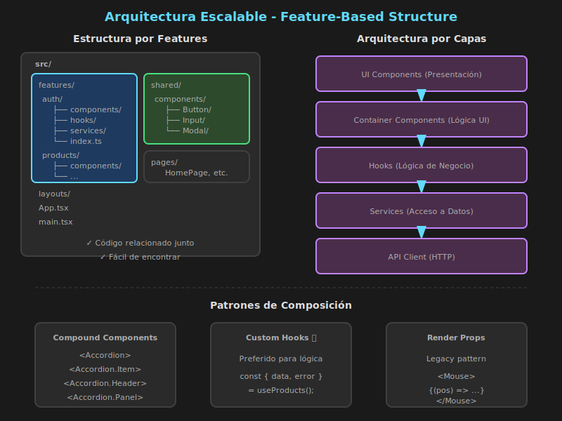

# Patrones y Arquitectura Escalable



## 🎯 Objetivos

- Conocer patrones de composición avanzados en React
- Estructurar proyectos React de forma escalable
- Aplicar principios de arquitectura limpia
- Organizar código para equipos grandes

---

## 📋 Contenido

### 1. Patrones de Composición

#### Compound Components

El patrón **Compound Components** permite crear componentes que trabajan juntos compartiendo estado implícito:

```typescript
import {
  createContext,
  useContext,
  useState,
  type FC,
  type ReactNode
} from 'react';

// ============================================
// CONTEXTO INTERNO
// ============================================
interface AccordionContextValue {
  activeIndex: number | null;
  setActiveIndex: (index: number | null) => void;
}

const AccordionContext = createContext<AccordionContextValue | null>(null);

const useAccordionContext = (): AccordionContextValue => {
  const context = useContext(AccordionContext);
  if (!context) {
    throw new Error('Accordion components must be used within Accordion');
  }
  return context;
};

// ============================================
// COMPONENTE PRINCIPAL
// ============================================
interface AccordionProps {
  children: ReactNode;
  defaultIndex?: number;
}

const Accordion: FC<AccordionProps> & {
  Item: typeof AccordionItem;
  Header: typeof AccordionHeader;
  Panel: typeof AccordionPanel;
} = ({ children, defaultIndex }) => {
  const [activeIndex, setActiveIndex] = useState<number | null>(defaultIndex ?? null);

  return (
    <AccordionContext.Provider value={{ activeIndex, setActiveIndex }}>
      <div className="accordion">{children}</div>
    </AccordionContext.Provider>
  );
};

// ============================================
// SUBCOMPONENTES
// ============================================
interface AccordionItemProps {
  children: ReactNode;
  index: number;
}

const AccordionItem: FC<AccordionItemProps> = ({ children, index }) => {
  return (
    <div className="accordion-item" data-index={index}>
      {children}
    </div>
  );
};

interface AccordionHeaderProps {
  children: ReactNode;
  index: number;
}

const AccordionHeader: FC<AccordionHeaderProps> = ({ children, index }) => {
  const { activeIndex, setActiveIndex } = useAccordionContext();
  const isActive = activeIndex === index;

  return (
    <button
      className={`accordion-header ${isActive ? 'active' : ''}`}
      onClick={() => setActiveIndex(isActive ? null : index)}
      aria-expanded={isActive}
    >
      {children}
    </button>
  );
};

interface AccordionPanelProps {
  children: ReactNode;
  index: number;
}

const AccordionPanel: FC<AccordionPanelProps> = ({ children, index }) => {
  const { activeIndex } = useAccordionContext();
  const isActive = activeIndex === index;

  if (!isActive) return null;

  return (
    <div className="accordion-panel" role="region">
      {children}
    </div>
  );
};

// Asignar subcomponentes
Accordion.Item = AccordionItem;
Accordion.Header = AccordionHeader;
Accordion.Panel = AccordionPanel;

export default Accordion;

// ============================================
// USO DEL COMPONENTE
// ============================================
const FAQ: FC = () => {
  return (
    <Accordion defaultIndex={0}>
      <Accordion.Item index={0}>
        <Accordion.Header index={0}>¿Cómo hago un pedido?</Accordion.Header>
        <Accordion.Panel index={0}>
          <p>Selecciona los productos y haz clic en "Comprar".</p>
        </Accordion.Panel>
      </Accordion.Item>

      <Accordion.Item index={1}>
        <Accordion.Header index={1}>¿Cuáles son los métodos de pago?</Accordion.Header>
        <Accordion.Panel index={1}>
          <p>Aceptamos tarjetas, PayPal y transferencia.</p>
        </Accordion.Panel>
      </Accordion.Item>
    </Accordion>
  );
};
```

#### Render Props

El patrón **Render Props** permite compartir lógica pasando una función como prop:

```typescript
// ============================================
// COMPONENTE CON RENDER PROP
// ============================================
interface MousePosition {
  x: number;
  y: number;
}

interface MouseTrackerProps {
  children: (position: MousePosition) => ReactNode;
}

const MouseTracker: FC<MouseTrackerProps> = ({ children }) => {
  const [position, setPosition] = useState<MousePosition>({ x: 0, y: 0 });

  const handleMouseMove = (e: React.MouseEvent) => {
    setPosition({ x: e.clientX, y: e.clientY });
  };

  return (
    <div onMouseMove={handleMouseMove} style={{ height: '100vh' }}>
      {children(position)}
    </div>
  );
};

// ============================================
// USO
// ============================================
const App: FC = () => {
  return (
    <MouseTracker>
      {({ x, y }) => (
        <div>
          <p>Posición del mouse: ({x}, {y})</p>
          <div
            style={{
              position: 'absolute',
              left: x - 10,
              top: y - 10,
              width: 20,
              height: 20,
              background: 'red',
              borderRadius: '50%',
            }}
          />
        </div>
      )}
    </MouseTracker>
  );
};
```

#### Hooks Personalizados (Preferido)

Hoy en día, **custom hooks** son preferidos sobre render props:

```typescript
// ============================================
// CUSTOM HOOK (MEJOR OPCIÓN)
// ============================================
const useMousePosition = () => {
  const [position, setPosition] = useState<MousePosition>({ x: 0, y: 0 });

  useEffect(() => {
    const handleMove = (e: MouseEvent) => {
      setPosition({ x: e.clientX, y: e.clientY });
    };

    window.addEventListener('mousemove', handleMove);
    return () => window.removeEventListener('mousemove', handleMove);
  }, []);

  return position;
};

// Uso más limpio
const App: FC = () => {
  const { x, y } = useMousePosition();

  return (
    <div>
      <p>Posición: ({x}, {y})</p>
    </div>
  );
};
```

---

### 2. Estructura de Carpetas

#### Estructura por Tipo (Tradicional)

```
src/
├── components/
│   ├── Button/
│   ├── Card/
│   └── Modal/
├── hooks/
│   ├── useAuth.ts
│   └── useApi.ts
├── pages/
│   ├── Home.tsx
│   └── Profile.tsx
├── services/
│   └── api.ts
├── utils/
│   └── helpers.ts
└── types/
    └── index.ts
```

**Pros**: Simple, familiar
**Cons**: No escala bien, archivos relacionados están dispersos

#### Estructura por Feature (Recomendada)

```
src/
├── features/
│   ├── auth/
│   │   ├── components/
│   │   │   ├── LoginForm.tsx
│   │   │   └── SignupForm.tsx
│   │   ├── hooks/
│   │   │   └── useAuth.ts
│   │   ├── services/
│   │   │   └── authApi.ts
│   │   ├── types/
│   │   │   └── auth.types.ts
│   │   └── index.ts
│   │
│   ├── products/
│   │   ├── components/
│   │   │   ├── ProductList.tsx
│   │   │   ├── ProductCard.tsx
│   │   │   └── ProductDetail.tsx
│   │   ├── hooks/
│   │   │   └── useProducts.ts
│   │   ├── services/
│   │   │   └── productsApi.ts
│   │   ├── types/
│   │   │   └── product.types.ts
│   │   └── index.ts
│   │
│   └── cart/
│       ├── components/
│       ├── hooks/
│       ├── services/
│       ├── types/
│       └── index.ts
│
├── shared/
│   ├── components/
│   │   ├── Button/
│   │   ├── Input/
│   │   └── Modal/
│   ├── hooks/
│   │   └── useLocalStorage.ts
│   └── utils/
│       └── formatters.ts
│
├── layouts/
│   ├── MainLayout.tsx
│   └── AuthLayout.tsx
│
├── pages/
│   ├── HomePage.tsx
│   ├── ProductsPage.tsx
│   └── CartPage.tsx
│
├── App.tsx
└── main.tsx
```

**Pros**: Escalable, código relacionado junto, fácil de encontrar
**Cons**: Requiere más estructura inicial

#### Barrel Exports

```typescript
// features/products/index.ts
// Exporta todo lo público del feature

// Componentes
export { ProductList } from './components/ProductList';
export { ProductCard } from './components/ProductCard';
export { ProductDetail } from './components/ProductDetail';

// Hooks
export { useProducts } from './hooks/useProducts';
export { useProductDetail } from './hooks/useProductDetail';

// Types
export type { Product, ProductCategory } from './types/product.types';

// Uso desde otro lugar:
// import { ProductList, useProducts, type Product } from '@/features/products';
```

---

### 3. Capas de Abstracción

#### Arquitectura por Capas

```
┌─────────────────────────────────────┐
│           UI Components             │  ← Presentación
├─────────────────────────────────────┤
│        Container Components         │  ← Lógica de UI
├─────────────────────────────────────┤
│             Hooks                   │  ← Lógica de negocio
├─────────────────────────────────────┤
│            Services                 │  ← Acceso a datos
├─────────────────────────────────────┤
│              API                    │  ← Comunicación externa
└─────────────────────────────────────┘
```

#### Implementación

```typescript
// ============================================
// CAPA: API (comunicación HTTP)
// ============================================
// services/api/client.ts
const apiClient = {
  async get<T>(url: string): Promise<T> {
    const response = await fetch(`${BASE_URL}${url}`);
    if (!response.ok) throw new Error('API Error');
    return response.json();
  },

  async post<T>(url: string, data: unknown): Promise<T> {
    const response = await fetch(`${BASE_URL}${url}`, {
      method: 'POST',
      headers: { 'Content-Type': 'application/json' },
      body: JSON.stringify(data),
    });
    if (!response.ok) throw new Error('API Error');
    return response.json();
  },
};

// ============================================
// CAPA: SERVICES (lógica de acceso a datos)
// ============================================
// features/products/services/productsApi.ts
import { apiClient } from '@/services/api/client';
import type { Product, CreateProductDTO } from '../types/product.types';

export const productsApi = {
  getAll: () => apiClient.get<Product[]>('/products'),
  getById: (id: number) => apiClient.get<Product>(`/products/${id}`),
  create: (data: CreateProductDTO) => apiClient.post<Product>('/products', data),
  update: (id: number, data: Partial<Product>) =>
    apiClient.put<Product>(`/products/${id}`, data),
  delete: (id: number) => apiClient.delete(`/products/${id}`),
};

// ============================================
// CAPA: HOOKS (lógica de negocio)
// ============================================
// features/products/hooks/useProducts.ts
import { useState, useEffect, useCallback } from 'react';
import { productsApi } from '../services/productsApi';
import type { Product } from '../types/product.types';

interface UseProductsReturn {
  products: Product[];
  isLoading: boolean;
  error: Error | null;
  refetch: () => Promise<void>;
  addProduct: (data: CreateProductDTO) => Promise<void>;
  deleteProduct: (id: number) => Promise<void>;
}

export const useProducts = (): UseProductsReturn => {
  const [products, setProducts] = useState<Product[]>([]);
  const [isLoading, setIsLoading] = useState(true);
  const [error, setError] = useState<Error | null>(null);

  const fetchProducts = useCallback(async () => {
    try {
      setIsLoading(true);
      setError(null);
      const data = await productsApi.getAll();
      setProducts(data);
    } catch (err) {
      setError(err instanceof Error ? err : new Error('Unknown error'));
    } finally {
      setIsLoading(false);
    }
  }, []);

  useEffect(() => {
    fetchProducts();
  }, [fetchProducts]);

  const addProduct = async (data: CreateProductDTO) => {
    const newProduct = await productsApi.create(data);
    setProducts(prev => [...prev, newProduct]);
  };

  const deleteProduct = async (id: number) => {
    await productsApi.delete(id);
    setProducts(prev => prev.filter(p => p.id !== id));
  };

  return {
    products,
    isLoading,
    error,
    refetch: fetchProducts,
    addProduct,
    deleteProduct,
  };
};

// ============================================
// CAPA: CONTAINER (conecta lógica con UI)
// ============================================
// features/products/components/ProductListContainer.tsx
import { useProducts } from '../hooks/useProducts';
import { ProductList } from './ProductList';
import { ProductListSkeleton } from './ProductListSkeleton';
import { ErrorMessage } from '@/shared/components/ErrorMessage';

export const ProductListContainer: FC = () => {
  const { products, isLoading, error, deleteProduct } = useProducts();

  if (isLoading) return <ProductListSkeleton />;
  if (error) return <ErrorMessage message={error.message} />;

  return (
    <ProductList
      products={products}
      onDelete={deleteProduct}
    />
  );
};

// ============================================
// CAPA: UI (presentación pura)
// ============================================
// features/products/components/ProductList.tsx
interface ProductListProps {
  products: Product[];
  onDelete: (id: number) => void;
}

export const ProductList: FC<ProductListProps> = ({ products, onDelete }) => {
  return (
    <ul className="product-list">
      {products.map(product => (
        <ProductCard
          key={product.id}
          product={product}
          onDelete={() => onDelete(product.id)}
        />
      ))}
    </ul>
  );
};
```

---

### 4. Alias de Importación

#### Configurar en Vite

```typescript
// vite.config.ts
import { defineConfig } from 'vite';
import react from '@vitejs/plugin-react';
import path from 'path';

export default defineConfig({
  plugins: [react()],
  resolve: {
    alias: {
      '@': path.resolve(__dirname, './src'),
      '@features': path.resolve(__dirname, './src/features'),
      '@shared': path.resolve(__dirname, './src/shared'),
      '@pages': path.resolve(__dirname, './src/pages'),
    },
  },
});
```

```json
// tsconfig.json
{
  "compilerOptions": {
    "baseUrl": ".",
    "paths": {
      "@/*": ["src/*"],
      "@features/*": ["src/features/*"],
      "@shared/*": ["src/shared/*"],
      "@pages/*": ["src/pages/*"]
    }
  }
}
```

```typescript
// Antes (rutas relativas largas)
import { Button } from '../../../shared/components/Button';
import { useProducts } from '../../products/hooks/useProducts';

// Después (alias limpios)
import { Button } from '@shared/components/Button';
import { useProducts } from '@features/products';
```

---

### 5. Manejo de Estado Global

#### Cuándo Usar Cada Solución

| Tipo de Estado        | Solución Recomendada    |
| --------------------- | ----------------------- |
| UI local              | `useState`              |
| Compartido (2-3 comp) | Lift state up           |
| Compartido (árbol)    | Context API             |
| Estado complejo       | Zustand / Redux Toolkit |
| Server state          | React Query / SWR       |
| URL state             | React Router            |

#### Separar Estado

```typescript
// ============================================
// CONTEXTO PARA UI (tema, sidebar, etc.)
// ============================================
// contexts/UIContext.tsx
interface UIState {
  sidebarOpen: boolean;
  theme: 'light' | 'dark';
}

// ============================================
// ZUSTAND PARA ESTADO DE APP
// ============================================
// stores/cartStore.ts
interface CartStore {
  items: CartItem[];
  addItem: (item: Product) => void;
  removeItem: (id: number) => void;
  clearCart: () => void;
}

// ============================================
// REACT QUERY PARA SERVER STATE
// ============================================
// hooks/useProducts.ts
const useProducts = () => {
  return useQuery({
    queryKey: ['products'],
    queryFn: productsApi.getAll,
  });
};
```

---

### 6. Principios SOLID en React

| Principio | Aplicación en React                           |
| --------- | --------------------------------------------- |
| S         | Componente hace una sola cosa                 |
| O         | Extender via props, no modificar              |
| L         | Props compatibles entre componentes similares |
| I         | Props interfaces pequeñas y específicas       |
| D         | Inyectar dependencias via props o context     |

```typescript
// ============================================
// SINGLE RESPONSIBILITY
// ============================================
// ❌ Hace demasiado
const ProductPage: FC = () => {
  // Fetch, filtros, ordenamiento, modal, form, etc.
};

// ✅ Responsabilidades separadas
const ProductPage: FC = () => (
  <ProductLayout>
    <ProductFilters />
    <ProductList />
    <ProductModal />
  </ProductLayout>
);

// ============================================
// DEPENDENCY INVERSION
// ============================================
// ❌ Dependencia directa
const UserCard: FC = () => {
  const user = useAuthStore().user; // Acoplado al store
  return <div>{user.name}</div>;
};

// ✅ Inyección de dependencia
interface UserCardProps {
  user: User;
}

const UserCard: FC<UserCardProps> = ({ user }) => {
  return <div>{user.name}</div>;
};

// El padre decide de dónde viene el user
const Container: FC = () => {
  const user = useAuthStore().user;
  return <UserCard user={user} />;
};
```

---

## ✅ Checklist de Verificación

- [ ] Conozco el patrón Compound Components
- [ ] Entiendo cuándo usar hooks vs render props
- [ ] Puedo estructurar un proyecto por features
- [ ] Implemento capas de abstracción correctamente
- [ ] Configuro alias de importación
- [ ] Aplico principios SOLID en React

---

## 📚 Recursos Adicionales

- [Patterns.dev - React Patterns](https://www.patterns.dev/posts)
- [Bulletproof React](https://github.com/alan2207/bulletproof-react)
- [Kent C. Dodds - Application State Management](https://kentcdodds.com/blog/application-state-management-with-react)

---

_Fin de la teoría - Semana 17_
