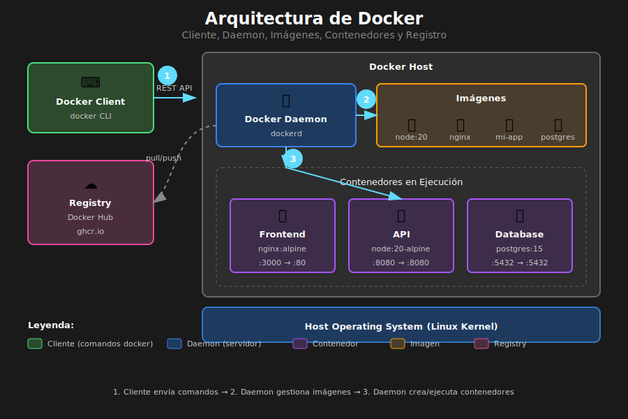

# Introducción a Docker



## 🎯 Objetivos

- Comprender qué es Docker y por qué es útil
- Conocer los conceptos fundamentales: imagen, contenedor, registro
- Entender el flujo de trabajo con Docker
- Ejecutar comandos básicos de Docker

---

## 📋 Contenido

### 1. ¿Qué es Docker?

Docker es una plataforma de **containerización** que permite empaquetar aplicaciones junto con todas sus dependencias en unidades llamadas **contenedores**.

#### El Problema que Resuelve

| Sin Docker                         | Con Docker                     |
| ---------------------------------- | ------------------------------ |
| "Funciona en mi máquina"           | Funciona igual en todas partes |
| Conflictos de versiones            | Dependencias aisladas          |
| Configuración manual del servidor  | Infraestructura como código    |
| Despliegues inconsistentes         | Despliegues reproducibles      |
| Dependencias del sistema operativo | Contenedores portables         |

#### ¿Por Qué Docker para Frontend?

1. **Consistencia**: Mismo entorno en desarrollo, CI/CD y producción
2. **Aislamiento**: Tu app no afecta ni es afectada por otras
3. **Portabilidad**: Corre en cualquier sistema con Docker
4. **Escalabilidad**: Fácil de replicar y orquestar
5. **CI/CD**: Integración simple con pipelines de despliegue

---

### 2. Conceptos Fundamentales

#### Imagen (Image)

Una **imagen** es un paquete inmutable que contiene todo lo necesario para ejecutar una aplicación:

- Código de la aplicación
- Runtime (Node.js, Nginx, etc.)
- Bibliotecas y dependencias
- Variables de entorno
- Configuración

```bash
# Listar imágenes locales
docker images

# Descargar una imagen
docker pull nginx:alpine

# Eliminar una imagen
docker rmi nginx:alpine
```

#### Contenedor (Container)

Un **contenedor** es una instancia en ejecución de una imagen:

```bash
# Crear y ejecutar un contenedor
docker run nginx:alpine

# Listar contenedores en ejecución
docker ps

# Listar todos los contenedores (incluidos detenidos)
docker ps -a

# Detener un contenedor
docker stop <container_id>

# Eliminar un contenedor
docker rm <container_id>
```

#### Registro (Registry)

Un **registro** es un repositorio de imágenes Docker:

- **Docker Hub**: Registro público por defecto
- **GitHub Container Registry (ghcr.io)**: Integrado con GitHub
- **Amazon ECR, Google GCR, Azure ACR**: Registros en la nube

```bash
# Iniciar sesión en Docker Hub
docker login

# Subir una imagen
docker push mi-usuario/mi-app:v1.0

# Descargar una imagen
docker pull mi-usuario/mi-app:v1.0
```

---

### 3. Arquitectura de Docker

```
┌─────────────────────────────────────────────────────────┐
│                    Docker Client                         │
│                  (docker CLI)                            │
└─────────────────────────────────────────────────────────┘
                           │
                           ▼
┌─────────────────────────────────────────────────────────┐
│                    Docker Daemon                         │
│                    (dockerd)                             │
├─────────────────────────────────────────────────────────┤
│  ┌───────────┐  ┌───────────┐  ┌───────────┐           │
│  │ Container │  │ Container │  │ Container │           │
│  │   App 1   │  │   App 2   │  │   App 3   │           │
│  └───────────┘  └───────────┘  └───────────┘           │
├─────────────────────────────────────────────────────────┤
│                    Docker Engine                         │
└─────────────────────────────────────────────────────────┘
                           │
                           ▼
┌─────────────────────────────────────────────────────────┐
│                    Host OS (Linux)                       │
└─────────────────────────────────────────────────────────┘
```

#### Diferencia con Máquinas Virtuales

| Aspecto     | Contenedores    | Máquinas Virtuales |
| ----------- | --------------- | ------------------ |
| Tamaño      | MB              | GB                 |
| Inicio      | Segundos        | Minutos            |
| Overhead    | Mínimo          | Alto               |
| Aislamiento | Proceso         | Hardware           |
| SO          | Comparte kernel | SO completo        |

---

### 4. Comandos Esenciales

#### Ejecutar Contenedores

```bash
# Ejecutar en primer plano
docker run nginx:alpine

# Ejecutar en segundo plano (detached)
docker run -d nginx:alpine

# Ejecutar con nombre personalizado
docker run -d --name mi-nginx nginx:alpine

# Ejecutar con mapeo de puertos
# -p <puerto_host>:<puerto_contenedor>
docker run -d -p 8080:80 nginx:alpine

# Ejecutar con volumen montado
# -v <ruta_host>:<ruta_contenedor>
docker run -d -v $(pwd)/html:/usr/share/nginx/html nginx:alpine

# Ejecutar con variables de entorno
docker run -d -e API_URL=http://api.example.com nginx:alpine

# Combinando opciones
docker run -d \
  --name mi-app \
  -p 3000:80 \
  -v $(pwd)/dist:/usr/share/nginx/html \
  -e NODE_ENV=production \
  nginx:alpine
```

#### Gestionar Contenedores

```bash
# Ver logs de un contenedor
docker logs mi-app

# Ver logs en tiempo real
docker logs -f mi-app

# Ejecutar comando dentro del contenedor
docker exec -it mi-app sh

# Ver uso de recursos
docker stats

# Inspeccionar un contenedor
docker inspect mi-app
```

#### Limpieza

```bash
# Eliminar contenedores detenidos
docker container prune

# Eliminar imágenes sin usar
docker image prune

# Eliminar todo lo no usado (cuidado!)
docker system prune -a
```

---

### 5. Flujo de Trabajo Típico

```
1. DESARROLLO LOCAL
   └── Código fuente + Dockerfile
           │
           ▼
2. BUILD
   └── docker build -t mi-app .
           │
           ▼
3. TEST LOCAL
   └── docker run -p 3000:80 mi-app
           │
           ▼
4. PUSH AL REGISTRO
   └── docker push mi-usuario/mi-app:v1.0
           │
           ▼
5. DEPLOY EN PRODUCCIÓN
   └── docker pull && docker run
```

---

### 6. Ejemplo Práctico: Nginx con HTML

```bash
# Crear directorio de proyecto
mkdir docker-demo && cd docker-demo

# Crear archivo HTML
echo '<!DOCTYPE html>
<html>
<head><title>Mi App</title></head>
<body><h1>¡Hola Docker!</h1></body>
</html>' > index.html

# Ejecutar Nginx sirviendo el HTML
docker run -d \
  --name mi-web \
  -p 8080:80 \
  -v $(pwd):/usr/share/nginx/html:ro \
  nginx:alpine

# Abrir en navegador: http://localhost:8080

# Detener y eliminar
docker stop mi-web && docker rm mi-web
```

---

## ✅ Checklist de Verificación

- [ ] Docker instalado y funcionando (`docker --version`)
- [ ] Entiendes la diferencia entre imagen y contenedor
- [ ] Puedes ejecutar un contenedor con `docker run`
- [ ] Sabes mapear puertos con `-p`
- [ ] Sabes montar volúmenes con `-v`
- [ ] Puedes ver logs con `docker logs`
- [ ] Sabes detener y eliminar contenedores

---

## 📚 Recursos Adicionales

- [Docker Documentation](https://docs.docker.com/)
- [Docker Hub](https://hub.docker.com/)
- [Play with Docker](https://labs.play-with-docker.com/)
