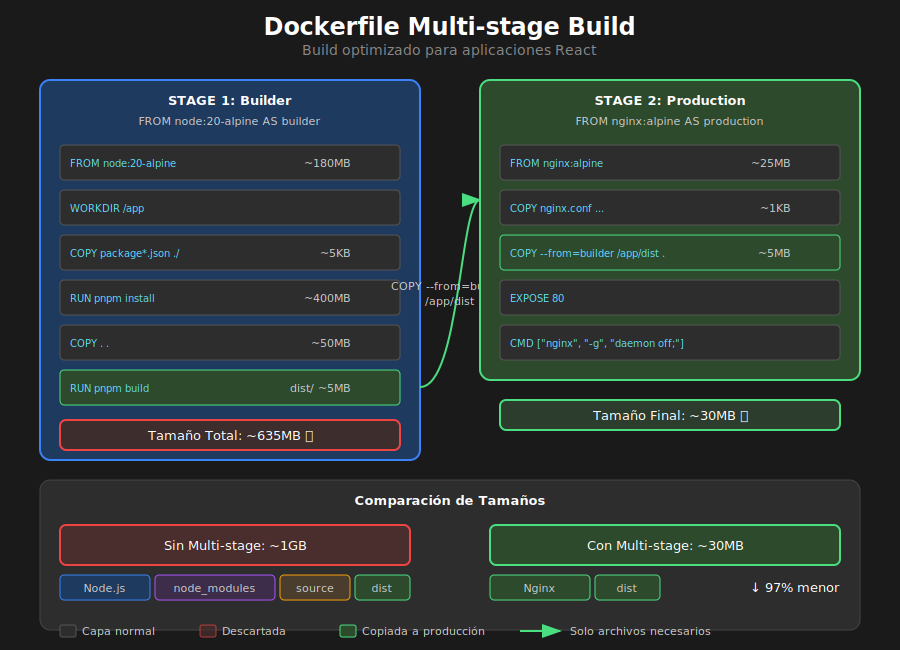

# Dockerfile Multi-stage para React



## 🎯 Objetivos

- Entender la estructura de un Dockerfile
- Implementar builds multi-stage para React
- Optimizar el tamaño de imágenes
- Configurar Nginx para SPAs

---

## 📋 Contenido

### 1. ¿Qué es un Dockerfile?

Un **Dockerfile** es un archivo de texto con instrucciones para construir una imagen Docker. Es como una "receta" que define paso a paso cómo crear el entorno de tu aplicación.

```dockerfile
# Ejemplo básico
FROM node:20-alpine
WORKDIR /app
COPY package*.json ./
RUN npm install
COPY . .
CMD ["npm", "start"]
```

---

### 2. Instrucciones Principales

| Instrucción | Descripción                    | Ejemplo                              |
| ----------- | ------------------------------ | ------------------------------------ |
| `FROM`      | Imagen base                    | `FROM node:20-alpine`                |
| `WORKDIR`   | Directorio de trabajo          | `WORKDIR /app`                       |
| `COPY`      | Copiar archivos del host       | `COPY . .`                           |
| `RUN`       | Ejecutar comando durante build | `RUN npm install`                    |
| `CMD`       | Comando por defecto al iniciar | `CMD ["nginx", "-g", "daemon off;"]` |
| `EXPOSE`    | Documentar puerto (no publica) | `EXPOSE 80`                          |
| `ENV`       | Variable de entorno            | `ENV NODE_ENV=production`            |
| `ARG`       | Argumento de build             | `ARG VITE_API_URL`                   |

---

### 3. El Problema del Build Simple

Un Dockerfile simple para React tendría un problema grave:

```dockerfile
# ❌ MAL: Imagen de ~1GB
FROM node:20
WORKDIR /app
COPY package*.json ./
RUN npm install
COPY . .
RUN npm run build
CMD ["npm", "run", "preview"]
```

**Problemas**:

- Incluye Node.js en producción (no necesario)
- Incluye node_modules (~500MB)
- Incluye código fuente (innecesario en producción)
- Solo necesitamos los archivos estáticos del build

---

### 4. Multi-stage Builds

Multi-stage permite usar múltiples `FROM` en un Dockerfile, tomando solo lo necesario de cada etapa:

```dockerfile
# ============================================
# STAGE 1: Build
# ============================================
FROM node:20-alpine AS builder

# Directorio de trabajo
WORKDIR /app

# Copiar archivos de dependencias primero (caché)
COPY package*.json ./

# Instalar dependencias
RUN npm ci

# Copiar código fuente
COPY . .

# Build de producción
RUN npm run build

# ============================================
# STAGE 2: Production
# ============================================
FROM nginx:alpine AS production

# Copiar configuración de Nginx
COPY nginx.conf /etc/nginx/conf.d/default.conf

# Copiar SOLO los archivos del build
COPY --from=builder /app/dist /usr/share/nginx/html

# Exponer puerto
EXPOSE 80

# Comando por defecto
CMD ["nginx", "-g", "daemon off;"]
```

**Resultado**:

- Stage 1 (`builder`): ~1GB (se descarta)
- Stage 2 (`production`): ~25MB (imagen final)

---

### 5. Configuración de Nginx para SPA

Las SPAs de React necesitan configuración especial para el routing del lado del cliente:

```nginx
# nginx.conf
server {
    listen 80;
    server_name localhost;

    # Directorio raíz
    root /usr/share/nginx/html;
    index index.html;

    # Compresión gzip
    gzip on;
    gzip_types text/plain text/css application/json application/javascript text/xml application/xml;

    # Cache para assets estáticos
    location ~* \.(js|css|png|jpg|jpeg|gif|ico|svg|woff|woff2)$ {
        expires 1y;
        add_header Cache-Control "public, immutable";
    }

    # SPA: Redirigir todas las rutas a index.html
    location / {
        try_files $uri $uri/ /index.html;
    }

    # Seguridad básica
    add_header X-Frame-Options "SAMEORIGIN" always;
    add_header X-Content-Type-Options "nosniff" always;
}
```

La línea clave es `try_files $uri $uri/ /index.html;`:

1. Intenta servir el archivo exacto (`$uri`)
2. Intenta servir como directorio (`$uri/`)
3. Si no existe, sirve `index.html` (React Router maneja la ruta)

---

### 6. Dockerfile Optimizado Completo

```dockerfile
# ============================================
# DOCKERFILE MULTI-STAGE PARA REACT + VITE
# ============================================

# ============================================
# STAGE 1: Dependencias
# ============================================
FROM node:20-alpine AS deps

WORKDIR /app

# Copiar solo archivos de dependencias
COPY package.json pnpm-lock.yaml ./

# Instalar pnpm e instalar dependencias
RUN corepack enable pnpm && pnpm install --frozen-lockfile

# ============================================
# STAGE 2: Build
# ============================================
FROM node:20-alpine AS builder

WORKDIR /app

# Copiar dependencias del stage anterior
COPY --from=deps /app/node_modules ./node_modules

# Copiar código fuente
COPY . .

# Variables de entorno para el build (ARG, no ENV)
ARG VITE_API_URL
ENV VITE_API_URL=$VITE_API_URL

# Build de producción
RUN corepack enable pnpm && pnpm build

# ============================================
# STAGE 3: Production
# ============================================
FROM nginx:1.25-alpine AS production

# Metadatos
LABEL maintainer="tu-email@example.com"
LABEL version="1.0"

# Eliminar configuración por defecto
RUN rm /etc/nginx/conf.d/default.conf

# Copiar configuración personalizada
COPY nginx.conf /etc/nginx/conf.d/default.conf

# Copiar archivos del build
COPY --from=builder /app/dist /usr/share/nginx/html

# Usuario no-root para seguridad
RUN chown -R nginx:nginx /usr/share/nginx/html

# Puerto
EXPOSE 80

# Health check
HEALTHCHECK --interval=30s --timeout=3s --start-period=5s --retries=3 \
    CMD wget --quiet --tries=1 --spider http://localhost/ || exit 1

# Comando
CMD ["nginx", "-g", "daemon off;"]
```

---

### 7. El Archivo .dockerignore

Evita copiar archivos innecesarios al contexto de build:

```dockerignore
# .dockerignore

# Dependencias
node_modules

# Build local
dist
build

# Control de versiones
.git
.gitignore

# IDE
.vscode
.idea
*.swp
*.swo

# Logs
*.log
npm-debug.log*

# Testing
coverage
.nyc_output

# Docker
Dockerfile*
docker-compose*
.docker

# Misc
.DS_Store
*.md
!README.md
.env.local
.env.*.local
```

---

### 8. Variables de Entorno

#### Durante el Build (ARG)

```dockerfile
# En Dockerfile
ARG VITE_API_URL
ENV VITE_API_URL=$VITE_API_URL
```

```bash
# Al construir
docker build --build-arg VITE_API_URL=https://api.example.com -t mi-app .
```

#### En Runtime (ENV)

Para apps React, las variables se "queman" durante el build. Para variables dinámicas en runtime, usa un script de inicialización:

```bash
#!/bin/sh
# entrypoint.sh

# Reemplazar placeholder en los archivos JS
find /usr/share/nginx/html -type f -name "*.js" -exec \
    sed -i "s|__API_URL__|$API_URL|g" {} \;

# Iniciar nginx
exec nginx -g "daemon off;"
```

---

### 9. Comandos de Build

```bash
# Build básico
docker build -t mi-app .

# Build con tag específico
docker build -t mi-app:v1.0 .

# Build con argumentos
docker build \
  --build-arg VITE_API_URL=https://api.example.com \
  -t mi-app:v1.0 \
  .

# Build sin caché (para debug)
docker build --no-cache -t mi-app .

# Ver tamaño de la imagen
docker images mi-app
```

---

### 10. Optimización de Capas y Caché

Docker cachea cada capa. Si una instrucción cambia, esa capa y todas las siguientes se reconstruyen.

```dockerfile
# ✅ BIEN: Dependencias primero (cambian poco)
COPY package*.json ./
RUN npm ci

# Código fuente después (cambia frecuentemente)
COPY . .
RUN npm run build
```

```dockerfile
# ❌ MAL: Todo junto (sin aprovechar caché)
COPY . .
RUN npm ci && npm run build
```

---

## ✅ Checklist de Verificación

- [ ] Dockerfile usa multi-stage build
- [ ] Imagen final usa Nginx Alpine (< 50MB)
- [ ] nginx.conf maneja rutas de SPA
- [ ] .dockerignore excluye node_modules
- [ ] Las dependencias se copian antes del código
- [ ] Build funciona: `docker build -t app .`
- [ ] App funciona: `docker run -p 3000:80 app`

---

## 📚 Recursos Adicionales

- [Dockerfile Reference](https://docs.docker.com/engine/reference/builder/)
- [Multi-stage Builds](https://docs.docker.com/build/building/multi-stage/)
- [Nginx Configuration](https://nginx.org/en/docs/)
