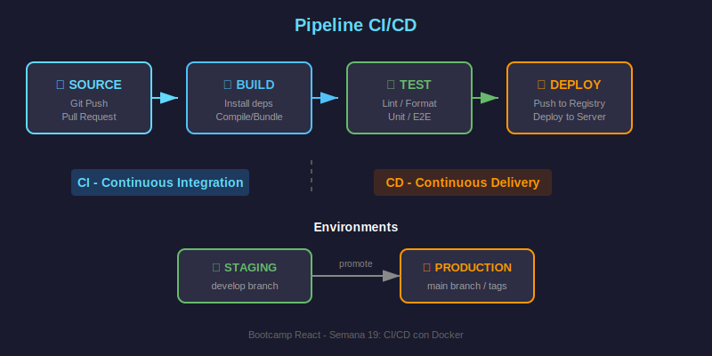

# Introducción a CI/CD

## 🎯 Objetivos

- Comprender qué es CI/CD y por qué es importante
- Conocer las diferencias entre Integración Continua y Despliegue Continuo
- Entender el flujo de un pipeline de CI/CD
- Identificar los beneficios para equipos de desarrollo

---

## 📖 ¿Qué es CI/CD?

**CI/CD** son prácticas de desarrollo de software que automatizan la integración de código y su despliegue a producción.

### CI - Integración Continua (Continuous Integration)

Práctica donde los desarrolladores integran código frecuentemente a un repositorio compartido. Cada integración se verifica automáticamente mediante:

- **Build automático**: Compilar/construir la aplicación
- **Tests automatizados**: Ejecutar tests unitarios e integración
- **Análisis de código**: Linting, formateo, seguridad

### CD - Despliegue Continuo (Continuous Deployment/Delivery)

Extensión de CI que automatiza el despliegue:

- **Continuous Delivery**: Código siempre listo para desplegar (requiere aprobación manual)
- **Continuous Deployment**: Despliegue automático a producción sin intervención humana

---

## 🔄 Pipeline de CI/CD



Un pipeline típico tiene estas fases:

### 1. Source (Código Fuente)

```
Trigger: push, pull_request, schedule
         ↓
┌─────────────────┐
│   Checkout      │  ← Obtener código del repo
│   Repository    │
└─────────────────┘
```

### 2. Build (Construcción)

```
┌─────────────────┐
│   Install       │  ← pnpm install
│   Dependencies  │
└─────────────────┘
         ↓
┌─────────────────┐
│   Build         │  ← pnpm build
│   Application   │
└─────────────────┘
```

### 3. Test (Pruebas)

```
┌─────────────────┐
│   Lint          │  ← ESLint, Prettier
└─────────────────┘
         ↓
┌─────────────────┐
│   Unit Tests    │  ← Vitest
└─────────────────┘
         ↓
┌─────────────────┐
│   E2E Tests     │  ← Playwright (opcional)
└─────────────────┘
```

### 4. Deploy (Despliegue)

```
┌─────────────────┐
│   Build Image   │  ← docker build
└─────────────────┘
         ↓
┌─────────────────┐
│   Push Registry │  ← docker push ghcr.io/...
└─────────────────┘
         ↓
┌─────────────────┐
│   Deploy        │  ← staging / production
└─────────────────┘
```

---

## 💡 Beneficios de CI/CD

### Para Desarrolladores

| Beneficio              | Descripción                                  |
| ---------------------- | -------------------------------------------- |
| **Feedback rápido**    | Errores detectados en minutos, no días       |
| **Menos conflictos**   | Integración frecuente reduce merge conflicts |
| **Confianza**          | Tests automáticos validan cambios            |
| **Documentación viva** | Pipeline documenta el proceso de build       |

### Para el Equipo

| Beneficio               | Descripción                               |
| ----------------------- | ----------------------------------------- |
| **Releases frecuentes** | Despliegues pequeños y seguros            |
| **Menor riesgo**        | Cambios incrementales fáciles de revertir |
| **Consistencia**        | Mismo proceso para todos los deployments  |
| **Trazabilidad**        | Historial de builds y deploys             |

### Para el Negocio

| Beneficio          | Descripción                           |
| ------------------ | ------------------------------------- |
| **Time to market** | Features llegan más rápido a usuarios |
| **Calidad**        | Menos bugs en producción              |
| **Costos**         | Automatización reduce trabajo manual  |

---

## 🛠️ Herramientas de CI/CD

### Plataformas Populares

| Herramienta        | Descripción               | Integración          |
| ------------------ | ------------------------- | -------------------- |
| **GitHub Actions** | CI/CD nativo de GitHub    | Excelente con GitHub |
| GitLab CI          | CI/CD de GitLab           | Nativo en GitLab     |
| Jenkins            | Open source, muy flexible | Cualquier plataforma |
| CircleCI           | Cloud-based, fácil setup  | GitHub, Bitbucket    |
| Travis CI          | Popular en open source    | GitHub               |

### ¿Por qué GitHub Actions?

Para este bootcamp usamos **GitHub Actions** porque:

1. **Integración nativa** con GitHub (donde está nuestro código)
2. **Gratuito** para repositorios públicos
3. **2,000 minutos/mes gratis** para repos privados
4. **Marketplace** con miles de acciones reutilizables
5. **YAML simple** y bien documentado
6. **Container Registry incluido** (GHCR)

---

## 📋 Anatomía de un Pipeline

### Ejemplo Conceptual para React

```yaml
# .github/workflows/ci.yml
name: CI Pipeline

# ¿Cuándo ejecutar?
on:
  push:
    branches: [main, develop]
  pull_request:
    branches: [main]

# ¿Qué ejecutar?
jobs:
  # Job 1: Lint y formateo
  lint:
    runs-on: ubuntu-latest
    steps:
      - uses: actions/checkout@v4
      - name: Setup Node
        uses: actions/setup-node@v4
      - name: Install dependencies
        run: pnpm install
      - name: Run ESLint
        run: pnpm lint

  # Job 2: Tests
  test:
    runs-on: ubuntu-latest
    steps:
      - uses: actions/checkout@v4
      - name: Setup and test
        run: |
          pnpm install
          pnpm test

  # Job 3: Build
  build:
    needs: [lint, test] # Espera a que pasen lint y test
    runs-on: ubuntu-latest
    steps:
      - uses: actions/checkout@v4
      - name: Build application
        run: |
          pnpm install
          pnpm build
```

---

## 🔑 Conceptos Clave

### Trigger (Disparador)

Evento que inicia el pipeline:

```yaml
on:
  push: # Al hacer push
  pull_request: # Al crear/actualizar PR
  schedule: # Programado (cron)
  workflow_dispatch: # Manual
```

### Job (Trabajo)

Conjunto de steps que se ejecutan en un runner:

```yaml
jobs:
  build:
    runs-on: ubuntu-latest # Runner
    steps: [...]
```

### Step (Paso)

Acción individual dentro de un job:

```yaml
steps:
  - name: Checkout code
    uses: actions/checkout@v4
  - name: Run tests
    run: pnpm test
```

### Artifact (Artefacto)

Archivos producidos por el pipeline (builds, reports):

```yaml
- uses: actions/upload-artifact@v4
  with:
    name: build-output
    path: dist/
```

---

## ✅ Checklist de Conocimientos

- [ ] Entiendo la diferencia entre CI y CD
- [ ] Conozco las fases de un pipeline típico
- [ ] Identifico los beneficios de CI/CD
- [ ] Comprendo por qué usamos GitHub Actions
- [ ] Conozco los conceptos: trigger, job, step, artifact

---

## 🔗 Recursos

- [What is CI/CD? - RedHat](https://www.redhat.com/en/topics/devops/what-is-ci-cd)
- [GitHub Actions Documentation](https://docs.github.com/en/actions)
- [CI/CD Best Practices](https://about.gitlab.com/topics/ci-cd/cicd-best-practices/)

---

## 📚 Siguiente

Continúa con [02-github-actions-fundamentos.md](02-github-actions-fundamentos.md) para aprender la sintaxis y estructura de GitHub Actions.
