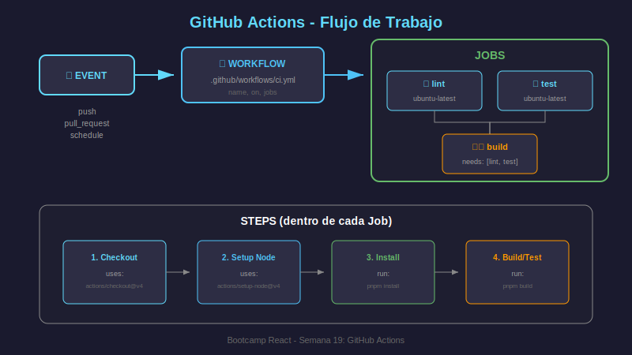

# GitHub Actions: Fundamentos

## 🎯 Objetivos

- Comprender la estructura de workflows en GitHub Actions
- Dominar la sintaxis YAML para definir pipelines
- Conocer triggers, jobs, steps y contexts
- Usar actions del marketplace

---

## 📖 ¿Qué es GitHub Actions?

**GitHub Actions** es una plataforma de CI/CD integrada en GitHub que permite automatizar workflows directamente desde tu repositorio.

### Características Principales

- 🔄 **Automatización**: Build, test, deploy automáticos
- 📦 **Marketplace**: Miles de acciones reutilizables
- 🐳 **Contenedores**: Soporte nativo para Docker
- 🔐 **Secrets**: Manejo seguro de credenciales
- 💰 **Gratuito**: Para repos públicos (2000 min/mes privados)

---

## 🔄 Flujo de GitHub Actions



```
Repository Event (push, PR, etc.)
         ↓
┌─────────────────────────────────┐
│         Workflow File           │
│    .github/workflows/*.yml      │
└─────────────────────────────────┘
         ↓
┌─────────────────────────────────┐
│           Jobs                  │
│  ┌─────────┐    ┌─────────┐    │
│  │  Job 1  │ → │  Job 2  │    │
│  │  (lint) │    │ (test)  │    │
│  └─────────┘    └─────────┘    │
└─────────────────────────────────┘
         ↓
┌─────────────────────────────────┐
│         Runners                 │
│   ubuntu-latest, windows, macos │
└─────────────────────────────────┘
```

---

## 📁 Estructura de Archivos

Los workflows se definen en:

```
.github/
└── workflows/
    ├── ci.yml        # Pipeline de CI
    ├── cd.yml        # Pipeline de CD
    └── release.yml   # Release automation
```

---

## 📝 Anatomía de un Workflow

### Estructura Básica

```yaml
# Nombre del workflow (aparece en la UI)
name: CI

# Eventos que disparan el workflow
on:
  push:
    branches: [main]
  pull_request:
    branches: [main]

# Variables de entorno globales
env:
  NODE_VERSION: '20'

# Definición de jobs
jobs:
  build:
    runs-on: ubuntu-latest
    steps:
      - name: Checkout
        uses: actions/checkout@v4
```

---

## 🎯 Triggers (on)

### Push y Pull Request

```yaml
on:
  push:
    branches:
      - main
      - 'feature/**' # Glob patterns
    paths:
      - 'src/**' # Solo si cambian estos archivos
      - '!**.md' # Excepto markdown

  pull_request:
    branches: [main]
    types: [opened, synchronize, reopened]
```

### Schedule (Cron)

```yaml
on:
  schedule:
    # Ejecutar a las 6:00 UTC cada día
    - cron: '0 6 * * *'
```

### Manual (workflow_dispatch)

```yaml
on:
  workflow_dispatch:
    inputs:
      environment:
        description: 'Target environment'
        required: true
        default: 'staging'
        type: choice
        options:
          - staging
          - production
```

### Otros Triggers

```yaml
on:
  release:
    types: [published]

  workflow_call: # Llamado por otro workflow

  repository_dispatch: # Evento externo vía API
```

---

## 💼 Jobs

### Job Básico

```yaml
jobs:
  mi-job:
    name: Mi Job Descriptivo
    runs-on: ubuntu-latest

    steps:
      - name: Paso 1
        run: echo "Hola mundo"
```

### Runners Disponibles

| Runner           | Descripción             |
| ---------------- | ----------------------- |
| `ubuntu-latest`  | Ubuntu LTS más reciente |
| `ubuntu-22.04`   | Ubuntu 22.04 específico |
| `windows-latest` | Windows Server          |
| `macos-latest`   | macOS más reciente      |

### Dependencias entre Jobs

```yaml
jobs:
  lint:
    runs-on: ubuntu-latest
    steps: [...]

  test:
    runs-on: ubuntu-latest
    steps: [...]

  build:
    needs: [lint, test] # Espera a lint y test
    runs-on: ubuntu-latest
    steps: [...]

  deploy:
    needs: build
    if: github.ref == 'refs/heads/main' # Solo en main
    runs-on: ubuntu-latest
    steps: [...]
```

### Matrix Strategy

Ejecutar job con múltiples configuraciones:

```yaml
jobs:
  test:
    runs-on: ubuntu-latest
    strategy:
      matrix:
        node-version: [18, 20, 22]
        os: [ubuntu-latest, windows-latest]
      fail-fast: false # Continuar aunque uno falle

    steps:
      - uses: actions/setup-node@v4
        with:
          node-version: ${{ matrix.node-version }}
```

---

## 📍 Steps

### Ejecutar Comandos

```yaml
steps:
  - name: Single command
    run: echo "Hola"

  - name: Multiple commands
    run: |
      echo "Línea 1"
      echo "Línea 2"
      npm install

  - name: With working directory
    run: pnpm build
    working-directory: ./frontend
```

### Usar Actions del Marketplace

```yaml
steps:
  # Action oficial de GitHub
  - name: Checkout code
    uses: actions/checkout@v4

  # Action con inputs
  - name: Setup Node.js
    uses: actions/setup-node@v4
    with:
      node-version: '20'
      cache: 'pnpm'

  # Action de la comunidad
  - name: Setup pnpm
    uses: pnpm/action-setup@v3
    with:
      version: 9
```

### Condicionales (if)

```yaml
steps:
  - name: Solo en main
    if: github.ref == 'refs/heads/main'
    run: echo "Estamos en main"

  - name: Solo si test pasó
    if: success()
    run: echo "Tests OK"

  - name: Solo si falló
    if: failure()
    run: echo "Algo falló"

  - name: Siempre ejecutar
    if: always()
    run: echo "Cleanup"
```

---

## 🔐 Secrets y Variables

### Configurar Secrets en GitHub

1. Ir a **Settings > Secrets and variables > Actions**
2. Crear **New repository secret**
3. Usar en workflow:

```yaml
steps:
  - name: Login to Registry
    run: echo "${{ secrets.REGISTRY_TOKEN }}" | docker login -u user --password-stdin
```

### Variables de Entorno

```yaml
# Global (todo el workflow)
env:
  NODE_ENV: production

jobs:
  build:
    # Por job
    env:
      API_URL: https://api.example.com

    steps:
      - name: Con variable
        # Por step
        env:
          MY_VAR: valor
        run: echo $MY_VAR
```

### GitHub Context

Variables disponibles automáticamente:

```yaml
steps:
  - run: |
      echo "Repo: ${{ github.repository }}"
      echo "Branch: ${{ github.ref_name }}"
      echo "SHA: ${{ github.sha }}"
      echo "Actor: ${{ github.actor }}"
      echo "Event: ${{ github.event_name }}"
```

---

## 📦 Cache y Artifacts

### Cache de Dependencias

```yaml
steps:
  - uses: actions/setup-node@v4
    with:
      node-version: '20'
      cache: 'pnpm' # Cache automático

  # O manualmente:
  - uses: actions/cache@v4
    with:
      path: ~/.pnpm-store
      key: ${{ runner.os }}-pnpm-${{ hashFiles('**/pnpm-lock.yaml') }}
      restore-keys: |
        ${{ runner.os }}-pnpm-
```

### Artifacts (Guardar archivos)

```yaml
jobs:
  build:
    steps:
      - run: pnpm build

      - name: Upload build
        uses: actions/upload-artifact@v4
        with:
          name: dist
          path: dist/
          retention-days: 7

  deploy:
    needs: build
    steps:
      - name: Download build
        uses: actions/download-artifact@v4
        with:
          name: dist
          path: dist/
```

---

## 🚀 Workflow Completo para React

```yaml
name: CI/CD React App

on:
  push:
    branches: [main, develop]
  pull_request:
    branches: [main]

env:
  NODE_VERSION: '20'

jobs:
  # ═══════════════════════════════════════════
  # JOB: Lint
  # ═══════════════════════════════════════════
  lint:
    name: 🔍 Lint
    runs-on: ubuntu-latest

    steps:
      - name: Checkout
        uses: actions/checkout@v4

      - name: Setup pnpm
        uses: pnpm/action-setup@v3
        with:
          version: 9

      - name: Setup Node.js
        uses: actions/setup-node@v4
        with:
          node-version: ${{ env.NODE_VERSION }}
          cache: 'pnpm'

      - name: Install dependencies
        run: pnpm install --frozen-lockfile

      - name: Run ESLint
        run: pnpm lint

  # ═══════════════════════════════════════════
  # JOB: Test
  # ═══════════════════════════════════════════
  test:
    name: 🧪 Test
    runs-on: ubuntu-latest

    steps:
      - uses: actions/checkout@v4

      - uses: pnpm/action-setup@v3
        with:
          version: 9

      - uses: actions/setup-node@v4
        with:
          node-version: ${{ env.NODE_VERSION }}
          cache: 'pnpm'

      - run: pnpm install --frozen-lockfile

      - name: Run tests
        run: pnpm test -- --coverage

      - name: Upload coverage
        uses: actions/upload-artifact@v4
        with:
          name: coverage
          path: coverage/

  # ═══════════════════════════════════════════
  # JOB: Build
  # ═══════════════════════════════════════════
  build:
    name: 🏗️ Build
    runs-on: ubuntu-latest
    needs: [lint, test]

    steps:
      - uses: actions/checkout@v4

      - uses: pnpm/action-setup@v3
        with:
          version: 9

      - uses: actions/setup-node@v4
        with:
          node-version: ${{ env.NODE_VERSION }}
          cache: 'pnpm'

      - run: pnpm install --frozen-lockfile

      - name: Build application
        run: pnpm build

      - name: Upload build artifact
        uses: actions/upload-artifact@v4
        with:
          name: dist
          path: dist/
```

---

## ✅ Checklist de Conocimientos

- [ ] Sé dónde crear archivos de workflow (`.github/workflows/`)
- [ ] Entiendo triggers: push, pull_request, schedule, workflow_dispatch
- [ ] Puedo definir jobs con dependencias (needs)
- [ ] Sé usar matrix strategy para múltiples configuraciones
- [ ] Manejo secrets de forma segura
- [ ] Uso cache para acelerar builds
- [ ] Entiendo artifacts para compartir archivos entre jobs

---

## 🔗 Recursos

- [Workflow Syntax](https://docs.github.com/en/actions/using-workflows/workflow-syntax-for-github-actions)
- [Actions Marketplace](https://github.com/marketplace?type=actions)
- [Contexts Reference](https://docs.github.com/en/actions/learn-github-actions/contexts)

---

## 📚 Siguiente

Continúa con [03-docker-registry-deploy.md](03-docker-registry-deploy.md) para aprender a publicar imágenes Docker y estrategias de deployment.
