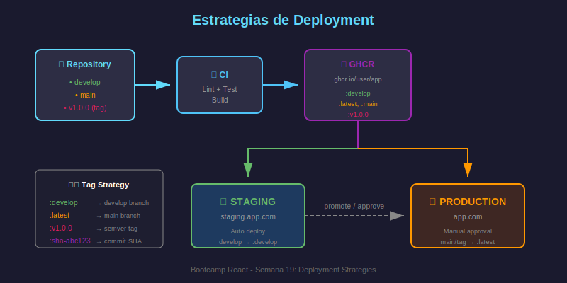

# Docker Registry y Estrategias de Deployment

## 🎯 Objetivos

- Publicar imágenes Docker en GitHub Container Registry (GHCR)
- Implementar tags semánticos para versionado
- Configurar estrategias de deployment (staging/production)
- Automatizar el flujo completo de CD

---

## 📦 GitHub Container Registry (GHCR)

### ¿Qué es GHCR?

**GitHub Container Registry** es un servicio de almacenamiento de imágenes de contenedores integrado con GitHub.

### Ventajas de GHCR

| Característica    | Descripción                             |
| ----------------- | --------------------------------------- |
| **Integración**   | Nativo con GitHub Actions               |
| **Permisos**      | Usa los mismos permisos del repositorio |
| **Gratuito**      | Para repositorios públicos              |
| **Privado**       | Imágenes privadas disponibles           |
| **Autenticación** | Con `GITHUB_TOKEN` automático           |

### URL de Imágenes

```
ghcr.io/OWNER/IMAGE_NAME:TAG

# Ejemplos:
ghcr.io/mi-usuario/mi-app:latest
ghcr.io/mi-org/frontend:v1.0.0
ghcr.io/mi-usuario/api:sha-a1b2c3d
```

---

## 🔄 Flujo de CD con Docker



```
Code Push → Build Image → Push to GHCR → Deploy
    ↓           ↓              ↓            ↓
  main      docker build    docker push   staging
  tags      multi-stage     ghcr.io/...   production
```

---

## 🔐 Autenticación con GHCR

### Usando GITHUB_TOKEN

El token se genera automáticamente en cada workflow:

```yaml
jobs:
  push:
    runs-on: ubuntu-latest

    # Permisos necesarios para push
    permissions:
      contents: read
      packages: write

    steps:
      - name: Login to GHCR
        uses: docker/login-action@v3
        with:
          registry: ghcr.io
          username: ${{ github.actor }}
          password: ${{ secrets.GITHUB_TOKEN }}
```

### Permisos Requeridos

```yaml
permissions:
  contents: read # Leer código
  packages: write # Publicar a GHCR
```

---

## 🏷️ Estrategias de Tagging

### Tags Comunes

| Tag       | Uso                    | Ejemplo              |
| --------- | ---------------------- | -------------------- |
| `latest`  | Última versión estable | `mi-app:latest`      |
| `sha-xxx` | Commit específico      | `mi-app:sha-a1b2c3d` |
| `v1.0.0`  | Versión semántica      | `mi-app:v1.0.0`      |
| `main`    | Branch main            | `mi-app:main`        |
| `pr-123`  | Pull request           | `mi-app:pr-123`      |

### Generar Tags Automáticamente

```yaml
- name: Docker metadata
  id: meta
  uses: docker/metadata-action@v5
  with:
    images: ghcr.io/${{ github.repository }}
    tags: |
      # Branch name
      type=ref,event=branch
      # PR number
      type=ref,event=pr
      # Semver tag
      type=semver,pattern={{version}}
      type=semver,pattern={{major}}.{{minor}}
      # SHA corto
      type=sha,prefix=sha-
      # Latest solo en main
      type=raw,value=latest,enable=${{ github.ref == 'refs/heads/main' }}
```

---

## 🚀 Workflow de CD Completo

### Build y Push a GHCR

```yaml
name: CD - Build and Push

on:
  push:
    branches: [main]
    tags: ['v*']

env:
  REGISTRY: ghcr.io
  IMAGE_NAME: ${{ github.repository }}

jobs:
  build-and-push:
    name: 🐳 Build & Push Docker Image
    runs-on: ubuntu-latest

    permissions:
      contents: read
      packages: write

    steps:
      # ═══════════════════════════════════════════
      # Checkout
      # ═══════════════════════════════════════════
      - name: Checkout repository
        uses: actions/checkout@v4

      # ═══════════════════════════════════════════
      # Setup Docker Buildx (para builds avanzados)
      # ═══════════════════════════════════════════
      - name: Set up Docker Buildx
        uses: docker/setup-buildx-action@v3

      # ═══════════════════════════════════════════
      # Login a GHCR
      # ═══════════════════════════════════════════
      - name: Log in to Container Registry
        uses: docker/login-action@v3
        with:
          registry: ${{ env.REGISTRY }}
          username: ${{ github.actor }}
          password: ${{ secrets.GITHUB_TOKEN }}

      # ═══════════════════════════════════════════
      # Generar tags y labels
      # ═══════════════════════════════════════════
      - name: Extract metadata (tags, labels)
        id: meta
        uses: docker/metadata-action@v5
        with:
          images: ${{ env.REGISTRY }}/${{ env.IMAGE_NAME }}
          tags: |
            type=ref,event=branch
            type=semver,pattern={{version}}
            type=semver,pattern={{major}}.{{minor}}
            type=sha,prefix=sha-
            type=raw,value=latest,enable=${{ github.ref == 'refs/heads/main' }}

      # ═══════════════════════════════════════════
      # Build y Push
      # ═══════════════════════════════════════════
      - name: Build and push Docker image
        uses: docker/build-push-action@v5
        with:
          context: .
          push: true
          tags: ${{ steps.meta.outputs.tags }}
          labels: ${{ steps.meta.outputs.labels }}
          cache-from: type=gha
          cache-to: type=gha,mode=max
```

---

## 🎯 Estrategias de Deployment

### 1. Deployment por Branch

```yaml
jobs:
  deploy-staging:
    if: github.ref == 'refs/heads/develop'
    runs-on: ubuntu-latest
    environment: staging
    steps:
      - name: Deploy to Staging
        run: echo "Deploying to staging..."

  deploy-production:
    if: github.ref == 'refs/heads/main'
    runs-on: ubuntu-latest
    environment: production
    steps:
      - name: Deploy to Production
        run: echo "Deploying to production..."
```

### 2. Deployment por Tags

```yaml
on:
  push:
    tags:
      - 'v*' # Solo cuando se crea un tag v*

jobs:
  release:
    runs-on: ubuntu-latest
    steps:
      - name: Get version from tag
        run: echo "VERSION=${GITHUB_REF#refs/tags/}" >> $GITHUB_ENV

      - name: Deploy version ${{ env.VERSION }}
        run: echo "Deploying $VERSION to production"
```

### 3. Environments con Aprobación

Configurar en **Settings > Environments**:

```yaml
jobs:
  deploy-production:
    runs-on: ubuntu-latest
    environment:
      name: production
      url: https://mi-app.com

    steps:
      - name: Deploy
        run: echo "Deploying..."
```

El environment `production` puede requerir aprobación manual.

---

## 🔒 Seguridad en CD

### Escaneo de Vulnerabilidades

```yaml
- name: Run Trivy vulnerability scanner
  uses: aquasecurity/trivy-action@master
  with:
    image-ref: ${{ env.REGISTRY }}/${{ env.IMAGE_NAME }}:${{ github.sha }}
    format: 'sarif'
    output: 'trivy-results.sarif'

- name: Upload Trivy scan results
  uses: github/codeql-action/upload-sarif@v3
  with:
    sarif_file: 'trivy-results.sarif'
```

### Firma de Imágenes (Sigstore/Cosign)

```yaml
- name: Sign image with Cosign
  uses: sigstore/cosign-installer@v3

- name: Sign the image
  run: |
    cosign sign --yes ${{ env.REGISTRY }}/${{ env.IMAGE_NAME }}@${{ steps.build.outputs.digest }}
```

---

## 📋 Workflow CI/CD Integrado

```yaml
name: CI/CD Pipeline

on:
  push:
    branches: [main, develop]
    tags: ['v*']
  pull_request:
    branches: [main]

env:
  REGISTRY: ghcr.io
  IMAGE_NAME: ${{ github.repository }}

jobs:
  # ═══════════════════════════════════════════
  # CI: Lint y Test
  # ═══════════════════════════════════════════
  ci:
    name: 🔍 CI
    runs-on: ubuntu-latest
    steps:
      - uses: actions/checkout@v4
      - uses: pnpm/action-setup@v3
        with:
          version: 9
      - uses: actions/setup-node@v4
        with:
          node-version: '20'
          cache: 'pnpm'
      - run: pnpm install --frozen-lockfile
      - run: pnpm lint
      - run: pnpm test

  # ═══════════════════════════════════════════
  # CD: Build y Push (solo en main y tags)
  # ═══════════════════════════════════════════
  cd:
    name: 🐳 CD
    needs: ci
    if: github.event_name == 'push' && (github.ref == 'refs/heads/main' || startsWith(github.ref, 'refs/tags/v'))
    runs-on: ubuntu-latest

    permissions:
      contents: read
      packages: write

    steps:
      - uses: actions/checkout@v4

      - uses: docker/setup-buildx-action@v3

      - uses: docker/login-action@v3
        with:
          registry: ${{ env.REGISTRY }}
          username: ${{ github.actor }}
          password: ${{ secrets.GITHUB_TOKEN }}

      - name: Extract metadata
        id: meta
        uses: docker/metadata-action@v5
        with:
          images: ${{ env.REGISTRY }}/${{ env.IMAGE_NAME }}
          tags: |
            type=ref,event=branch
            type=semver,pattern={{version}}
            type=sha,prefix=sha-
            type=raw,value=latest,enable=${{ github.ref == 'refs/heads/main' }}

      - name: Build and push
        uses: docker/build-push-action@v5
        with:
          context: .
          push: true
          tags: ${{ steps.meta.outputs.tags }}
          labels: ${{ steps.meta.outputs.labels }}
          cache-from: type=gha
          cache-to: type=gha,mode=max
```

---

## 📊 Badges de Estado

Añadir badges al README:

````markdown
# Mi App


## Docker Image

```bash
docker pull ghcr.io/OWNER/REPO:latest
```
````

```

---

## ✅ Checklist de Conocimientos

- [ ] Sé cómo autenticarme con GHCR usando GITHUB_TOKEN
- [ ] Entiendo las estrategias de tagging (latest, semver, sha)
- [ ] Puedo usar docker/metadata-action para tags automáticos
- [ ] Sé configurar deployments por branch y por tags
- [ ] Entiendo environments con aprobación
- [ ] Puedo añadir badges de CI al README

---

## 🔗 Recursos

- [GHCR Documentation](https://docs.github.com/en/packages/working-with-a-github-packages-registry/working-with-the-container-registry)
- [docker/build-push-action](https://github.com/docker/build-push-action)
- [docker/metadata-action](https://github.com/docker/metadata-action)
- [GitHub Environments](https://docs.github.com/en/actions/deployment/targeting-different-environments/using-environments-for-deployment)

---

## 📚 Siguiente

Continúa con los [ejercicios prácticos](../2-ejercicios/) para aplicar estos conceptos.
```
