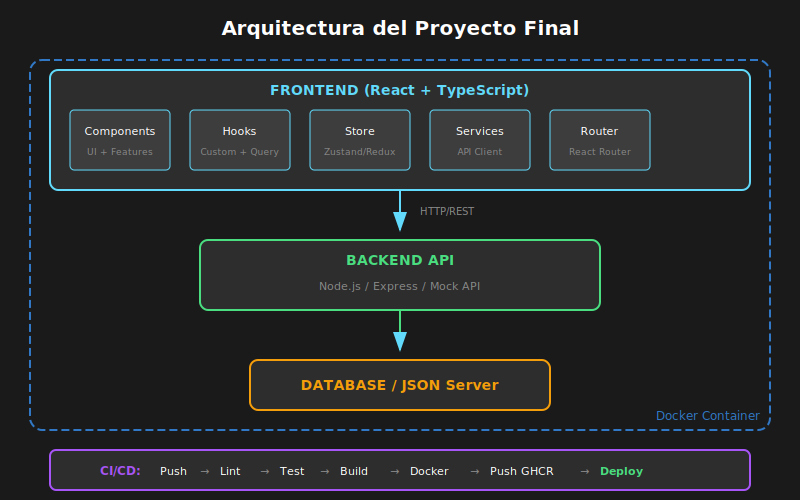

# Planificación del Proyecto Final

## 🎯 Objetivos de Aprendizaje

- Aplicar metodologías de planificación de proyectos
- Definir alcance y MVP (Minimum Viable Product)
- Estructurar la arquitectura de la aplicación
- Gestionar el tiempo efectivamente

---

## 📋 Metodología de Planificación

### 1. Definición del Alcance

Antes de escribir código, define claramente qué vas a construir:

```markdown
## Mi Proyecto: [Nombre de tu App]

### Dominio

[Tu dominio asignado: Biblioteca, Farmacia, Gimnasio, etc.]

### Problema que Resuelve

[Describe el problema del mundo real que tu app soluciona]

### Usuario Objetivo

[¿Quién usará esta aplicación?]

### Funcionalidades Core (MVP)

1. [Funcionalidad principal 1]
2. [Funcionalidad principal 2]
3. [Funcionalidad principal 3]

### Funcionalidades Opcionales (Nice-to-have)

- [Funcionalidad extra 1]
- [Funcionalidad extra 2]
```

### 2. Definición del MVP

El **MVP (Minimum Viable Product)** es la versión más simple que demuestra valor:

```
┌─────────────────────────────────────────────────────────────┐
│                    PRINCIPIO MVP                            │
├─────────────────────────────────────────────────────────────┤
│                                                             │
│   ❌ NO construyas todo desde el inicio                     │
│                                                             │
│   ✅ SÍ construye lo mínimo que funciona                   │
│                                                             │
│   Pregúntate: "¿Puedo demostrar el concepto sin esto?"     │
│                                                             │
│   Si la respuesta es SÍ → Déjalo para después              │
│                                                             │
└─────────────────────────────────────────────────────────────┘
```

---

## 🏗️ Arquitectura Recomendada

### Estructura de Carpetas

```
mi-proyecto/
├── .github/
│   └── workflows/
│       ├── ci.yml              # Integración continua
│       └── cd.yml              # Despliegue continuo
├── src/
│   ├── components/             # Componentes reutilizables
│   │   ├── ui/                 # Componentes UI genéricos
│   │   └── features/           # Componentes específicos del dominio
│   ├── hooks/                  # Custom hooks
│   ├── pages/                  # Páginas/Rutas principales
│   ├── services/               # Llamadas a API
│   ├── store/                  # Estado global (Zustand/Redux)
│   ├── types/                  # Tipos TypeScript
│   ├── utils/                  # Funciones utilitarias
│   ├── App.tsx
│   └── main.tsx
├── tests/                      # Tests
├── .storybook/                 # Configuración Storybook
├── Dockerfile
├── docker-compose.yml
├── nginx.conf
├── package.json
├── tsconfig.json
├── vite.config.ts
└── README.md
```

### Diagrama de Arquitectura



---

## ⏱️ Gestión del Tiempo (8 horas)

### Distribución Recomendada

```
Hora 1: PLANIFICACIÓN
├── Definir alcance y MVP
├── Diseñar arquitectura de carpetas
└── Crear issues/tareas

Horas 2-3: SETUP Y ESTRUCTURA
├── Configurar proyecto (Vite + TypeScript)
├── Configurar Docker y docker-compose
├── Configurar CI/CD básico
└── Crear estructura de carpetas

Horas 4-5: DESARROLLO CORE
├── Implementar componentes principales
├── Configurar estado global
├── Implementar routing
└── Conectar con API

Hora 6: TESTING
├── Escribir tests unitarios
├── Escribir tests de integración
└── Verificar cobertura

Hora 7: DOCUMENTACIÓN
├── Completar README
├── Configurar Storybook
└── Documentar componentes

Hora 8: REVISIÓN Y DEPLOY
├── Verificar CI/CD funcionando
├── Probar build de producción
├── Preparar presentación
└── Verificar checklist final
```

---

## 📝 Plantilla de Tareas

Divide tu proyecto en tareas manejables:

```markdown
## Tareas del Proyecto

### Setup (1 hora)

- [ ] Crear proyecto con Vite + TypeScript
- [ ] Configurar ESLint y Prettier
- [ ] Configurar Vitest
- [ ] Crear Dockerfile multi-stage
- [ ] Crear docker-compose.yml
- [ ] Crear workflow CI
- [ ] Crear workflow CD

### Componentes (2 horas)

- [ ] Layout principal
- [ ] Componente Header/Navbar
- [ ] Componente de lista de items
- [ ] Componente de detalle de item
- [ ] Componente de formulario
- [ ] Componentes UI reutilizables

### Estado y Datos (1 hora)

- [ ] Configurar Zustand/Redux
- [ ] Configurar React Query
- [ ] Crear servicios de API
- [ ] Implementar autenticación

### Routing (30 min)

- [ ] Configurar React Router
- [ ] Implementar rutas protegidas
- [ ] Página 404

### Testing (1 hora)

- [ ] Tests de componentes
- [ ] Tests de hooks
- [ ] Tests de integración

### Documentación (1 hora)

- [ ] README completo
- [ ] Storybook básico
- [ ] Comentarios en código

### Finalización (1.5 horas)

- [ ] Verificar Docker funciona
- [ ] Verificar CI/CD funciona
- [ ] Revisar checklist
- [ ] Preparar demo
```

---

## 🎯 Checklist Pre-Desarrollo

Antes de comenzar a codear, verifica:

### Alcance Definido

- [ ] Tengo claro qué problema resuelve mi app
- [ ] Tengo definidas 3-5 funcionalidades core
- [ ] Sé qué es MVP y qué es opcional

### Arquitectura Planificada

- [ ] Tengo la estructura de carpetas definida
- [ ] Sé qué tecnologías voy a usar
- [ ] Tengo el diagrama de componentes

### Tiempo Distribuido

- [ ] Tengo un plan de 8 horas
- [ ] Tengo buffer para imprevistos
- [ ] Sé qué puedo sacrificar si me atraso

---

## 💡 Consejos Clave

### 1. Empieza por lo Difícil

```
Primero: Docker, CI/CD, configuración
Después: Componentes y lógica de negocio
```

¿Por qué? Si dejas Docker/CI para el final y algo falla, no tendrás tiempo.

### 2. Commits Frecuentes

```bash
# Mal: Un commit gigante al final
git commit -m "Todo el proyecto"

# Bien: Commits pequeños y frecuentes
git commit -m "feat: add user authentication"
git commit -m "feat: add item list component"
git commit -m "test: add unit tests for ItemCard"
```

### 3. Verifica Continuamente

```bash
# Cada hora, verifica:
pnpm lint        # ¿Hay errores de linting?
pnpm test        # ¿Pasan los tests?
pnpm build       # ¿Compila correctamente?
docker compose up # ¿Funciona en Docker?
```

### 4. No Reinventes la Rueda

Usa lo que ya existe:

- Componentes UI: Radix UI, Headless UI
- Formularios: React Hook Form + Zod
- Estilos: Tailwind CSS
- Estado: Zustand (más simple) o Redux Toolkit

---

## 📚 Recursos Adicionales

- [React Project Structure Best Practices](https://react.dev/learn/thinking-in-react)
- [TypeScript Project References](https://www.typescriptlang.org/docs/handbook/project-references.html)
- [Vite Guide](https://vitejs.dev/guide/)

---

## ✅ Verificación de Aprendizaje

Antes de continuar, asegúrate de poder responder:

1. ¿Cuál es el alcance de mi proyecto (MVP)?
2. ¿Cómo está estructurada mi arquitectura de carpetas?
3. ¿Cómo voy a distribuir las 8 horas?
4. ¿Qué puedo sacrificar si me atraso?

---

_Siguiente: [Integración Full-Stack](02-integracion-fullstack.md)_
