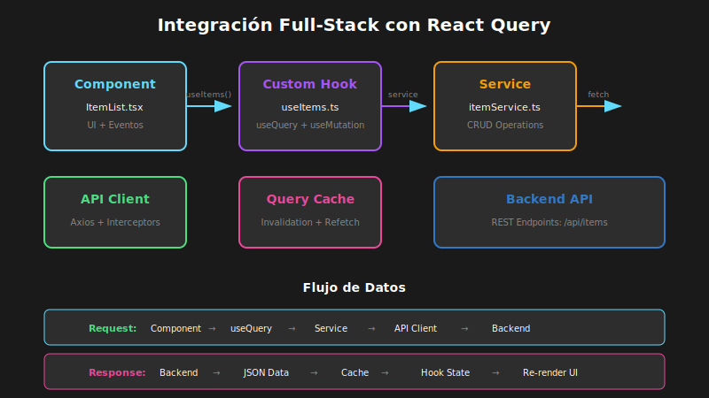

# Integración Full-Stack

## 🎯 Objetivos de Aprendizaje

- Conectar frontend React con backend API
- Implementar autenticación con JWT
- Usar React Query para manejo de server state
- Manejar errores de red y estados de carga

---

## 🔌 Arquitectura de Integración

### Diagrama de Flujo



### Capas de la Aplicación

```
┌─────────────────────────────────────────────────────────────┐
│                      FRONTEND (React)                       │
├─────────────────────────────────────────────────────────────┤
│  Componentes → Hooks → Services → API Client → Backend     │
└─────────────────────────────────────────────────────────────┘

Componentes: UI y lógica de presentación
Hooks: useQuery, useMutation, custom hooks
Services: Funciones que llaman a la API
API Client: Axios/Fetch configurado
Backend: REST API o GraphQL
```

---

## 🛠️ Configuración del API Client

### Con Axios

```typescript
// src/services/api.ts

import axios from 'axios';

// Crear instancia de Axios configurada
const api = axios.create({
  baseURL: import.meta.env.VITE_API_URL || 'http://localhost:3001/api',
  timeout: 10000,
  headers: {
    'Content-Type': 'application/json',
  },
});

// Interceptor para agregar token de autenticación
api.interceptors.request.use(
  (config) => {
    const token = localStorage.getItem('auth_token');
    if (token) {
      config.headers.Authorization = `Bearer ${token}`;
    }
    return config;
  },
  (error) => Promise.reject(error),
);

// Interceptor para manejar errores globales
api.interceptors.response.use(
  (response) => response,
  (error) => {
    // Si el token expiró, redirigir a login
    if (error.response?.status === 401) {
      localStorage.removeItem('auth_token');
      window.location.href = '/login';
    }
    return Promise.reject(error);
  },
);

export default api;
```

### Con Fetch Nativo

```typescript
// src/services/api.ts

const API_URL = import.meta.env.VITE_API_URL || 'http://localhost:3001/api';

// Tipo para opciones de fetch extendidas
interface FetchOptions extends RequestInit {
  timeout?: number;
}

// Función fetch con timeout y auth
async function fetchWithAuth<T>(
  endpoint: string,
  options: FetchOptions = {},
): Promise<T> {
  const { timeout = 10000, ...fetchOptions } = options;

  // Obtener token
  const token = localStorage.getItem('auth_token');

  // Configurar headers
  const headers: HeadersInit = {
    'Content-Type': 'application/json',
    ...(token && { Authorization: `Bearer ${token}` }),
    ...fetchOptions.headers,
  };

  // Crear AbortController para timeout
  const controller = new AbortController();
  const timeoutId = setTimeout(() => controller.abort(), timeout);

  try {
    const response = await fetch(`${API_URL}${endpoint}`, {
      ...fetchOptions,
      headers,
      signal: controller.signal,
    });

    clearTimeout(timeoutId);

    // Manejar errores HTTP
    if (!response.ok) {
      if (response.status === 401) {
        localStorage.removeItem('auth_token');
        window.location.href = '/login';
      }
      throw new Error(`HTTP error! status: ${response.status}`);
    }

    return response.json();
  } catch (error) {
    clearTimeout(timeoutId);
    throw error;
  }
}

export const api = {
  get: <T>(endpoint: string) => fetchWithAuth<T>(endpoint, { method: 'GET' }),

  post: <T>(endpoint: string, data: unknown) =>
    fetchWithAuth<T>(endpoint, {
      method: 'POST',
      body: JSON.stringify(data),
    }),

  put: <T>(endpoint: string, data: unknown) =>
    fetchWithAuth<T>(endpoint, {
      method: 'PUT',
      body: JSON.stringify(data),
    }),

  delete: <T>(endpoint: string) =>
    fetchWithAuth<T>(endpoint, { method: 'DELETE' }),
};
```

---

## 🔐 Autenticación con JWT

### Servicio de Autenticación

```typescript
// src/services/authService.ts

import { api } from './api';

// Tipos para autenticación
interface LoginCredentials {
  email: string;
  password: string;
}

interface AuthResponse {
  user: {
    id: string;
    name: string;
    email: string;
  };
  token: string;
}

interface RegisterData extends LoginCredentials {
  name: string;
}

export const authService = {
  // Iniciar sesión
  login: async (credentials: LoginCredentials): Promise<AuthResponse> => {
    const response = await api.post<AuthResponse>('/auth/login', credentials);

    // Guardar token
    localStorage.setItem('auth_token', response.token);

    return response;
  },

  // Registrar usuario
  register: async (data: RegisterData): Promise<AuthResponse> => {
    const response = await api.post<AuthResponse>('/auth/register', data);

    // Guardar token
    localStorage.setItem('auth_token', response.token);

    return response;
  },

  // Cerrar sesión
  logout: () => {
    localStorage.removeItem('auth_token');
    window.location.href = '/login';
  },

  // Verificar si está autenticado
  isAuthenticated: (): boolean => {
    return !!localStorage.getItem('auth_token');
  },

  // Obtener usuario actual
  getCurrentUser: async () => {
    return api.get<AuthResponse['user']>('/auth/me');
  },
};
```

### Hook de Autenticación

```typescript
// src/hooks/useAuth.ts

import { create } from 'zustand';
import { persist } from 'zustand/middleware';
import { authService } from '../services/authService';

interface User {
  id: string;
  name: string;
  email: string;
}

interface AuthState {
  user: User | null;
  isAuthenticated: boolean;
  isLoading: boolean;
  error: string | null;
  login: (email: string, password: string) => Promise<void>;
  logout: () => void;
  clearError: () => void;
}

export const useAuth = create<AuthState>()(
  persist(
    (set) => ({
      user: null,
      isAuthenticated: false,
      isLoading: false,
      error: null,

      login: async (email: string, password: string) => {
        set({ isLoading: true, error: null });
        try {
          const response = await authService.login({ email, password });
          set({
            user: response.user,
            isAuthenticated: true,
            isLoading: false,
          });
        } catch (error) {
          set({
            error: 'Credenciales inválidas',
            isLoading: false,
          });
        }
      },

      logout: () => {
        authService.logout();
        set({
          user: null,
          isAuthenticated: false,
        });
      },

      clearError: () => set({ error: null }),
    }),
    {
      name: 'auth-storage',
      partialize: (state) => ({
        user: state.user,
        isAuthenticated: state.isAuthenticated,
      }),
    },
  ),
);
```

---

## 📡 React Query para Server State

### Configuración

```typescript
// src/main.tsx

import { QueryClient, QueryClientProvider } from '@tanstack/react-query';
import { ReactQueryDevtools } from '@tanstack/react-query-devtools';

// Crear cliente con configuración global
const queryClient = new QueryClient({
  defaultOptions: {
    queries: {
      // Tiempo que los datos se consideran "frescos"
      staleTime: 5 * 60 * 1000, // 5 minutos
      // Tiempo que los datos permanecen en caché
      gcTime: 10 * 60 * 1000, // 10 minutos (antes: cacheTime)
      // Reintentos en caso de error
      retry: 1,
      // No refetch automático al enfocar ventana
      refetchOnWindowFocus: false,
    },
  },
});

function App() {
  return (
    <QueryClientProvider client={queryClient}>
      <Router />
      <ReactQueryDevtools initialIsOpen={false} />
    </QueryClientProvider>
  );
}
```

### Servicio de Datos

```typescript
// src/services/itemService.ts

import { api } from './api';

// Tipos del dominio (adaptar a tu dominio)
interface Item {
  id: string;
  name: string;
  description: string;
  price: number;
  category: string;
  createdAt: string;
}

interface CreateItemData {
  name: string;
  description: string;
  price: number;
  category: string;
}

interface ItemsResponse {
  items: Item[];
  total: number;
  page: number;
  pageSize: number;
}

interface ItemFilters {
  category?: string;
  search?: string;
  page?: number;
  pageSize?: number;
}

export const itemService = {
  // Obtener lista de items
  getItems: async (filters: ItemFilters = {}): Promise<ItemsResponse> => {
    const params = new URLSearchParams();

    if (filters.category) params.append('category', filters.category);
    if (filters.search) params.append('search', filters.search);
    if (filters.page) params.append('page', String(filters.page));
    if (filters.pageSize) params.append('pageSize', String(filters.pageSize));

    const query = params.toString();
    return api.get<ItemsResponse>(`/items${query ? `?${query}` : ''}`);
  },

  // Obtener item por ID
  getItem: async (id: string): Promise<Item> => {
    return api.get<Item>(`/items/${id}`);
  },

  // Crear item
  createItem: async (data: CreateItemData): Promise<Item> => {
    return api.post<Item>('/items', data);
  },

  // Actualizar item
  updateItem: async (
    id: string,
    data: Partial<CreateItemData>,
  ): Promise<Item> => {
    return api.put<Item>(`/items/${id}`, data);
  },

  // Eliminar item
  deleteItem: async (id: string): Promise<void> => {
    return api.delete(`/items/${id}`);
  },
};
```

### Hooks con React Query

```typescript
// src/hooks/useItems.ts

import { useQuery, useMutation, useQueryClient } from '@tanstack/react-query';
import { itemService } from '../services/itemService';
import type { ItemFilters, CreateItemData } from '../services/itemService';

// Keys para queries (importante para invalidación)
export const itemKeys = {
  all: ['items'] as const,
  lists: () => [...itemKeys.all, 'list'] as const,
  list: (filters: ItemFilters) => [...itemKeys.lists(), filters] as const,
  details: () => [...itemKeys.all, 'detail'] as const,
  detail: (id: string) => [...itemKeys.details(), id] as const,
};

// Hook para obtener lista de items
export function useItems(filters: ItemFilters = {}) {
  return useQuery({
    queryKey: itemKeys.list(filters),
    queryFn: () => itemService.getItems(filters),
  });
}

// Hook para obtener un item
export function useItem(id: string) {
  return useQuery({
    queryKey: itemKeys.detail(id),
    queryFn: () => itemService.getItem(id),
    enabled: !!id, // Solo ejecutar si hay ID
  });
}

// Hook para crear item
export function useCreateItem() {
  const queryClient = useQueryClient();

  return useMutation({
    mutationFn: (data: CreateItemData) => itemService.createItem(data),
    onSuccess: () => {
      // Invalidar lista para refetch
      queryClient.invalidateQueries({ queryKey: itemKeys.lists() });
    },
  });
}

// Hook para actualizar item
export function useUpdateItem() {
  const queryClient = useQueryClient();

  return useMutation({
    mutationFn: ({ id, data }: { id: string; data: Partial<CreateItemData> }) =>
      itemService.updateItem(id, data),
    onSuccess: (_, { id }) => {
      // Invalidar lista y detalle específico
      queryClient.invalidateQueries({ queryKey: itemKeys.lists() });
      queryClient.invalidateQueries({ queryKey: itemKeys.detail(id) });
    },
  });
}

// Hook para eliminar item
export function useDeleteItem() {
  const queryClient = useQueryClient();

  return useMutation({
    mutationFn: (id: string) => itemService.deleteItem(id),
    onSuccess: () => {
      queryClient.invalidateQueries({ queryKey: itemKeys.lists() });
    },
  });
}
```

---

## 🎨 Uso en Componentes

### Componente de Lista

```tsx
// src/components/features/ItemList.tsx

import { useItems, useDeleteItem } from '../../hooks/useItems';

interface ItemListProps {
  category?: string;
}

export const ItemList: React.FC<ItemListProps> = ({ category }) => {
  // Obtener items con React Query
  const { data, isLoading, isError, error } = useItems({ category });

  // Mutación para eliminar
  const deleteItem = useDeleteItem();

  // Estado de carga
  if (isLoading) {
    return (
      <div className="flex justify-center p-8">
        <span className="loading loading-spinner loading-lg" />
      </div>
    );
  }

  // Estado de error
  if (isError) {
    return (
      <div className="alert alert-error">
        <span>Error: {error.message}</span>
      </div>
    );
  }

  // Lista vacía
  if (!data?.items.length) {
    return (
      <div className="text-center p-8 text-gray-500">
        No hay items disponibles
      </div>
    );
  }

  // Renderizar lista
  return (
    <div className="grid gap-4 md:grid-cols-2 lg:grid-cols-3">
      {data.items.map((item) => (
        <div
          key={item.id}
          className="card bg-base-100 shadow">
          <div className="card-body">
            <h3 className="card-title">{item.name}</h3>
            <p>{item.description}</p>
            <p className="text-lg font-bold">${item.price}</p>
            <div className="card-actions justify-end">
              <button
                className="btn btn-error btn-sm"
                onClick={() => deleteItem.mutate(item.id)}
                disabled={deleteItem.isPending}>
                {deleteItem.isPending ? 'Eliminando...' : 'Eliminar'}
              </button>
            </div>
          </div>
        </div>
      ))}
    </div>
  );
};
```

### Componente de Formulario

```tsx
// src/components/features/ItemForm.tsx

import { useForm } from 'react-hook-form';
import { zodResolver } from '@hookform/resolvers/zod';
import { z } from 'zod';
import { useCreateItem } from '../../hooks/useItems';

// Schema de validación
const itemSchema = z.object({
  name: z.string().min(3, 'El nombre debe tener al menos 3 caracteres'),
  description: z
    .string()
    .min(10, 'La descripción debe tener al menos 10 caracteres'),
  price: z.number().positive('El precio debe ser positivo'),
  category: z.string().min(1, 'Selecciona una categoría'),
});

type ItemFormData = z.infer<typeof itemSchema>;

interface ItemFormProps {
  onSuccess?: () => void;
}

export const ItemForm: React.FC<ItemFormProps> = ({ onSuccess }) => {
  const createItem = useCreateItem();

  const {
    register,
    handleSubmit,
    reset,
    formState: { errors },
  } = useForm<ItemFormData>({
    resolver: zodResolver(itemSchema),
  });

  const onSubmit = async (data: ItemFormData) => {
    try {
      await createItem.mutateAsync(data);
      reset();
      onSuccess?.();
    } catch (error) {
      // Error manejado por React Query
      console.error('Error al crear item:', error);
    }
  };

  return (
    <form
      onSubmit={handleSubmit(onSubmit)}
      className="space-y-4">
      <div>
        <label className="label">Nombre</label>
        <input
          {...register('name')}
          className="input input-bordered w-full"
          placeholder="Nombre del item"
        />
        {errors.name && (
          <span className="text-error text-sm">{errors.name.message}</span>
        )}
      </div>

      <div>
        <label className="label">Descripción</label>
        <textarea
          {...register('description')}
          className="textarea textarea-bordered w-full"
          placeholder="Descripción del item"
        />
        {errors.description && (
          <span className="text-error text-sm">
            {errors.description.message}
          </span>
        )}
      </div>

      <div>
        <label className="label">Precio</label>
        <input
          {...register('price', { valueAsNumber: true })}
          type="number"
          step="0.01"
          className="input input-bordered w-full"
          placeholder="0.00"
        />
        {errors.price && (
          <span className="text-error text-sm">{errors.price.message}</span>
        )}
      </div>

      <div>
        <label className="label">Categoría</label>
        <select
          {...register('category')}
          className="select select-bordered w-full">
          <option value="">Seleccionar categoría</option>
          <option value="electronics">Electrónica</option>
          <option value="clothing">Ropa</option>
          <option value="food">Alimentos</option>
        </select>
        {errors.category && (
          <span className="text-error text-sm">{errors.category.message}</span>
        )}
      </div>

      <button
        type="submit"
        className="btn btn-primary w-full"
        disabled={createItem.isPending}>
        {createItem.isPending ? 'Guardando...' : 'Guardar Item'}
      </button>

      {createItem.isError && (
        <div className="alert alert-error">
          Error al guardar: {createItem.error.message}
        </div>
      )}
    </form>
  );
};
```

---

## 🔒 Rutas Protegidas

```tsx
// src/components/ProtectedRoute.tsx

import { Navigate, Outlet } from 'react-router-dom';
import { useAuth } from '../hooks/useAuth';

export const ProtectedRoute: React.FC = () => {
  const { isAuthenticated, isLoading } = useAuth();

  // Mostrar loading mientras verifica autenticación
  if (isLoading) {
    return (
      <div className="flex items-center justify-center min-h-screen">
        <span className="loading loading-spinner loading-lg" />
      </div>
    );
  }

  // Redirigir a login si no está autenticado
  if (!isAuthenticated) {
    return (
      <Navigate
        to="/login"
        replace
      />
    );
  }

  // Renderizar rutas hijas
  return <Outlet />;
};

// Uso en Router
// src/App.tsx
import { BrowserRouter, Routes, Route } from 'react-router-dom';
import { ProtectedRoute } from './components/ProtectedRoute';

export const App: React.FC = () => {
  return (
    <BrowserRouter>
      <Routes>
        {/* Rutas públicas */}
        <Route
          path="/login"
          element={<LoginPage />}
        />
        <Route
          path="/register"
          element={<RegisterPage />}
        />

        {/* Rutas protegidas */}
        <Route element={<ProtectedRoute />}>
          <Route
            path="/"
            element={<DashboardPage />}
          />
          <Route
            path="/items"
            element={<ItemsPage />}
          />
          <Route
            path="/items/:id"
            element={<ItemDetailPage />}
          />
          <Route
            path="/profile"
            element={<ProfilePage />}
          />
        </Route>

        {/* 404 */}
        <Route
          path="*"
          element={<NotFoundPage />}
        />
      </Routes>
    </BrowserRouter>
  );
};
```

---

## 💡 Buenas Prácticas

### 1. Separación de Responsabilidades

```
Componentes → Solo UI y lógica de presentación
Hooks → Lógica de estado y efectos
Services → Llamadas a API
Types → Definiciones de tipos
```

### 2. Manejo de Errores Centralizado

```typescript
// Crear un ErrorBoundary para errores de React
// Usar interceptores de Axios para errores de API
// Mostrar feedback al usuario siempre
```

### 3. Loading States Consistentes

```typescript
// Siempre mostrar indicador de carga
// Deshabilitar botones durante operaciones
// Usar skeleton loaders para mejor UX
```

---

## ✅ Verificación de Aprendizaje

Antes de continuar, asegúrate de poder:

1. ¿Configurar un API client con autenticación?
2. ¿Usar React Query para fetch y cache de datos?
3. ¿Implementar autenticación con JWT?
4. ¿Crear rutas protegidas?

---

_Siguiente: [Accesibilidad, SEO y Producción](03-a11y-seo-produccion.md)_
